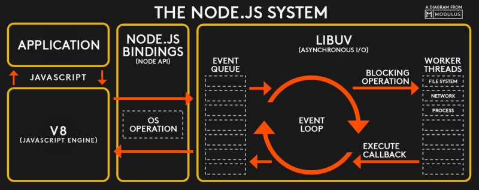
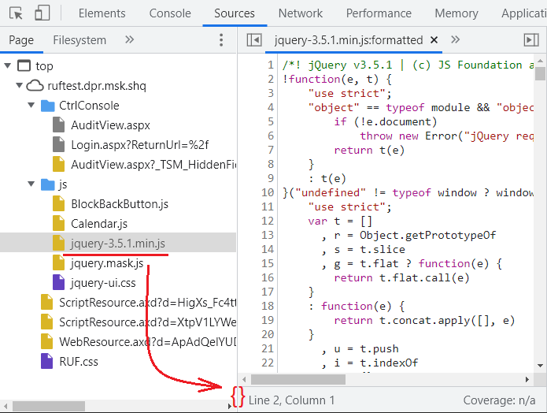

# Что такое web-разработка

Под термином **web application** часто подразумевают приложение, доступ к которому осуществляется через интернет-браузер. Пользователь запускает Google Chrome, Firefox, или Microsoft Edge, вводит адрес этого приложения (URL), браузер подключается к серверу, загружает данные, обрабатывает их и отображет результат на экране компьютера.

Сервер формирует и передаёт браузеру набор данных, состоящийх из:

- HTML-верстки - структурированные текстовые данные
- каскадные таблицы - стилистическое оформление данных при выводе на экран
- клиентские js-файлы - программный код, вполняющийся браузером
- дополнительные данные: справочную информацию, картинки, видео, и т.д.

Динамическое поведение, обеспечиваемое при выполнении программного кода браузером позволяет реализовывать сложную логику взаимодействия человека с информационными системами, находящимися на стороне сервера. В современном мире, буквально, каждая полученная страница выполняет какой-либо программный код. По сложившейся традиции, разработка программного кода работающего непосредственно в браузере называется **Front-End** Development.

Приложения, работающие на сервере и обеспечивающие подготовку данных для передачи браузеру, а также обработку запросов приложения работающего в браузере принято называть **Back-End** Development.

Сложные web-сайты часто разрабатывают целые группы специалистов, отвечающие за такие задачи, как:

- Front-End разработка
- Обработка запросов на стороне сервера
- Управление данными размещёнными в системах управления базами данных (СУБД)
- Развертывание приложение (DevOps)

В данной статье, рассматриваются различные аспекты разработки web-приложений:

- Технологии [Front-End](#frontend)
- Альтернативы и развитие JavaScript: [WebAssembly](#webassembly), [TypeScript](#typescript)
- [Основные проблемы](#problems) web-приложений
- [Решение проблем](#frameworks) при помощи фреймворков
- [Bundler-ы](#bundler). WebPack и другие
- [Информационная безопасность](#security)
- Json Web Tokens [JWT](#jwt)
- Cross-Origin Resource Sharing [CORS](#cors)
- Типы команд разработчиков и [архитектурных шаблонов](#teams)
- Технологии [Back-End](#backend)
- Особенности технологического стека [Node.js](#nodejs)
- Особенности технологического стека [ASP.NET Core](#aspnet)
- Особенности технологического стека [Java](#java)
- [Serverless Backend](#serverless)
- Архитектурный подход [RESTful и CRUD](#crud)
- Шаблон проектирования [MVC](#mvc)
- Шаблон проектирования [CQRS](#cqrs)
- [Reverse Proxy](#reverse_proxy): nginx, Apache и IIS
- [Инструментальные средства](#tools) для web-разработки
- [Дополнительно](#extra)

## Технологический стек

Одним из ключевых понятий web-разработки является **технологический стэк**. В это понятие входят:

- используемый язык, или даже языки программирования
- используемые фреймворки и вспомогательные библиотеки
- набор инструментальных средства, включая IDE
- серверное ПО, обеспечивающее работу приложения
- используемая СУБД и системы кэширования данных

Классические примеры технологических стековстека:

- MEAN: MongoDB, Express.js, AngularJS и Node.js
- LAMP: Linux OS, Apache Web Server, MySQL и PHP

Выбор технологического стека критически влияет на разработку программного обеспечения – именно этот выбор закладывает технологические ограничения, которые возникнут в будущем. Поменять технологический стек, на практике, крайне сложно и этот выбор определяет наборы «костылей», которыми будет обладать продукт, а также стоимость его сопровождения и развития.

Крупные IT-компании часто фиксируют разрешённый набор используемых технологий. Так, например, СБЕР допускает использование Postgres и Java, но не допускает использование .NET Framework (не Code), Microsoft SQL Server и Oracle.

<a name="frontend"></a>

## Технологии Front-End

При разработке Front-End часто используется принцип, называемый **Separation of Concerns**. В соответствии с этим принципом, структура данных описывается посредством HTML, стилистическое оформление определяется каскадными таблицами **CSS**, а динамическое поведение определяет JavaScript-код.

В современных web-приложениях HTML является хранилищем структурированных данных - это **документ с иерархической структурой** (дерево), у каждого элемента которого есть:

1. Уникальный идентификатор (id)
2. Набор классов (class) к которым относится этот элемент
3. Тип (tag name)
4. Набор дополнительных атрибутов
5. Содержимое - человеко-читаемый текст

Всё **стилистическое оформление** указывается в каскадных таблицах. Это относится не только к шрифтам и цвету, но и к взаимному расположению элементов, а также к **векторной графике** и **анимации** (transitions). В современном HTML уже нет тэгов TABLE, TD, TR и подобных - взаимное расположение элементов описывается посредством **Flexbox** ([шпаргалка](https://tpverstak.ru/flex-cheatsheet/)).

[Сайт-пример](http://www.csszengarden.com/) использования CSS с объяснениями, является сопровождением книги «The Zen of CSS Design: Visual Enlightenment for the Web».

С CSS связано понятие **CSS Selector** - способ поиска DOM-элемента на странице для применения к нему стилистического оформления. [Статья](https://code.tutsplus.com/ru/tutorials/the-30-css-selectors-you-must-memorize--net-16048) об селекторах. Ещё одна [статья](https://developer.mozilla.org/ru/docs/Web/CSS/Specificity) о том, как браузер применяет стили для комплексных селекторов. Для наиболее сложных случаев рекомендуется использовать специальный [инструмент для определения specificity](https://specificity.keegan.st/).

Отдельная большая задача - [выбор совместимых шрифтов](https://www.cssfontstack.com/), доступность которых на разных операционных системах может отличаться. Google рекомендует хранить шрифты на сайте и загружать их вместе с другими артефактами. Также Google предоставляет бесплатную коллекцию шрифтов [Google Fonts](https://fonts.google.com). [Статья](http://css-tricks.com/snippets/css/using-font-face/) описывает загрузку шрифтов в web-приложении.

Существуют специализированные наборы CSS-стилей (а также дополнительного JavaScript-кода) значительно упрощающие дизайн пользовательского интерфейса web-приложений. Такие наборы оформляются в виде библиотеки и часто содержат:

1. Grid-систему, упрощающую размещение элементов пользовательского интерфейса друг относительно друга
2. Механизмы отображения модальных окон
3. Responsive design - автоматическую адаптацию внешнего вида приложений под фактическое разрешение монитора/экрана планшета и мобильного телефона, с учётом ориентации
4. Дополнительные наборы widgets

Наиболее популярной библиотекой является [Twitter Bootstrap](http://getbootstrap.com/), разработанной сотрудником Twitter Mark Otto в 2011 году. Жесткая критика Bootstrap 4/5 изложена в статье [Bootstrap’s Garbage Bin Overflows! Rewriting Their Blog Template As Vanilla Code](https://medium.com/codex/bootstraps-garbage-bin-overflows-rewriting-their-blog-template-as-vanilla-code-22539acaa68e) by Jason Knight.

Также популярной библиотекой является [Semantic UI](https://semantic-ui.com/), у которой есть адаптация под React.

Другие популярные библиотеки визуального оформления компонентов для React: [Material UI](https://mui.com/material-ui/), [Ant Design](https://ant.design/), [Next UI](https://nextui.org/), [Grommet](https://v2.grommet.io/), [Onsen UI](https://onsen.io/).

Набирающая популярность библиотека CSS-стилей - [Bulma](https://bulma.io/). Библиотека "из коробки" поддерживается [DataTables.NET](https://datatables.net/)

> Существует важно отличие между библиотекой, реализующей компонентную модель пользовательского интерфейса и библиотеками компонентов. Например, мы можем использовать React, в качестве основы для нашего Single-Page Application, но в качестве библиотеки компонентов можем использовать Semantic UI, Material UI, Fluent UI React, или что-то ещё. Или мы можем использовать Blazor, как основу приложения, а в качестве набора компонентов, использовать Fluent UI Blazor, или Bootstrap Blazor. Такой подход позволяет достигать гибкости при разработке приложения, усиливая инструментарий в тех направлениях, в которых это необходимо для решения конкретной задачи. Например, команда знает React, но существует требование реализации пользовательского интерфейса "точка-в-точку" по эскизам технического задания. В этом случае, React по прежнему полезен, но в качестве библиотеки компонентов нам подойдёт Material UI, но не подойдёт Fluent UI React.

В крупных проектах возникает проблема избыточных CSS, которая влияет как на объём передаваемых по сети данных, так и на простоту сопровождения web-приложения. Для решения проблемы можно использовать специализированные пред-процессоры SaSS/SCSS, [LESS](http://lesscss.org/), [Stylus](https://stylus-lang.com/) и другие. [Syntactically Awesome Stylesheets (SASS)](http://sass-lang.com/) является одним из наболее популярных инструментов для описания каскадных таблиц с элементами языка программирования. Пример определения каскадных таблиц на **SCSS** - новой версии SaSS:

```css
$font-stack:    Helvetica, sans-serif
$primary-color: #333
body
    font: 100% $font-stack
    color: $primary-color
```

SaSS-компилятор преобразует определение в следующий CSS:

```css
body {
    font: 100% Helvetica, sans-serif;
    color: #333;
}
```

Для исследования рекомендуется [Playground](https://sass-lang.com/playground/) с сайта SASS.

Ещё один продукт - [Tailwind CSS](https://tailwindcss.com/) считается одним из наиболее перспективных инструментов предобработки CSS. К его достоинствам относятся: versatile, user-friendly, responsive, reliable, fast. Tailwind совместим с Next.js, Vite, Angular, React.

Рекомендуется к прочтению статья [Обзор фреймворка TailwindCSS: чем он хорош и кому будет полезен](https://timeweb.com/ru/community/articles/chto-takoe-tailwindcss-zachem-nuzhen-i-chem-horosh) за авторством Space Police. Идея заключается в том, чтобы прописывать стили напрямую в директиву class, а не под селекторами в CSS-файле. Это выглядит так:

```html
<div class="flex justify-center font-bold text-red-400">Заголовок</div>
```

Каждый класс Tailwind – отдельный CSS-селектор, определяемый в CSS-файле:

```css
.flex { display: flex; }
.justify-center { justify-content: center; }
.flex-col { flex-direction: column; }
.border { border: 1px black solid; }
.text-blue-200 { --tw-text-opacity: 1; rgba(191, 219, 254, var(--tw-text-opacity)); }
```

Технически это похоже на применение inline-классов, когда вы описываете дизайн элемента внутри его тега:

```html
<div style="display: flex; justify-content: center; font-weight: 700; color: rgba(248, 113, 113, var(--tw-text-opacity));>Заголовок</div>
```

Устанавливается Tailwind CSS через npm - это plug-in для системы сборки проекта и это означает, что команда установки зависит от целевого framework-а. Например, для React команда может выглядеть следующим образом:

```shell
npm install -D tailwindcss@latest postcss@latest autoprefixer@latest
```

Однако, применение Tailwind CSS - это holywar-ная тема и у этого подхода есть свои недостатки. Рекомендуются к прочтению статьи:

- [Чем хорош и чем плох Tailwind CSS, или «Допустим, у вас стартап!»](https://habr.com/ru/companies/sbermarket/articles/737474/) за авторством vodolazskikh
- [Взгляд на Tailwind CSS](https://habr.com/ru/companies/skillfactory/articles/558654/) за авторством Mari_Dem

**Динамическое поведение** (JavaScript), преимущественно отвечает за взаимодействие с сервером. В случае применения парадигмы Single Page Application (**SPA**), значение JavaScript значительно шире - он начинает управлять состоянием приложения, переходами между логическими экранами, обеспечивает информационную безопасность, и т.д.

Следует заметить, что не смотря на универсальность JavaScript, его реализации на сервере (в первую очередь Node.js) и в браузере, очень сильно отличаются. Так, в браузере есть Document Object Model (DOM), которой нет в Node.js. С другой стороны, в Node.js есть файловая система, которая отсутствует в JavaScript-коде выполняющемся в браузере. Так же, для сервера не особенно важна проблема различных версий JavaScript - вы можете установить ту, которая вам необходима. Однако, разные пользователи могут использовать различные браузеры, поддерживающие разные версии JavaScript и это может быть исключительно серьёзной проблемой.

Из-за использования пользователями разных браузеров и их разных версий, существует проблема технологической фрагментации - какие-то технологические возможности браузера могут быть недоступны конкретному пользователю. Чтобы решить подобные проблемы обычно используются вспомогательные инструменты/библиотеки.

В течение долгого времени, доминировала библиотека [jQuery](https://jquery.com/), но в последние пять-десять лет популярность jQuery начала снижаться. Основной проблемой jQuery считается дополнительная вычислительная нагрузка (например, проверка типа селектора для подбора соответствующей реализации алгоритма поиска DOM-элементов).

Применение jQuery требует загрузки файла размеров от 200 до 500 килобайт, что тоже является издержками. В реальности, этот недостаток можно компенсировать (отчасти) умелым кэшированием ресурсов.

Что ещё полезного делает jQuery?

- Указывать селекторы в jQuery очень удобно
- jQuery автоматически выполняет binding (связывание) контекста исполнения (this) к объекту, с которым мы подразумеваем работу в коде
- Реализована специальная модель "расширения" dom-объекта специализированными функциями (объектом управления со сложным поведением)
- jQuery позволяет в некоторых случаях сделать код более лакончиным, например, можно указывать HTTP VERB в имени функции: `$get()`, `$post()`, `$delete`
- Содержит вспомогательные методы для сборки параметров формы для отправки их на сервер, посредством AJAX (`form.serialize()`, `form.attr()`)
- Доступна большая библиотека вспомогательных органов управления jQuery/UI, DataTables.NET и т.д.

Считается, что новых промышленных приложений с использованием jQuery уже почти не создаётся, хотя всё ещё встречаются крупные приложения построенные на jQuery. Например, решения корпорации [Atlassian](https://www.atlassian.com/ru).

> Следует заметить, что некоторые свойства jQuery UI, например, привязка обработчиков к pre-rendered HTML-компонентам, оценивается многими web-разработчиками, как хорошее решение даже в 2024 году.

Вместе с тем, снижение популярности происходит скорее не из-за jQuery как таковой, а из-за перехода от Multi-Page Applications к Single-Page Applications. SPA даёт следующие потенциальные преимущества:

1. Приложение может быть написано на более современных языках программирования, например, на TypeScript
2. SPA часто разрабатываются в декларативном стиле и не требует управлять DOM вручную. Именно управление DOM вручную является одной из наиболее часто встречающихся проблем в приложениях с использованием VanillaJS и jQuery
3. Scope переменных ощутимо меньше захламляется
4. Справочники скачиваются один раз при запуске приложения, а не при загрузке каждой страницы

В некоторых случаях, разработчики используют ["чистый" JavaScript](http://youmightnotneedjquery.com/), т.н. *Vanilla JavaScript*. Для проверки применимости некоторой функции в конкретном браузере может быть использован ресурс [CanIUse](https://caniuse.com/).

В последние годы появляется много приложений поддерживающих **The WebSocket Protocol**. Его ключевое отличие от http состоит в том, что WebSocket является двунаправленным протоколом с постоянно установленным соединением. Это значит, что при необходимости отправки сообщения не нужно выполнять handshake, а сервер может отправить сообщение любому из активных web-приложений, исполняющихся в браузере, в произвольный момент времени. Этот протокол позволят динамически обновлять HTML-контент со стороны сервера. Наиболее популярными библиотеками для работы с WebSocket являются [Socket.io](https://socket.io/) и [SignalR](https://github.com/SignalR/SignalR).

## Альтернативы и развитие JavaScript

По мере появления всё более изощрённых JavaScript-приложений явным образом стали проявляться проблемы в дизайне этого языка программирования, наиболее серьёзной проблемой которого является слабая типизация. Проблемы стали носить драматический характер когда крупные корпорации (в первую очередь, Microsoft) начали портировать в облака свои офисные пакеты. Фактически, специалистам Microsoft пришлось переписывать MS Office с C++ на JavaScript. См. [TypeScript Origins: The Documentary](https://www.youtube.com/watch?v=U6s2pdxebSo&ab_channel=OfferZenOrigins) by OfferZen Origins на YouTube.

Проблемы JavaScript:

- слабая типизация (отчасти решается посредством TypeScript)
- слабая инкапсуляция стилей, что привело к созданию таких "костылей" как Shadow DOM
- отсутствует полноценная поддержка многопоточности, при том, что типовые аппаратные архитектуры в современном мире 4-8 CPU Core и десятки тысяч GPU Core
- медленный Runtime (если сравнивать с приложениями на C++ и Rust)
- не позволяет работать с аппаратным обеспечением. Могла бы быть модель прав для предоставления доступа сайта, например, к конкретному USB-устройству, но такая модель не была разработана

На апрель 2024 года обозначены следующие направления развития JavaScript:

- Стандартизация JavaScript в [ECMA](https://ecma-international.org/publications-and-standards/standards/ecma-262/). Текущий стандарт - ECMAScript 2023 (14 редакция)
- Microsoft "исправляет ошибки" JavaScript посредством транспайлера TypeScript
- Google разработал и развивает альтернативу JavaScript - Dart (но основное применение - мобильные платформы)
- Microsoft развивает инструмент Blazor, который обеспечивает трансляцию .NET-приложений в WebAssembly, для нативного исполнения в браузере. Blazor поддерживает interop с JavaScript, а также имеет доступ к DOM (через "blazor.js")

<a name="webassembly"></a>

### Выполнение кода в браузере

Основными ограничениями JavaScript на клиентских компьютерах считаются: однопоточность и тот факт, что JavaScript - интерпретируемый язык программирования. Влияение этих факторов может быть минимальным благодаря тому, что многопоточность поддерживается в runtime и благодаря этому, например, клиентский JavaScript может выполнять несколько http(s) запросов одновременно. То же самое можно сказать и о производительности - до того момента, пока JavaScript не используется для выполнения задач с высокой вычислительной нагрузкой (они выполняются Runtime, либо посредством ActiveX, либо посредством кода в host-приложении), проблем с производительностью быть не должно.

Если же необходимо выполнить высокую вычислительную нагрузку непосредственно в клиентском коде, альтернативой JavaScript может выступать технология **WebAssembly**. Эта технология поддерживается современными браузерами и существуют инструменты, которые позволяют разрабатывать соответствующий клиентский код. В первую очередь это [Microsoft Blazor](https://dotnet.microsoft.com/apps/aspnet/web-apps/blazor) и [Qt for WebAssembly](https://doc.qt.io/qt-5/wasm.html). Так же разработка может осуществляться на языке программирования Rust. Однако, здесь также могут быть существенные ограничения, т.к. Blazor в режиме client-size устанавливает на клиентской машине Microsoft.NET и зависимости проекта, а в режиме server-side rendering требует высокой латентности сети для обмена данными между клиентом и сервером (используется библиотека SignalR).

Вместе с тем, существует проблема использования **WebAssembly** и эта проблема - запуск виртуальной машины WebAssembly для выполнения вычислений (!?). В статье [How Fast is WebAssembly Versus JavaScript](https://betterprogramming.pub/how-fast-is-webassembly-versus-javascript-bc0eca058a54#:~:text=Finally%2C%20WebAssembly%20is%20faster%20%E2%80%94%20almost,faster%20as%20the%20factorial%20increases.) Ashley Peacock отмечает, что основная задача WebAssembly - ускорять ресурсоёмкие вычисления посредством выполнения их в native-коде. Запуск кода  WebAssembly требует запуска VM для WebAssembly и это приводит к затратам в ~300 ms. Т.е. бездумное применение WebAssembly, скорее приведёт к снижению производительности и отзывчивости приложения, а не к росту.

<a name="typescript"></a>

### Трансляция кода в JavaScript

Поскольку разные браузеры поддерживают разные версии JavaSctipt, раньше разумной стратегией являлось использование версии языка поддерживаемого максимально большим количеством браузеров, т.е. работало правило: "Чем старее JavaScript, тем он лучше совместим с браузерами". По мере взросления технологий web-разработки, стали появляться транспайлеры - инструменты конвертирующий код на одном языке программирования в соместимую с целевыми браузерами версию JavaScript. Одним из наиболее популярных языков для которого есть эффективный транспайлер является [TypeScrypt](https://www.typescriptlang.org/).

Разработка TypeScript ведётся в Microsoft и первоначально, этот инструмент рассматривался как внутренний инструмент для портирования Microsoft Office в облако.

Достоинства TypeScrypt:

- Строгая типизация (Strong Typing)
- Является объектно-ориентированным (Object Orientated)
- Удобен для поддержки IntelliSense
- Поддержка модификаторов доступа (Access Modifiers)
- Поддержка будущих функций JavaScript (Future JavaScript features)
- Отслеживает глупые ошибки в процессе разработки кода
- Поддерживается большим количеством 3rd party библиотек
- Прост в изучении, если вы уже знаете JavaScript

Недостатки TypeScript:

- Код становится более объёмным
- Ограничения, связанные с комплексными типами в TypeScript приводят к запутанному коду и сложным технических м задачам для программистов, которые должны обеспечить конфликты, возникающие в интерфейсах, использующих сложные типы
- Некоторые библиотеки не поддерживают TypeScript и для них требуется разрабатывать wrapper-ы
- Strict mode в TypeScript действительно очень _strict_ (жестокий)
- Проверка типов осуществляется только на этапе компиляции, но не на этапе выполнения
- трансляция TypeScript-кода в JavaScript увеличивает время сборки проекта в системах CI/CD

По мнению экспертного сообщества (сентябрь 2023 г.), ценность TypeScript сильно снизится после того, как проверка типов будет включена в новые версии JavaScript (в том числе, во время исполнения кода), а также по мере развития экосистемы Framework-ов: Svelte, Drizzle и Turbo. См.: https://www.reddit.com/r/JavaScriptTips/comments/16q1ur2/why_are_javascript_pros_saying_goodbye_to/

> Svelte, Turbo и ещё ряд разработчиков frameworks отказались (*ditching*) от использования TypeScript в своих продуктах. Причин две: компиляция делает цикл сборки более длинным, а так же код становится гораздо более сложным. Для обозначения увеличения сложности кода был введён специальный термин - *TypeScript Gymnastics*. Примеры [TypeScript Gymnastics](https://github.com/g-plane/type-gymnastics). Под термином "гимнастика" подразумевается "художественная гимнастика", т.е. выступления профессиональных атлетов, которые крутят "колёса" на перекладинах, кольцах и брусьях.

Следует заметить, что в некоторые инструментальные средства, например в [Deno](https://docs.deno.com/runtime/manual/advanced/typescript/overview) и [Bun](https://bun.sh/), TypeScript встроен и используется как "_язык первого класса_". В Node.js 23 встроенная поддержка TypeScript была также включена в экспериментальном режиме.

Альтернативой TypeScript является [JSDoc](https://jsdoc.app/) специальный формат комментариев, в которых также можно указать информацию о типе переменных. Многие популярные инструментальные средства поддерживают JSDoc "из коробки". К достоинствам подхода можно отнести отсутствие необходимости транспиляции кода с ts в js, т.е. разработчик получает _Linting_, _Type Inference_, практически, бесплатно. Также, JSDoc содержит инструмент для генерации документации по классу, т.е. это более широкий инструмент, чем система контроля типов.

Пример использования JSDoc в коде:

```js
/**
 * Функция заменяет иконку состояния конкретного модуля
 *  @param {number} moduleId - Идентификатор модуля
 *  @param {string} propKey - Имя изменяемого свойства
 *  @param {string} propValue - Новое значение свойства
*/
function changeModuleProp(moduleId, propKey, propValue) { ...
```

C другой стороны, если в проекте используется Bundling, то транспиляция это уже не является stop-фактором, который как-то существенно меняет процесс разработки кода. И в этом случае, с TypeScript существенно лучше, чем без него.

<a name="problems"></a>

## Основные проблемы web-приложений

Одним из наиболее критичных ограничений, связанных с работой web-приложений является канал связи между клиентским компьютером (браузером) и сервером. На пользовательский опыт крайне негативно влияют: **полоса пропускания** (какой объём данных может быть загружен за единицу времени) и **латентность** сети (как быстро будет получен ответ на запрос, без учёта потерь на подготовку ответа сервером).

Чтобы обеспечить конфортное использование приложения пользователем, необходимо минимизировать объём передаваемой информации и делать это только при необходимости.

Различают два подхода в организации пользовательского интерфейса: [server-side rendering](server-side-rendering.md) и [client-side rendering](client-side-rendering.md). В первом случае, основная работа по формированию пользовательского интерфейса осуществляется на сервере, т.е. максимально близко к базам данных. Во-втором случае, сервер генерирует данные, а HTML-генерируется браузером на локальном компьютере. При выборе подхода следует принять во внимание множество факторов, в первую очередь:

- желательно, чтобы главный HTML-документ был минимального размера, т.к. все дополнительные файлы (js, css и json) начнут загружаться только после того, как будет полностью загружен главный HTML-документ
- если генерация контента содержит много условий связанных с данными, проверку этих условий имеет смысл выполнять на сервере, с тем, чтобы не передавать по сети данные, которые могут не потребоваться браузером

Чтобы уменьшить количество запросов на сервер (в том числе, статических данных) используются:

1. Bundling - объединение разнородных ресурсов в один, или несколько загружаемых файлов. Пример объединения нескольких SVG-файлов в один, доступен [здесь](svg-bundling.md). Заметим, что некоторые библиотеки позволяют получить сборку с уже включенными зависимостями. Например, DataTables.NET может быть загружен с интегрированным кодом Bootstrap и jQuery
2. Minifying - реструктуризация JavaScript/CSS-кода с целью устранения избыточностей. Из кода могут быть удалены комменатрии, переменные могут быть переименованы
3. Client Side Caching - кэширование данных на стороне клиента

К проблемам разработки web-приложений могут быть отнесены: различные функциональные возможности клиентских браузеров, см. [CanIUse](https://caniuse.com/), а также высокая сложность клиентского JavaScript-кода. Часто, в одном js-файле реализован функционал имеющих отношения к десяткам разных органов управления, никак не связанных между собой. Всё это сказывается на сложность сопровождения Front-End и надежности приложения в работе.

Также значимой проблемой может быть использование разных версий JavaScript как в браузере, так и на серверной стороне. Похожая проблема существует и при использовании разных версий Node.js, которые поддерживают разные версии и свойства ECMAScript (JavaScript). Возможное решение проблемы - применение транспайлинга кода, т.е. его трансляции в JavaScript-код, совместимый с целевой системой.

В случае, если web-приложение используется глобально, могут возникать различные проблемы доступа к сайту, в частности, долгое время загрузки артефактов из-за большого количества router-ов между пользователем и сервером. Чтобы решить эту проблему используются **Content Distribution Networks (CDN)** - сети кэширующих серверов. Услуги CDN-провайдеров чаще всего платными для владельцев web-сайтов. Также CDN-провайдеры могут решать задачи балансировки нагрузки, защиты от DDoS, и т.д.

Потенциально критичная проблема - слабое управление кэшированием объектов, в частности, javascript-кода. При публикации новой версии приложения, при загрузке нового HTML-файла может использовать JavaScript-код из кэша, что может привести к фатальным ошибкам в коде. Для решения проблемы, URL для загрузки компонента (js, css) может содержать либо версию сборки, либо случайное значение, обновляемое при публикации новой версии.

Ещё одна особенность современных web-приложений - необходимость валидации данных как приложением выполняющися в браузере (client-side validation), так и на стороне сервера (server-side validation). При этом, проверка параметров на сервере является обязательной, а не сайте - крайне желательной. Рекомендуются к прочтению статьи о client-side validation: [Проверка форм в HTML5 с помощью атрибута "pattern"](https://webdesign.tutsplus.com/ru/tutorials/html5-form-validation-with-the-pattern-attribute--cms-25145) и [Техники валидации форм](https://htmlacademy.ru/blog/articles/form-validation-techniques).

<a name="frameworks"></a>

## Решение проблем при помощи фреймворков

Направлениями, в котором существующие проблемы web-разработки решаемы, являются:

- Разделение приложения на набор простых в сопровождении компонентов, с высокой степенью изоляции друг от друга (**компонентная модель**)
- Переход к описания универсальной структуры документа, в которой некоторый группы элементов зависят от некоторых флагов. Флаги определяют, будет ли группа элементов отображаться, или нет. Соответственно, динамический код (JavaScript) модифицирует флаги, а не управляет добавлением и удалением DOM-элементов. Контент отделён от разметки и, чаще всего, хранится специальных классах хранилищах, объединённых в **систему управляния состоянием** (State Management System)
- Применяются **HTML-расширения** (например, JSX), в частности, допускающие динамическое изменение значения некоторых атрибутов и полей HTML-элементов
- Активно применяется подход с использованием **Virtual DOM** - при изменении состояния приложения выполняется рендеринг всего документа, но делается это в памяти. Актуальный документ сравнивается с предыдущей копией и изменения включаются в Document-Object Model (DOM) браузера. Поскольку изменение DOM браузера является наиболее ресурсоёмкой задачей, минимизация подобных изменений приводит к многократному росту производительности web-приложения
- Оптимизация количества и объёма загружаемых статических данных, за счёт модификации JavaScript-кода и применения инструментов **Bundling-а**

Перечисленные улучшения реализуются в современных фреймворках и библиотеках, таких как React.js, Vue.js, и т.д. На данный момент, доминирующими решениями являются:

1. Библиотека [React](https://ru.reactjs.org/) от Facebook. React - это ядро. Для создания полноценных приложений нужны вспомогательные *3d party* компоненты. [Пример](reactappsample.md) простейшего React-приложения. Наиболее популярная система управления состояниями - [Redux](https://redux.js.org/). Redux часто критикуют за многословность (*is very verbose*) и высокий расход вычислительных ресурсов. Альтернативы - [MobX](https://mobx.js.org/README.html), [Recoil](https://recoiljs.org/), [Effector](https://effector.dev/ru/) используется в Сбере, [Zustand](https://zustand-demo.pmnd.rs/), произносится близко к _Зюштандт_. Сравнение state management есть в статье [React State Management in 2022](https://medium.com/@pitis.radu/react-state-management-in-2022-345c87922479) by Pitis Radu. Критика React за ограниченное подмножество используемых языковых средств в статье [React may ruin you as a software developer](https://medium.com/codex/react-may-ruin-you-as-a-software-developer-122ff423e37d) by Dream Science
2. Framework [Angular](https://angular.io/) от Google. Бывший лидер. Проблемы с SEO. Особенность - все необходимые компоненты уже встроены во Framework. Мнения о судьбе продукта полярным: некоторые  разработчики считают его "сходящим с дистанции", но другие считают наилучшим Enterprise-решением. Важная особенность - это "швайцарский нож", т.е. инструмент в котором есть всё, что необходимо для создания приложения. Эта особенность является критичной для Enterprise-приложений. Часто отмечается, что порог вхождения в продукт достаточно высокий
3. [Vue.js](https://vuejs.org/), Легковесный. *Evan You* - бывший инженер **Google Creative Labs**. Разработка Vue.js началась в 2014 году. В некоторых источниках указывается, что Even You внёс свой вклад в разработку Angular.js, однако это, скорее всего не так - из [других источников](https://egghead.io/podcasts/evan-you-creator-of-vue-js) можно сделать вывод, что он начинал свою карьеру разработка используя Angular 1 и ограничения этого инструмента заставили его задуматься о разработке своего собственного варианта компонентной библиотеки. [Pinia](https://pinia.vuejs.org/) - state management library для Vue.js
4. [Svelte](https://svelte.dev/). Особенность - предварительная компиляция кода, в том числе, с целью упростить код управления состояниями SPA-приложения. Svelte генерирует связующий слой, устраняя одну из наиболее серьёзных причины ошибок и замедления кода приложения. Рекомедуется к прочтению [The Compiled Future of Front End](https://medium.com/@andrew.hansen/the-compiled-future-of-front-end-a8c07b53d97f) by Andrew Hansen. Вместе с тем, существуют жалобы на то, что модель управления состояниями в Svelte не очень надёжная и в приложениях возможны потери критичных уведомлений об изменениях.

> Даниил Абрамов [покинул Facebook/Meta](https://thenewstack.io/dev-news-16m-javascript-devs-reacts-abramov-leaves-meta/) в июля 2023 года (перешёл в Twitter). Учитывая тот факт, что Даниил разработал Redux и Create-React-App - он один из ключевых разработчиков в проекте React, Facebook охладевает к open source-проектам. Как написал _Tom Smykowski_: "It’s maybe not so surprising in the current economy, but may be perceived as Meta being less enthusiastic in financing their open source offering".
>
> Интересное видео об отказе Microsoft от использования React в Edge [Microsoft Regrets Using React (For Edge)](https://www.youtube.com/watch?v=Bm8Ga07BOnI&t=381s&ab_channel=Theo-t3%E2%80%A4gg) by Theo - t3․gg. Microsoft использует [@ReactNativeMSFT](https://microsoft.github.io/react-native-windows/) во многих проектах требующих работы в Windows, macOS и XBox. В Edge практически все встроенные компоненты были разработаны на React Native как React mini-apps. Однако, в актуальных версиях Edge Microsoft отказалась от React Native из-за низкой скорости и большого расхода памяти. Theo ссылается на блог - [An even faster Microsoft Edge](https://blogs.windows.com/msedgedev/2024/05/28/an-even-faster-microsoft-edge/). Таким образом, с одной стороны, React - зрелая технология, которую активно использует лидер рынка, но с другой стороны - у React серьёзные проблемы с производительностью и памятью. По мнению Theo, проблема не столько в React (который работает отлично, если он работает в одном приложении), сколько в Microsoft, которые встроили в Edge около 17 React-приложений.
>
> Однако следует учитывать, что, например, Microsoft Teams, Office 365, SharePoint и OneDrive написаны на React. Можно утверждать, что Microsoft относится к компаниям, которые масштабно внедряют технологию (_benefit from React's component-based architecture_) в свои бизнес-критичные продукты. Но при этом активно исследует и разрабатывает альтернативы (в частности Blazor).

> К одной из основных проблем React (до React 19) относят мемоизацию, т.е. использование hook-ов, таких как `useMemo` и `useCallback`. Мемоизация вызывает дополнительный расход вычислительных ресурсов и может приводить к критичной деградации производительности кода. Кроме этого, мемоизация приводит к повышению когнитивной сложности кода. Дополнительно, мемтоизация может вызывать т.е. "Stale Values", т.е. непредсказуемое поведение приложения из-за некорректно указанных зависимостей. Также это усложняет отладку и изначительно увеличивает расход оперативной памяти. Программистам бывает сложно понять, когда и как имеет смысл использовать мемоизацию. По мнению многих web-программистов, гораздо более здоровой и эффективной является модель программирования Vue.js.

> В React 19 существует API React Context, в котором определены: createContext(), Context.Provider и useContext. Create Context - это не хранилище данных, а средство их доставки. **createContext** - объявление контекста, его можно воспринимать как store из Redux. **Context.Provider** - компонент, оборачивающий компоненты, которые должны иметь доступ к данным. **useContext** - хук, позволяющий получить данные из контекста. В статье [React Context]https://habr.com/ru/articles/873044/) by teryaevandrey, есть пример использования React Context в React-приложении. Однако, автор статьи указывает, что обычно этот API не используют в чистом виде, или потенциальных лишних рендерингов. На практике, этот API используют другие State Management, такие как Redux и MobX. Эти библиотеки реализуют собственные алгоритмы сравнения контекста, обеспечивая ре-рендеринг только извенившихся компонентов.

В статье [The JavaScript framework war is over. And there is only one winner.](https://medium.com/codex/the-javascript-framework-war-is-over-bd110ddab732) by David Rodenas, Ph. D., перечислены слабые и сильные стороны различных Framework-ов. Довольно интересны отсылки к библиотекам [StencilJS](https://stenciljs.com/) и [Metosis](https://mitosis.builder.io/), которые транслируют описание компонентов в одну из "больших" библиотек.

Одним из ключевых требований к разрабатываемому web-приложению является т.е. "Требование Perfect Pixels", которое означает, что внешний вид приложения должен соответствовать предоставленному заказчиком дизайну с точностью до точки на экране. Это требование может быть очень сложно выполнить, если библиотека с компонентами пользовательского интерфейса активно использует Shadow DOM. Например, в случае использование Fluent UI для Blazor, очень сложно кастомизировать такие компоненты, как FluentTab и FluentSelect.

Также для ознакомления рекомендуется [Redux Toolkit](https://redux-toolkit.js.org/).

При выборе State Management для React рекомендуется ознакомиться с видео [Почему я выбираю Zustand вместо Redux Toolkit?](https://www.youtube.com/watch?v=atcA2dbO7R0&t=274s&ab_channel=PurpleSchool%7CAntonLarichev) от PurpleSchool | Anton Larichev.

В простых приложениях могут быть использованы mini-frameworks, которые используют Shadow DOM для решения одной специализированной задачи, например, для управления отображением, фильтрацией, сортировкой и поиском данных в таблице. Пример такой специализированной библиотеки - [DataTables.net](https://datatables.net/).

Ключевые термины:

1. **Transpiler** - инструменты, преобразующие современный код ([TypeScript](https://www.typescriptlang.org/)/[CoffeeScript](https://coffeescript.org/)) в совместимый с конкретной целевой платформой. **Transpilation** (сокращение от _transcompilation_): означает действие компиляции исходного кода посредством его преобразования из одного языка программирования в другой. В контексте JavaScript эта техника используется для трансляции с языка, обладающего значительно большими синтаксическими возможностями к эквивалентной программе, использующей более старый _runtime_, который не поддерживает данные возможности
2. [Babel](https://babeljs.io/) - одна из наиболее популярных реализаций транспайлеров. **Update 2024**: считается устаревшей технологией
3. **Polyfill** - JavaScript-код компенсирующий отсутствие в конкретной реализации JavaScript конкретных функциональных возможностей. Чаще всего применение polyfills приводит к некоторому падению производительности приложения. Дополнительная информация доступна [здесь](http://kangax.github.io/compat-table/es6/).
3.A: **Polyfill** - код, который предоставляет реализацию стандартных API в _plain JavaScript_, который может быть импортирован в окружения, в которых эти API не доступны (обычно это старые браузеры, или runtime). [core-js](https://github.com/zloirock/core-js) от ЗлойРок/Денис Пушкарёв, один из наиболее известных polyfill-ов для JavaScript
4. **Bundle** - единица доставки (distribution), в которую может быть включено несколько файлов
5. **Bundler** - инструмент объединения файлов с JavaScript-кодом в один, или несколько файлов (bundles). Наиболее популярный bundler - [WebPack](https://webpack.js.org/). Поддерживает огромное количество plug-ins
6. **Preset** - готовые наборы предустановок для наиболее популярных особенностей языка 
7. **HTML Preprocessor** - компонент, осуществляющий генерацию HTML-верстки, используя шаблоны документов

### Virtual DOM vs Shadow DOM

Один из аспектов, нуждающихся в обсуждении: разница между **Virtual DOM** и **Shadow DOM**.

**Virtual DOM** (VDOM) - это концепция построения пользовательского интерфейса, в рамках которой существует некоторый "идеальный DOM" (именно он называется виртуальным) и "реальным DOM" в браузере. Специализированная библиотека, например, ReactDOM систематически синхронизует UI хранящийся в памяти приложения (VDOM) с "реальным" DOM, обновляя последний. Этот процесс называется _reconciliation_ (англ. - сверка, согласование). Этот подход является оптимизационной техникой - рендеринга пользовательского интерфейса в приложении осуществляется систематически и, часто, изменения затрагивают очень небольшую часть пользовательского интерфейса. Заменяя лишь небольшую часть реального DOM, а не всю модель, можно выиграть в производительности в разы, или даже на порядки. Именно этот подход является основной таких инструментов, как React, Angular и Vue.js

**Shadow DOM** - это способ инкапсуляции органов управления, разработчики которых хотели бы, чтобы внешние изменения CSS повлияли бы на внешний вид их компонентов. В частности, Shadow DOM используется при реализации таких органов управления, как выпадающий список (состоит из нескольких элементов), или Range (выбор значения в диапазоне). Если мы попытаемся увидеть Layout через Deleoper Console, или через селекторы, то мы увидим только внешний контур, например:

```html
<input type="range">
```

Однако, под внешним контуром может быть весьма изобретательная и сложная верстка. При выполнении ряда условий мы можем получить доступ к стилистичесому оформлению это верстки и, таким образом, поменять отображение системных объектов. Например, мы можем поменять цвет фона у ползунка (range):

```html
<style>
/* делаем цвет шкалы ползунка красным */
input::-webkit-slider-runnable-track {
  background: red;
}
</style>

<input type="range">
```

Чтобы увидеть, из чего состоят системные органы управления, необходимо активировать режим "show user agent shadow DOM", в свойствах Developer Console (F12): Preferences -> Elements.

Таким образом, Shadow DOM используется для решения двух задач:

- сокрытие реализации системных органов управления, чтобы на них нельзя было изменить через CSS
- получить доступ к стилистическому оформлению системных орагнов управления, чтобы изменить их

<a name="bundler"></a>

### Bundler. WebPack и другие

Приложение для формирования bundle-а (**Bundler**) позволяет настроить среды отладки и промышленной сборки. Конфигурация Bundler-а определяет:

1. какой транспайлер будет использован, например: Babel (React), или TypeScript (Angular)
2. какая версии ECMAScript является целевой
3. какие полифилы должны быть подключены при выполнении кода в браузере
4. какой инструментарий должен быть запущен при отладке кода (**nodemon**?)
5. какие файлы и в какие bundles должны быть упакованы и каким loader-ом. Какой следует использовать алгоритм сжатия (**gzip**, **brotli compression**) и утилиту минификации
6. каким образом должны быть сформированы имена клиентских файлов (css и js) для того, чтобы при их изменении на сервере, браузер не забрал ранее локально закэшированные файлы

Одна из задач решаемых bundler-ом - поиск не используемых зависимостей и их исключение из состава дистрибьюционного пакета. Поиск не используемых зависимостей часто называют **tree shaking**. В идеальном случае, исключаются не только не используемые зависисмости, но и не используемые функции. Для выполнения этой задачи осуществляется построение **Dependency graph resolution**.

Чаще всего инструментальные средства (CLI) конкретных фреймворков создают конфигурационные файлы для Bundler-а (часто, для WebPack 4).

Считается, что WebPack является мощным, но сложным в использовании инструментом, поскольку он появился одним из первых и включает большое количество *legacy* технологий. Основные претензии - сложный, многоуровневый файл "webpack.\*.js", в котором активно используются регулярные выражения, а синтаксис настроек подключаемых компонентов (plug-ins) слабо структурирован. Также считается медленным инструментом.

В качестве альтернатив рассматриваются:

- [Parcel](https://parceljs.org/). Разработчики продукта сфокусировались на *zero configuration*. Простота достигается посредством большого количества default-ных значений. Недостаток: подходит только для простых проектов
- [Rollup](https://rollupjs.org/guide/en/). Статья [Why I use Rollup, and not Webpack](https://medium.com/@PepsRyuu/why-i-use-rollup-and-not-webpack-e3ab163f4fd3) за авторством _Paul Sweeney_. Разработчики так же стремятся реализовать подход zero configuration, что достигается благодаря использованию ES Modules, нативно поддерживаемому современными браузерами. Также предлагает некоторое количество оптимизаций, включая **tree shaking** и **dead code elimination**. **Vite 5** базируется на Rollup
- [Vite](https://vitejs.dev/). Использует [Esbuild](https://esbuild.github.io/), разработанный на Go и работает очень быстро. Разработчик - Evan You (автор Vue.js). Критика инструмента в статье [Vite: How to fail on killing Webpack](https://darkghosthunter.medium.com/vite-how-to-fail-on-killing-webpack-16eb1834593c) by Italo Baeza Cabrera. Статья в подержку Vite - [You Should Choose Vite Over CRA for React Apps, Here’s Why](https://medium.com/codex/you-should-choose-vite-over-cra-for-react-apps-heres-why-47e2e7381d13) by Can Durmus. Vite - это не только система сборки, но и генератор шаблонных проектов. Генерация проекта: `npm create vite@latest`
- [Snowpack](https://www.snowpack.dev/). Статья [Web Developers: Use Snowpack instead of Webpack](https://javascript.plainenglish.io/web-developers-use-snowpack-instead-of-webpack-70e7b04f7853) за авторством Morgan Page
- [Brunch](https://brunch.io/) - декларируется высокая скорость работы
- [Microbundle](https://www.npmjs.com/package/microbundle) - bundler для маленьких модулей, базируется на Rollup
- [Rspack](https://rspack.dev/) - совместимый с WebPack bundler, разработанный на Rust. Обеспечивает более высокую скорость работы (на порядок), чем WebPack 5

Вместе с тем, WebPack 5 может быть лишён многих, озвучиваемых сообществом, недостатков: https://webpack.js.org/blog/2020-10-10-webpack-5-release/

В некоторых проектах не удаётся применять полноценный Bundler и в этом случае можно применить инструмент минификации. Пример подобной утилиты - [Uglify-JS](https://www.npmjs.com/package/uglify-js).

Установить Uglify-JS можно локально:

```shell
npm install uglify-js
```

Допустим, что мы хотим выполнить минификацию файла "device.js" и сохранить результат в "device.min.js". В этом случае, команда может выглядеть следующим образом:

```shell
node d:\Sources\RUFServerLite\node_modules\uglify-js\bin\uglifyjs d:\Sources\RUFServerLite\public\devices.js -o d:\Sources\RUFServerLite\public\devices.min.js
```

Параметры `-c` (compress) и `-m` (mangle names) позволяют применять дополнительную оптимизацию JavaScript-кода.

На практике объём типового JavaScript-файла удаётся уменьшить в три раза.

### Ценность снижения объема Bundle

Борьба за минимальный размер Bundle-а может иметь высокую коммерческую ценность. Для улучшения пользовательского опыта компоненты web-приложения часто размещают максимально близко к пользователю, используя **Content Delivery Networks** (CDN). Такие сети могут состоять из десятков тысяч кэширующих серверов, размещённых по всему миру. В соответствии с тарифной политикой, CDN сумма платёжа чаще всего зависит от объема переданных данных, т.е. размер Bundle явным образом и весьма ощутимо влиять на расходы компании.

<a name="security"></a>

## Этапы развития web-технологий

Можно условно определить этапы развития web-технологий:

- 1995-2005 - HTML генерируется на сервере: CGI-scripts, PHP, Django, ASP.NET
- 2005-2010 - активно используется динамическое поведение: jQuery, AJAX
- 2010-2015 - появились первый SPA: Bakcbone.js, Ember, Kbockout, Angular.js
- 2015-2022 - активное развитие SPA: React, Vue. Angular, Svelte, Blazor
- 2022 и дальше - Server + Client Components: Next.js, Nuxt

## Информационная безопасность

При разработке web-приложений, чаще всего приходится решать задачи, связанные и информационной безопасностью, к которым относятся:

1. Аутентификация пользователя
2. Управление сессионной информацией
3. Подтверждение достоверности сервера и клиента

В различных технологических стеках используются разные инструменты, но схожие подходы. Говоря об аутентификации пользователя критически важным является хранение на сервере пароля пользователя как **хэш-кода**, а не plain text. Это связано с тем, что подавляющее число пользователей используют одни и те же **credentials** (пару логин/пароль). Соответственно, при компрометации базы с пользовательскими данными, злоумышленники пробуют похищенные credentials на множестве крупных сайтов и это часто приводит к взлому аккаунтов, в том числе, в банковских системах.

При вычислении хэш-кода должно подмешиваться случайное значение (часто такое значение называется *salt*). 

Важно знать, что вычисление хэш-кода является односторонней криптографической операцией (*one-way algorithm*), что означает, что можно вычислить хэш-код для пароля, но нельзя вычислить пароль по хэш-коду. Примерами алгоритмов вычисления хэш-кода являются **SHA512** и **SHA256**.

Для увеличения криптографической сложности вычислений используется понятие *the number of rounds*, которое представляет собой степень двойки. Операция вычисления hash-повторяется соответствующее количество раз и это припятствует взлому системы методом *brute force*, значительно замедляя вычисления hash-кода. На практике, *the number of rounds* часто устанавливают в значение десять, или восемь.

Примеры криптографических операций, связанных с вычислением hash-кода приведены [по ссылке](bcrypt.md).

<a name="jwt"></a>

### Json Web Tokens (JWT) и Refresh Tokens

Для управления сессионной информацией чаще всего используется JSON Web Token (**JWT**) - блок данных, которых состоит из заголовка, полезной нагрузки и хэш-кода (электронно цифровой подписи). После проверки пароля, сервер формирует JWT и возвращает его клиенту (JavaScript-коду исполняемому в браузере). Клиентское приложение сохраняет этот код в localStorage браузера и при каждом следующей запросе на сервер добавляет его в MIME-заголовок https-запроса. Сервер проверяет созданным его же ключами JWT и либо выполняет, либо отклоняет запрос. Чаще всего у JWT установлен период действия, при истечении которого JWT считается нелегитимным. Сервер может передать клиенту новый JWT, если посчитает это возможным. В рамках подхода считается, что злоумышленник не сможет получить доступ к localStorage конкретного пользователя.

Для того, чтобы повысить безопасность системы, часто используют связку из token-а и refreshToken-а. Первый из них обладает коротким временем жизни (например, в одну минуту), а второй может быть годным, например, в течение недели, но является одноразовым. Как только token становится expired сервер возвращает приложению код 401 и клиентское ПО запрашивает у сервера обновление токена (по специальному URL), предоставляя refreshToken. Если злоумышленник перехватит token, этого токена хватит всего на одну минуту. Если будет украден и «refreshToken», то пользователя выкинет из системы и он(а) поймёт, что безопасность была нарушена. При повторном логине, украденный «refreshToken» перестанет действовать.

Обычно, сервер возвращает token в ответе на запросы Login/Register в JSON формате, а затем клиентское ПО помещает его в поле «Bearer» в http-заголовке всех последующих запросов. RefreshToken – это значение, которое передаётся через cookie и является идентификатором в базе данных, и который позволяет понять серверу, что генерация нового токена является допустимой.

Для проверки достоверности клиента и сервера может осуществляться односторонняя, или двухсторонняя аутентификация. Для проведения аутентификации используется **ассиметричная криптография**. Ключевые слова: сертификаты, корневой сертификат, SSL, TLS, Cipher Suite.

<a name="cors"></a>

### CORS

При разработке традиционных web-приложений задачи программирования часто разделяют на _frontend_ и _backend_. Для этих частей часто используют разные технологические stack-и. Например, frontend разрабатывается в парадигме Single Page Applications (SPA), с использованием React, Vue.js, Angular, Svelte. Backend, в свою очередь, часто создаётся с использованием технологического стека на базе .NET Core, Node.js, или J2EE.

Различие технологических стеков и структуры задач находит своё отражение и в организационной структуре - команды разработчиков frontend и backend часто имеют очень слабые организационные связи. Это касается и в задач развертывания приложений для эксплуатации (_deployment_) - каждая из команд разработчиков имеет свой собственный CI/CD Pipeline и свой собственный сервер.

Ещё одна причина разделять frontend и backend при развертывании состоит в том, что нагрузка на сервера разных типов может быть совершенно разной. Например, для того, чтобы отдать статический сайт может хватить одного сервера, а для того, чтобы обеспечивать высокую скорость обработки запросов пользователей может потребоваться десяти и сотни экземпляров (_instances_) серверов backend.

Даже если оба экземпляра приложения размещаются на одном сервере, разные приложения могут обрабатывать запросы на разные порты машины. Например, http-запросы браузера будут приходить на порт 5000, а Web API будет обрабатывать запросы JavaScript-кода на порту 3000.

Фактически, браузер выполняет оба типа запросов, но инициатором первых является человек-пользователь, а инициатором второго - разработчик JavaScript-кода. Чтобы защитить пользователя системы от действий злоумышленников, в случае расхождения Origins, браузер считает, что возникла попытка кросс-доменного доступа.

Термин **Origin** является синонимом **different domains**, что означает определённую комбинацию из: domain, scheme, или port.

**Cross-Origin Resource Sharing (CORS)** — механизм, использующий дополнительные HTTP-заголовки, чтобы дать возможность агенту пользователя получать разрешения на доступ к выбранным ресурсам с сервера на источнике (домене), отличном от того, с которого был загружен сайт. Проверка осуществляется посредством дополнительного предзапроса с использованием HTTP-глагола **OPTIONS**. Получая такой запрос сервер сообщает, какие источники javascript-кода являются допустимыми для подобных (_cross-origin_) запросов.

Если не предпринимать никаких действий, то браузер заблокирует запрос к Web API и, в общем случае, будет прав, т.к. запросы из JavaScript-кода выполняются без подтверждения пользователем.

Для того, чтобы браузер разрешил доступ к Web API, последний должен поддерживать специальные запросы браузера, связанные с CORS, т.е. вспомогательный протокол для предоставления браузеру информацию о разрешениях доступа. Сервер с Web API должен объяснить браузеру, какие типы запросов, источником которых является JavaScript-код Web API считает безопасными для пользователя. В общем случае, Web API указывает, с каких адресов должен быть загружен JavaScript-код, чтобы считаться безопасным для пользователя API.

Вид атаки, которым противостоит CORS - использование легального cookie со страницы злоумышленника, на которой вызывается fetch() для доступа к стороннему сайту (чаще всего банка) с целью хищение средств. В целом, CORS позволяет снизить остроту проблемы, но "есть нюансы". CORS не отдаст злоумышленнику данные с сайта, который не разрешил доступ к себе из другого доступа. Однако браузер доставить запрос на сервер - в том числе, может быть доставлен POST-запрос. Соответственно, все критичные операции нуждаются в подтверждении по другим каналам (например, SMS, или уведомление через мобильное приложение).

Рекомендуется к прочтению статья [CORS — это тупо](https://habr.com/ru/articles/840498/) by Kevin Cox.

### Если потребовалась настройка CORS на уровне приложения ASP.NET Core

Настройка CORS осуществляется на Web API. В коде Web API должны быть настроены соответствующие разрешения. Для этого, сначала нужно добавить Middleware, который умеет обрабатывать дополнительные запросы браузера, связанные с CORS:

```csharp
public void ConfigureServices(IServiceCollection services)
{
	services.AddCors(); // Добавляем Middleware, который умеет работать с CORS
}
```

Далее мы настраиваем политику CORS, т.е. указываем условия, при которых доступ считается разрешённым. Ниже приведён пример политики, которая разрешает всё:

```csharp
public void Configure(IApplicationBuilder app)
{
	app.UseDeveloperExceptionPage();

	app.UseRouting();
	
	// Указываем политику, которая разрешает всё
	app.UseCors(builder => builder.AllowAnyOrigin());
```

Мы добавляем сервис для обслуживания запросов из другого домена (`services.AddCors()`) и настраиваем политику доступа в `app.UseCors()`. Политика может быть более сложной и более точной. Например:

```csharp
app.UseCors(configurePolicy: policy => 
    policy.WithOrigins("http://localhost:5000", "https://localhost:5001")
        .AllowAnyMethod()   // Может быть вариант: .WithMethods("GET", "POST", "PUT", "DELETE");
        .WithHeaders(HeaderNames.ContentType));
```

Следует заметить, что разрешением выполнения запросов к другому домену, проблемы с **Cors** могут не завершиться. Если аутентификация в системе построена на использовании **cookie**, а не **JWT**, может потребоваться ещё и соответствующая настройка клиента и сервера. Рекомендуется для прочтения статья [Blazor WASM Hosted App with Cookie-based Authentication and Microsoft Identity](https://www.codeproject.com/Articles/5363405/Blazor-WASM-Hosted-App-with-Cookie-based-Authentic) by Michael Kanios.

### Объединить несколько Endpoints в один

На практике, может оказаться гораздо более удобно не бороться с Cors для доступа SPA к API, а объединить статический контент (SPA) с динамическим контентом (API) в одном Endpoint. Если рассматривать применение такого варианта к приложениям ASP.NET Core то следует выполнить два действия:

- отключить поддержку Cors, убрав код `app.Use(Cores)`
- указать у обоих проектов (SPA и API) одинаковый домен

При развертывании обоих проектов, например, на IIS, если не возникает коллизий по именам файлов, то публикация разных проектов в одном домене является допустимой.

<a name="teams"></a>

## Типы команд разработчиков и архитектурных шаблонов

Web-программирование это комбинация ПО работающего на клиентском компьютере (чаще всего - код исполняется браузером) и серверного ПО. Различают несколько архитектурных шаблонов:

**Monolith** - в этом типе архитектур, программисты обычно являются _full-stack developers_. Они разрабатывают и front end, и back end. Такой тип команд считается наиболее ортодоксальным.

**FE/BE** - разные группы инженеров отвечают за разработку front end и back end. Специализация позволяет создавать более сложные системы, но ценой больших затрат на команду и командное взаимодействие.

**Microservices** - архитектура, разработанная с целью устранения ограничений монолитных приложений и SOA/ESB. Формализованы [атрибуты микро-сервисной архитектуры](microservices.md). Система состоит из множества относительно простых, слабо связанных сервисов, что позволяет работать над каждым из сервисов изолированного от других. Цель: улучшение параметра **time to market**, снижение стоимости разработки системы, лучшая утилизация вычислительных ресурсов.

**Micro frontends** - разные команды занимаются не только разными сервисами, но и разными задачами в области front-end. Этот подход способен ещё больше повысить сложность системы в целом.

В статье [What Are Micro Frontends? Is It Even Necessary to Use Them?](https://medium.com/better-programming/what-are-micro-frontends-is-it-even-necessary-to-use-them-f1393d65ef2f) Harsha Vardhan эта тема рассматривается подробнее.

<a name="backend"></a>

## Технологии Back-End

Посмотреть информацию о том, какие технологические стеки выбирают разные IT-компании можно на сайте [StackShare](https://stackshare.io/).

Первым узлом, который обрабатывает запросы браузера является web-сервер, который выполняет маршрутизацию запросов на сервер приложений. Разработчик web-приложения использует  некоторый Framework интегрированный с сервером приложений. Framework, обычно, содержит инструментальные средства для взаимодействия с базами данных, или другими сетевыми сервисами. Ниже приведены примеры технологических стэков для разработки Back-End.

|         Runtime           |     Язык       |                    Web-сервер                    |
|:-------------------------:|:--------------:|:-------------------------------------------------|
| ASP.NET Core              |       C#       |       Internet Information Server и Kestler      |
| Node.js, Deno, Bun        | JavaScript, TS |           Express.js, Koa.js, Fastify            |
| Python                    |     Python     |                  Django, Flask                   |
| Spring, Struts, Hibernate |      Java      | Nginx/Apache с Tomcat, Glassfish, Wildfly, Jetty |

Задача Framework состоит в том, чтобы доставить http-запрос в функцию, наиболее подходящую для его обработки. Для этого осуществляется настройка таблиц маршрутизации (Routing) в web-приложении. Основные различия между фреймворками состоят в том, какая именно модель используется для описания таблиц маршрутизации. Одной из наиболее популярных моделей является **Model-View-Controller** (MVC). В этой модели различают методы доступа к данным (чаще всего база данных, Model), методы управления обработкой http-запросов (Controller) и методы генерации HTML-кода (View). Контроллер является связующим звеном и изолирует методы отображения от методов работы с данными в базе.

**Update 2024**: Таблица с Web-серверами не корректная, т.к. в контенте смешаны Reverse Proxy и web-сервера с базовой функциональностью. В промышленной эксплуатации чаще всего используются комбинации серверов. Например, IIS "торчит наружу" и защищает систему, тогда как Kestler получает от IIS запросы через 80 порт и обеспечивает базовые функции маршрутизации запросов в контроллеры ASP.NET Core.

Особое значение для разработки Back-End имеет [Middleware](middleware.md).

Огромную важность представляют задачи обработки данных в СУБД. Различают два принципиально разных подхода: **реляционную модель** (SQL) и **NoSQL** (кэширующая база с иерархическим представлением данных). Реляционная модель отлично подходит для выполнения сложных запросов отбора данных, тогда как NoSQL обеспечивает великолепное время поиска слабо-структурированных данных. На практике встречаются комбинированные модели, в которых данные хранятся в SQL СУБД, но часть из них кэшируется в NoSQL.

После введения санкций со стороны США, ряд продуктов стали официально недоступны для российского рынка. В частности, ограничения коснулись: MongoDB, Oracle, Microsoft SQL Server. Для Microsoft SQL Server существуют бесплатные лицензии для целей обучения (Express Edition), но такая СУБД не может рассматриваться в качестве промышленной.

Ряд перспективных технологий перестали быть бесплатными по причине активного использования облачными провайдерами без финансирования open-source разработчиков. Так, например Redis стал коммерческим продуктом, без возможности бесплатного использования.

Следует обратить внимание на критический уровень деградации СУБД MySQL, которая существенно не развивается уже более десятилетия. Разработчики СУБД, основав новую компанию и выпускающие СУБД MariaDB находятся в состояния постоянного недофинансирования, что делает сомнительным использование этой технологии в промышленных системах.

Таким образом, в 2024 году, в России кажется разумным использовать:

- PostgreSQL - реляционная СУБД, с поддержкой SQL
- [Apache Cassandra](https://cassandra.apache.org/) - нереляционная отказоустойчивая распределенная СУБД, рассчитанная на создание высоко-масштабируемых и надёжных хранилищ огромных массивов данных, представленных в виде хэша
- [Memcached](https://memcached.org/) - ервис кэширования данных в оперативной памяти на основе хеш-таблицы. Условный аналог Redis
- так же имеет смысл посмотреть на: [Apache CouchDB](https://couchdb.apache.org/), библиотека [RocksDB](https://github.com/facebook/rocksdb) от Facebook, [Aerospike](https://aerospike.com/).

В Memcached/Redis чаще всего хранится результат операции. Ценность такого подхода очень высока, если в системе используется горизонтальное масштабирование, т.е. запущено несколько копий web-сервера. В случае однопоточных Runtime (Node.js), горизонтальное масштабирование кажется неизбежным. Также Memcached/RedisRedis может быть использован как средство хранения результата выполнения вычислительно ёмких операций, которые выполняются уже после того, как клиент получает ответ на запрос запуска задачи.

Важно заметить, что Runtime может очень сильно влиять на архитектуру системы в целом. Например, .NET Core эффективно перераспределяет вычислительную нагрузку на разные ядра процессора, а Node.js - нет, что приводит к тому, что на одном компьютере имеет смысл запустить несколько копий Node.js и в этом случае, использование Redis/Memcached для кэширования результатов вызова API может давать очень большое ускорение в работе. Однако, важно заметить, что преимущество .NET Core на Node.js не такое уж однозначное. Да, для улучшения утилизации вычислительных ресурсов в случае использования Node.js может потребоваться использовать более сложную архитектуру, но обработка http-запросов в Node.js/Express/Fastify требует значительно меньшего количества потоков и менее интенсивного переключения контекста, что позволяет обрабатывать больше запросов на тех же аппаратных ресурсах.

При использовании реляционной модели распространено два подхода, которые легко комбинируются: для выполнения запросов используется client-side SQL, либо используются **хранимые процедуры**, размещённые и исполняемые СУБД. В общем случае, хранимые процедуры обеспечивают значительно лучшую производительность, т.к. минимизируют сетевой трафик, данные находятся максимально близко, кэширование запросов на СУБД (**Execution plan**/план исполнения) выполняется. Тем не менее, разработка хранимых процедур - это отдельная компетенция, развитие которой может занимать годы (особенно в случае, если разработчик осуществляет анализ плана выполнения SQL-запросов и занимается оптимизацией структуры базы данных).

Несмотря на то, что многие web-приложения непосредственно формируют SQL-запросы, этот подход не считается оптимальным из-за высокой вероятности ошибок и избыточных действий. Обычно, за генерацию SQL-запросов отвечает специализированный framework - **Object-Relational Mapping (ORM)**. Современные ORM позвололяют описывать модель базы данных в терминах объектов языка программирования и обрабатывать результаты запросов, как контейнеры (списки, векторы, словари, и т.д.). Такой подход позволяет разработчикам без навыков работы с SQL использовать СУБД (на практике, конечно же, SQL знать нужно). К дополнительным функциям ORM можно отнести:

1. Контроль соответствия объектной модели в коде с фактической структурой таблиц в базе данных
2. Управление миграциями, т.е. создание скрипта обновления структуры таблицы в случае, если вышла новая версия приложения
3. Кэширование результатов запрос на client-side

Классическим примером ORM является Entity Framework для Microsoft ASP.NET.

<a name="nodejs"></a>

### Особенности технологического стека Node.js

[Node.js](https://nodejs.org/en/) - это программная платформа, ключевыми компонентами которой является движок **V8** (осуществляющий исполнение JavaScript-кода) и Runtime, разработанный на C++. JavaScript-код выполняется всегда в основном потоке, но операции ввода-вывода Runtime исполняет асинхронно, в отдельных рабочих потоках. Благодаря отсутствию необходимости синхронизаци потоков и изедржек, связанных с многопоточностью, обеспечивается высокая производительность приложений Node.js в приложениях, которых нет тяжёлых вычислений, но есть много операций ввода/вывода. Пример задач, которые очень хорошо вписываются к парадигму Node.js: разработка web-сервера (Express, Fastify) с базой данных (Postgres, MongoDB, и т.д.).

Основное ограничение при разработке web-сайтов на Node.js - выполнение http-запросов, требующих значительной вычислительной нагрузки. Поскольку Node.js асинхронный, но однопоточный, то если какой-то запрос начнёт выполнять длительные вычисления, другие запросы будут ждать своей очереди поработать в основном потоке, пока "тяжёлый" запрос не завершиться. Такая ситуация называется "_Running CPU-bound tasks_". Решается проблема разными способами:

- разбиением всей работы на отдельные блоки, итерация по которым выполняется через **setImmediate**(), что даёт возможность исполнителю выполнять и другие задачи из event loop
- можно запускать отдельный процесс (процесс уровня операционной системы). Этот подход называется "_Delegating the task to an external process_". Node.js содержит инструменты для взаимодействия между родительским и дочерним процессами (на базе **EventEmitter**()). Для выполнения "тяжёлых" задач обычно используется pool внешних процессов. Создание процесса осуществляется через `child_process.fork()`
- начиная с Node.js 10.4 можно использовать [API Worker Threads](https://nodejsdev.ru/api/worker_threads/)

Для промышленных применений, в случае потребности создания Worker Pool, могут быть использованы библиотеки: [workerpool](https://www.npmjs.com/package/workerpool) и [piscina](https://www.npmjs.com/package/piscina).



Рекомендуется к прочтению статья [Using Node.js for Backend Web Development in 2022](https://medium.com/geekculture/using-node-js-for-backend-web-development-in-2022-f2917c6c0a87) by MobiDev.

Ключевая особенность стека - фокус на модульности решений. Типовое приложение включает сотни и тысячи зависимостей (*dependencies*) от библиотек (*packages*). Для [управления зависимостями](nodejs-dependency-management.md) используются специализированные инструменты - [менеджеры зависимостей npm и yarn](npm-vs-yarn.md). На практике, в дополнение к **npm** (Node Package Manager) часто используется **npx** (Node Package Executor), который умеет исполнять packages в командной строке. Статья L. Javier Tovar об отличаях npm и npx: [Are npm and npx the same?](https://medium.com/codex/are-npm-and-npx-the-same-567104f13bf0).

Разработчики стремяться к уменьшению количества зависимостей, а также фокусировке каждого package на решении конкретной специализированной функции. В практическом плане, это приводит к постепенному переходу к более модульным и компактным продуктам. Так, например, самый популярный web-сервер [Express](https://expressjs.com/ru/) постепенно заменяется [Koa.js](https://koajs.com/), который разрабатывается той же группой программистов. По ссылке доступна [статья](express.md) с описанием основных возможностей Express. Ключевое отличие Koa.js от Express состоит в том, что он использует более современный синтаксис, в частности используется async/await, тогда как Express построен с использованием callbacks.

При выборе библиотеки для организации web-приложения часто сравнивают количество обрабатываемых запросов в секунду. В статье [How Many Requests Can a Real-World Node.js Server-Side App Handle?](https://javascript.plainenglish.io/how-many-requests-can-handle-a-real-world-nodejs-server-side-application-55da7a2f06f3) by Davit Vardanyan приводятся сравнительные характеристики разных инструментов. Для примера, указывается, что "из коробки" Express с системой Routing-а обслуживает ~15 тыс. запросов, тогда как Fastify более, чем 78 тыс. запросов. Но в реальных ситуациях, основные вычислительные ресурсы расходуются на работу с СУБД и количество обрабатываемых запросов составляет лишь от 200 до 400 в секунду.

Следует заметить, что огромное community и доступность сотен тысяч open-source библиотек делают эко-систему Node.js и JavaScript фантастически популярной. В значительной степени, успешность разработки web-приложения на Node.js зависит от разумно выбранных шаблонов и подходящих к шаблонам, надёжных библиотек.

Наиболее популярной технологией хранения и поиска данных является NoSQL (Not only SQL). Популярная СУБД является [MongoDB](https://www.mongodb.com/). Часто в проектах используется **Object Document Mapper (ODM)** под названием [Mongoose](https://mongoosejs.com/). Вместе с тем, с ORM для реляционных баз данных всё тоже прекрасно. Популярные ORM: [Sequelize](https://sequelize.org/), [TypeORM](https://typeorm.io/#/), [Bookshelf](https://bookshelfjs.org/) и [Objection](https://vincit.github.io/objection.js/).

Райян Даль (Ryan Dahl), создатель Node.js осуществляет разработку нового продукта [Deno](https://deno.land/). С сильными и слабыми сторонами обоих *runtimes* можно [ознакомиться здесь](deno.md).

Для повышения производительности, могут быть использованы native-библиотеки, компирирующиеся из C/C++. Для сборки часто используется специальный модуль [node-gyp](https://www.npmjs.com/package/node-gyp).

<a name="aspnet"></a>

### Особенности технологического стека ASP.NET Core

Основным языком программирования ASP.NET Core является C#. Для описания шаблонов Html-страниц может использоваться Razor-синтаксис, который позволяет исполнять C#-код, при генерации верстки сервером. ASP.NET Core поддерживает шаблон проектирования MVC.

Сильными сторонами ASP.NET Core является встроенная поддержка ORM Entity Framework, позволяющая работать с базой данных, используя LINQ-запросы, обращаясь к СУБД, как к контейнеру объектов C#. Можно выбрать один из двух вариантов синтаксиса запросов.

Extension methods:

```csharp
var results = context.Contacts.SelectMany(c => c.SalesOrderHeaders)
    .OrderBy(c => c.SalesOrderDetails.Count)
    .Select(c => new { c.SalesOrderDetails.Count });
```

LINQ Syntax:

```csharp
IQueryable<SalesOrderDetail> query =
    from sale in context.SalesOrderDetails
    where sale.SalesOrderID == s
    select sale;
```

Из других удобных особенностей C#: поддержка Dependency Injection.

В качестве web-сервера рекомендуется использовать **Microsoft Internet Information Server**. Для отладки кода можно использовать встроенный сервер **Kestrel**. Статья по настройке IIS и SQL Server доступна [здесь](iis.md).

Считается, что web-приложения на ASP.NET Core обладают высокой производительностью и надёжностью.

Приложения ASP.NET Core могут работать как под Windows, так и под Linux (Apache).

К недостаткам ASP.NET Core относят: высокую вероятность использования двух языков программирования для разработки приложений: С# с Razor Pages на сервере и JavaScript с jQuery (или другими библиотеками) на клиенте. Иногда такое смешение создаёт приложения с очень причудливой логикой, сложной в сопровождении.

Ещё одна серьёзная претензия - ASP.NET Identity поддерживает существенно меньшее количество механизмов аутентификации пользователей, в части федерализации, чем альтернативные экосистемы (Node.js, Java EE). Для пользователей из западного мира это является существенным ограничениям, тогда как для россиян и китайцев, возможность аутентификации на "западных" IT-серверах не имеет существенного преимущества.

<a name="java"></a>

### Особенности технологического стека Java

Сильная сторона Java - огромное количество мощных библиотеки, развитая эко-система. Основной разработчик Java - корпорация Oracle, поставляет два **Java Development Kit** (JDK): платный, надежный, с длительным циклом поддержки (LTS) **Oracle JDK** и бесплатный экспериментальный **Open JDK**. Статья [За Oracle JDK нужно будет платить. Какие теперь варианты?](https://habr.com/ru/company/epam_systems/blog/430084/)

Ключевой репозитарий библиотек для Java - [Maven Central Repository](https://search.maven.org/?eh=)

Существуют альтернативные релизы Open JDK, например: [Amazon Corretto](https://docs.aws.amazon.com/corretto/index.html), [Microsoft JDK](https://docs.microsoft.com/ru-ru/java/openjdk/download), [Zulu OpenJDK](https://www.azul.com/downloads/zulu-community/?package=jdk), [Alibaba Dragonwell OpenJDK](http://dragonwell-jdk.io/), [Eclipse Temurin](https://adoptium.net/) - 12.3 млн. загрузок Runtime в феврале 2023 года. Доступен [OpenJDK Axiom от российского разработчика BellSoft](https://libericajdk.ru/pages/liberica-jdk/), сертифицированный ФСТЭК России.

Альтернативые версии Open JDK базируются на open-source [OpenJDK](https://openjdk.org/) и, чаще всего, содержат специализированные дополнения (в том числе, поддержка требований государственных регламентирующих организаций) и исправления ошибок. Важный нюанс состоит в том, что Open JDK - это исходные тексты, а разработчикам прикладных систем нужны бинарные сборки для целевых платформ. Так, например, OpenJDK Axiom создаёт сборки для процессоров Эльбрус и Байкал. Степень доверия к поставщикам бинарных сборок может быть разной, что также позволяет их дифференциировать (например, госорганизации России не могут использовать коммерческий JDK от Oracle).

Ключевым вендором Java в России становится BellSoft с их Axiom SDK Pro. Разработчик занимается сопровождением JDK, т.е. максимально быстро исправляет критичные ошибки в реализации Runtime (что является очень серьезной проблемой из-за роста сложности Runtime; зарегистрировано и не устранено более 2500 уязвимостей). В качестве сервера приложений предлагается использовать **Libercat**, а системы контейнеризации: **Axiom Runtime Container**, **Axiom Linux** и **Axiom Native Image Kit**. История команды изложена в статье [Как мы делаем Java: 30 лет истории российской разработки](https://habr.com/ru/companies/axiomjdk/articles/868056/) by DukeArchitect (Axiom JDK) рассказывает о корнях "русского Java". В 1996 году состоялась встреча Б.А. Бабаяна с руководством R&D Sun Microsystems, по результатам которой Sun стала отдавать МЦСТ (Московский центр SPARC-технологий) задачи, связанные с разработкой инструментальных средств Java. Один из ключевых инструментов, разработанных в МЦСТ стал **Java Compatibility Kit (JCK)** (140 000 тестов для продтверждения соответствия реализации VM языку Java). Sun отдавал в Россию и другие компоненты Java, в том числе компиляторы, отдельные версии JVM (Java Virtual Machine). Большая группа в Санкт-Петербурге разрабатывала графические API Swing и Java2D, а также оконную библиотеку AWT (Abstract Window Toolkit). После приобретения Sun компанией Oracle центр стал крупнейшим ядром разработки Java за пределами США. При участии российских специалистов вышла Java 8.

Заметим, что ядро Java написано на C++.

Существуют специализированные виртуальные машины для компиляции Java в native code, например: [GraalVM](https://www.graalvm.org/).

Агентство New Relic [выпустило отчёт](https://sdtimes.com/software-development/eclipse-foundation-finds-significant-momentum-for-open-source-java-this-year/) в 2022 году, в котором указывается, что доля Oracle’s share на рынке Java снизилась с 75% в 2020 до 35% в 2022.

Ключевой библиотекой для взаимодействия с базой данных является [Hibernate ORM](http://hibernate.org/orm/).

[Apache Struts](https://struts.apache.org/) - фреймворк для разработки web-приложений с использованием шаблона проектирования MVC.

Набор библиотек [Spring](https://spring.io/) содержит множество инструментов, исключительно эффективных для разработки корпоративных приложений: Serverless, Cloud, Microservices, Reactive, Event Driven.

A type-safe HTTP client for Android and Java - [Retrofit](https://square.github.io/retrofit/).

Рекомендуется к прочтению статья [Top 10 Libraries every Java Developer should know](https://towardsdatascience.com/top-10-libraries-every-java-developer-should-know-37dd136dff54).

<a name="serverless"></a>
## Serverless Backend

Одним из популярных направлений разработки Backend является Serverless. Основная идея состоит в делегировании функций управления ресурсами провайдеру облачных услуг. Наиболее популярными являются [Google Firebase](https://firebase.google.com/) и [AWS Lambda](https://aws.amazon.com/ru/lambda/).

Приложение использует предоставленный облачным провайдером SDK, либо REST API для выполнения типовых задач:

1. Аутентификация пользователей
2. Сохранение данных в базе (чаще всего NoSQL)
3. Хранение статических файлов (Hosting)
4. Системы машинного обучения

Компания, разрабатывающая мобильное, или web-приложение не создаёт серверов – она использует SDK, а обработка запросов, масштабирование (развертывание дополнительных instances) выполняются самой платформой (Firebase, AWS).

В случае использования AWS Lambda, или Firebase Cloud Functions – могут быть разработаны специализированные функции, выполняющиеся на сервере, что позволяет добавить функционал, изначально отсутствующий у облачных провайдеров.

Достоинства:

1. Отличное масштабирование
2. Высокая надёжность (не так для Firebase Realtime Database)
3. Очень лёгкая интеграция сервисов в клиентское ПО
4. Огромное разнообразие сервисов аутентификации

Недостатки:

1. Оплата по факту использованных ресурсов – можно легко выйти за бюджет и даже разориться, из-за небольших недоработок в коде
2. Высокая, фактическая, стоимость – в том числе, есть неявные статьи расходов, которые сложно запланировать, не имея значительного опыта в использовании сервисов
3. В России отсутствуют центры обработки данных Amazon, Microsoft и Google. Время отклика хуже, чем в развитых странах мира
4. Возможно введение «цифрового железного занавеса» с любой из сторон (санкции США, либо блокировки РосКомНадзора)

Наиболее сложной технической проблемой при работе serverless-приложений является эффективность масштабирования. Ключевая проблема состоит в том, что когда облачный провайдер понимает, что требуется запустить ещё одну копию приложения (в контейнере) этот запуск (start-up) занимает некоторое время (0.5-5 мс). Если процесс не достаточно хорошо оптимизирован, то время выполнения запроса может изменяться в широком диапазоне. В случае активного использования микро-сервисов (т.е. выполнения нескольких атомарных операций в рамках одной бизнес-операции), время выполнения может быть значительным. Благодаря повторному использованию ранее запущенных машин, повторное выполнение запросов осуществляется существенно быстрее. Т.к. при снижении нагрузку облако удаляеет "лишнее" контейнеры, при "рваной" нагрузке система в целом тратит много времени на подъём и освобождение контейнеров (эти задачи включаются в счёт на оплату и это приводит к низкому КПД - значительную часть расходов составляют не целевые действия системы). В случае, если нагрузка равномерная, гораздо удобнее использовать типовой подход с выделенным сервером (или несколькимим серверами). Провайдеры пытаются решить проблему внедряя продукты с быстрым запуском приложения, например, заранее компилируя Java-код в нативный код (см. [GraalVM](https://www.graalvm.org/)).

Видео: [Serverless Doesn't Make Sense](https://www.youtube.com/watch?v=AuMeockiuLs) by Ben Awad

Статьи: [Playing with GraalVM on Windows 10 and WSL2](https://tsuyoshiushio.medium.com/playing-with-graalvm-on-windows-10-8be837007b33) by Tsuyoshi Ushio, [Is Quarkus the future of Java?](https://medium.com/swlh/is-quarkus-the-future-of-java-b664c5e79381) by Ben Khemis

Важные термины:

**Federated Identity** – это возможность выполнять аутентификацию пользователя по его/её логину в других крупных системах (Google, Apple, Facebook, Twitter, GitHub, Microsoft).

**Provisioning Resources** – выделение/предоставление ресурсов.

# Шаблоны проектирования

При разработке web-приложений шаблоны проектирования играют ключевую роль. Практически, в любом web-приложении применяется тот, или иной шаблон проектирования.

<a name="crud"></a>
## RESTful и CRUD

Архитектурный подход **RESTful** описывает принципы построения web-приложений. Существуют формальные признаки соответствия архитектуры RESTful:

- Client – Server. Применение Client-Server архитектуры позволяет развивать каждую из сторон независимо от другой (Independent Evolution). Используется термин: **De-Couple** = _No impact of changes_
- Uniform Interface – для доступа к ресурсами используются URI/URL. В запросе идентификаторы объектов включаются непосредственно в http(s)-запрос позиционно. Например: /computers/89056, где 89056 является идентификатором объекта. Ответ REST API чаще всего является JSON-представлением. HTTP-глаголы используются для того, чтобы отличать запросы изменяющие состояние системы (меняют что-то в базе данных) и не изменяющие её (только получают информацию), а также для упрощения сопровождения системы в целом
- Statelessness - в RESTful сервер не хранит сессий. Это позволяет легко масштабировать приложение (Easier to Scale - Horizontally), сохранять приложение простым (Simplifies) и уменьшить потребность в ресурсах (Reduces the resource needs)
- Caching - поскольку сервер является Statelessness, возрастает chattiness – взаимодействие между клиентом и сервером возрастает и это влияет на производительность. Это плохо. Кэширование позволяет уменьшить негативных эффект от Statelessness. RESTful требует использования директивы "cache-control" в MIME-заголовке
- Layered - похоже на web-приложения, RESTful требует разделения приложения на уровни. Например: REST Client, Gateway/Proxy, Load Balancer, RESTful API, база данных
- Code on Demand (не обязательный признак/опциональный) - REST server может прислать не только данные, но и ссылки, по которым следует перейти для выполнения дальнейшей работы. Например, в ответе на «Vacation package details» могут быть отправлены две дополнительные ссылки: "Add a review" и "Book the package"

Для оценки зрелости _Leonard Richardson_ разработал Richardson Maturity Model (RMM), описывающую четыре уровня зрелости.

**CRUD** можно рассматривать как одна из полезных практик использвоания  RESTful. Акроним расшифровывается как Create, Read, Update, Delete/Destroy и ссылается на четыре наиболее универсальные операции работы с каталогизируемыми сущностями (что-то, что можно рассматривать как список). Под сущностью подразумевается понятие из конкретной прикладной области, например: пользователь, счёт в банке, запись в блоге.

Широкое распространение CRUD связано с его простотой, легкостью изучения, а также тем, что CRUD легко интегрируется с СУБД (CREATE = INSERT, READ = SELECT, UPDATE = UPDATE, DELETE = DELETE). Web-разработчикам достаточно перечислить список сущностей, чтобы понять ожидаемый результат, объём работы по созданию CRUD API и её сложность.

Пример определения HTTP Routes для сущности "собака" в CRUD:

| Команда |    Пример URL   | HTTP Verb |                         Описание                         |
|:-------:|:---------------:|:---------:|:--------------------------------------------------------:|
|  Index  | /dogs           |    GET    | Вывести список всех собак                                |
|   New   | /dogs/new       |    GET    | Вывести форму для ввода данных о новой собаке            |
|  Create | /dogs           |    POST   | Добавить новую собаку в базу данных                      |
|   Show  | /dogs/:id       |    GET    | Показать информацию об одной собаке                      |
|   Edit  | / dogs/:id/edit |    GET    | Показать форму для редактирования информации о собаке    |
|  Update | /dogs/:id       |    PUT    | Обновить данные о собаке, а потом перейти куда-нибудь    |
| Destroy | /dogs/:id       |   DELETE  | Удалить информацию о собаке, а потом перейти куда-нибудь |

HTTP-глаголы и возвращаемые HTTP Status Codes

| Действие              | HTTP Verb                                                                                                                                                      | HTTP Status Codes                                                 |
|-----------------------|----------------------------------------------------------------------------------------------------------------------------------------------------------------|-------------------------------------------------------------------|
| Creating a Resource   | POST                                                                                                                                                           | 201 Created. 400 Missing required field. 503 Database unreachable |
| Retrieving Resource   | GET                                                                                                                                                            | 200 OK. 404 Resource Not Found. 500 Internal Server Error         |
| Updating the Resource | PUT – Update ALL of the attributes of the resource. PATCH – Update SOME of the attributes of the resource. Patch May be more performant for large size objects | 200 Success. 201 Created. 204 No Content                          |
| Deleting the Resource | DELETE                                                                                                                                                         | 200 Success. 204 No Content                                       |

Для проектирования и документирования REST API часто используется специализированный инструмент [Swagger](https://swagger.io/). Настройка Swagger в проекте с Node.js описана в [статье](https://github.com/Kerminator1973/RUFServerLite/blob/main/docs/swagger.md).

Разница между http-глаголами представляется драматической:

- GET не должен приводить к изменение данных на сервере. Как следствие, GET-запросы могут кэшироваться, что позволяет значительно ускорять работу web-приложения
- PUT только изменяет существующие данные, но не добавляет их. Это свойство называется idempotency. Разница между PUT и POST подробно описана в статье [Why You Should Use a PUT Request Instead of a POST request](https://betterprogramming.pub/why-you-should-use-a-put-request-instead-of-a-post-request-13b593b6e67c) by Dieter Jordens.

**Идемпотентность** — свойство объекта или операции при повторном применении операции к объекту давать тот же результат, что и при первом. Термин предложил американский математик Бенджамин Пирс в статьях 1870-х годов.

Одна из сильных сторон RESTful - удобство кэширования за счёт использования директивы "Cache-Control" в HTTP-заголовке. Благодаря хранению идентификаторов сущностей в URI, можно указывать для редко-изменяемых объектов свойства **public** и **max-age**. Если время жизни ресурса (URI) в кэше не завершилось, то браузер не будет повторно посылать запрос на сервер, а использует закэшированное значение. Этот механизм позволяет значительно снижать нагрузку на сервер и сеть. Пример кода указания директивы:

``` js
res.header('Cache-Control', 'public, max-age=600');
```

### Выбор клиентской библиотеки для взаимодействия с REST API

Наиболее популярными средствами доступа к REST API являются [Fetch API](https://developer.mozilla.org/ru/docs/Web/API/Fetch_API), [jQuery ajax](https://api.jquery.com/jquery.ajax/) и [Axios](https://www.npmjs.com/package/axios).

Считается, что fetch и jQuery ajax больше подходят для небольших приложений, в первую очередь из-за небольшого размера библиотек (minimal footprint). Axios прекрасно подходит для сложных приложений, в том числе, благодаря мощному механизму Axios Interceptors, позволяющему централизованно встраивать дополнительных код при обработке запросов и формировании ответов. Это значительно повышает удобство поддержки JWT.

### Критика CRUD

Несмотря на очевидную популярность CRUD среди консультантов и авторов online-курсов, среди профессиональных разработчиков отношение скорее негативное. Это связано, в первую очередь, с тем, что CRUD подходит для простых приложений, но начинает создавать множество проблем в косплексных, активно развивающихся приложениях.

Рекомендуются к прочтению следующие статьи: [Why Are You Still Creating CRUD APIs?](https://levelup.gitconnected.com/why-are-you-still-creating-crud-apis-8790ca261bfb) by Nicklas Millard, [Is CRUD Bad for REST?](https://www.infoq.com/news/2009/07/CRUDREST/) by Boris Lublinsky, [Using CQRS with Event Sourcing or – what’s wrong with CRUD?](https://blog.softmemes.com/2016/11/12/using-cqrs-with-event-sourcing/) by Kristian Freed, [Why CRUD might be what they want, but may not be what they need](http://codebetter.com/iancooper/2011/07/15/why-crud-might-be-what-they-want-but-may-not-be-what-they-need/) by Ian Cooper, [CRUD is an antipattern](https://verraes.net/2013/04/crud-is-an-anti-pattern/) by Mathias Verraes, [What’s Wrong With Your CRUD APIs— Besides Everything?](https://levelup.gitconnected.com/whats-wrong-with-your-crudy-interfaces-besides-everything-bde4f4c8cb8a) by Nicklas Millard.

Личный опыт автора связан с разработкой приложений, в которых применение CRUD было осложнено тем, что:

- требовалось большое количество операций Upload, которые не "ложаться" в CRUD
- при работе с одной сущностью, использовались разные идентификаторы (а не один, явно обозначенный идентификатор сущности), или группы ключей
- требовалось реализовывать групповые операции, которые в типовых CRUD-приложениях почти не встречаются

Популяризаторы CRUD отмечают, что если ваш API содержит действие, которое не попадает в CRUD, добавьте ACTION. ACTION – это глагол, который размещается в URI за номером версии API. Примеры глаголов: CALCULATE, SEARCH, и т.д. В частности, Spotify использует ACTION search:

``` http
https://api.spotify.com/v1/search?query=tania+nowra&offset 
```

В качестве альтернативы рассматриваются [GraphQL](https://graphql.org/), [gRPC](https://github.com/grpc/grpc) и [JSON-RPC](https://en.wikipedia.org/wiki/JSON-RPC).

<a name="mvc"></a>

## MVC

Акроним расшифровывается как **Model-View-Controller**. Шаблон рекомендуется отделять модель (способ представления и хранения данных) от view - уровня представления (пользовательский интерфейс). Связующим звеном является Controller, в котором, чаще всего выполняется бизнес логика. Уровень представления генерирует события, которые обрабатываются контроллером, контроллер обращается за данными к Model и передаёт эти данные во View для формирования пользовательского интерфейса.

Шаблон позволяет достаточно легко реализовывать схемы, в рамках одной системы может существовать несколько разных пользовательских интерфейсов (например, для web и для мобильных устройств). Также, модификация структуры данных, или переход на другую СУБД является существенно менее сложной задачей, чем в случае, если разделение на уровни не осуществляется.

<a name="cqrs"></a>

## CQRS

CQRS - _Command-query separation_. Шаблон проектирования часто применяется при разработке Backend, возвращающий JSON. Ключевое требование - метод должен быть либо командой, выполняющей какое-то действие, либо запросом, возвращающим данные, но не одновременно. **Команда**: выполняет какое-то действие модифицирующее состояние системы, но не возвращает значений. **Запрос**: отвечает внешнему коду на некоторый вопрос не изменяя состояние системы, возвращая некоторое значение.

Разделение кода на команды и запросы позволяет значительно упростить масштабирование системы. Например, можно настроить репликацию базы данных, в которой главная копия выполняет команды (Insert/Update/Delete), а вспомогательные копии - только отдают данные (Select). Можно утверждать, что модель упрощает оптимизацию для операций чтения (Query) и записи (Command).

Довольно часто совместно с CQRS используют шаблон проектирования **Mediator**, который встраивается в контроллер (MVC) и переадрессует запросы специализированным классам, в которых реализованы внутренние классы для выполнения команд и запросов. В приведённом ниже примере, это осуществляется посредством вызова Mediator.Send():

```csharp
namespace API.Controllers
{
    [Route("api/[controller]")]
    [ApiController]
    public class ActivitiesController : BaseApiController
    {
        [HttpGet]   // GET api/activities
        public async Task<ActionResult<IEnumerable<Activity>>> GetActivities()
        {
            // Переадрессуем запрос в подкласс класса List из пространства имён
            // Application.Activities
            var values = await Mediator.Send(new List.Query());

            // Возвращаем успешный Http Status Code и полученные данные
            return Ok(values);
        }
```

<a name="reverse_proxy"></a>
# Reverse Proxy

В промышленных системах web-приложения доступны не напрямую, а через так называемые [Reverse Proxy](https://medium.com/intrinsic/why-should-i-use-a-reverse-proxy-if-node-js-is-production-ready-5a079408b2ca). Это делается по нескольким причинам:

1. Защищённость системы: за защиту отвечает специализированные инструменты
2. Reverse Proxy работает с сертификатами безопасности с полноценным использованием PKI (Public Key Infrastructure). Ключевая особенность - подтверждение доверенности сторон (т.е. использование цепочек с использованием Certificate Authority и полномочиями)
3. Выполняет архивирование ответа сервера (эффективность reverse proxy может быть выше на 15-50%)
4. Осуществляется проверка и подмена полей http-запросов в MIME-заголовке
5. Повышенная производительность и надёжность: Reverse Proxy может распределять запрос между несколькими worker-ами (например, между несколькими копиями Node.js)
6. Обеспечивают поддержку современных протоколов, в частности [HTTP/2](http2.md). Поддержка HTTP/2 позволяет использовать одно TCP-соединение для нескольких http-запросов, а так же загружать статические документы с упреждением. Например, CSS-файл может начать загружаться до того, как будет завершена загрузка html-документа

Резюмируя: использование Reverse Proxy позволяет значительно увеличить производительность системы, снизить нагрузку на сетевую подсистему, а также улучшить безопасность системы.

В качестве таких прокси часто используются Microsoft Internet Information Server, [nginx](https://nginx.org/ru/) и [HAProxy](http://www.haproxy.org/). Также могут быть использованы proxy реализуемые в рамках экосистемы конкретного языка программирования (например: _Node.js-based proxies_), или _Cloud-based proxies_.

Различия между **Reverse Proxy** и **Forward Proxy** приведены в документации по (Apache HTTP server](https://httpd.apache.org/docs/2.4/mod/mod_proxy.html#forwardreverse)

На официальном сайте **nginx** доступна бесплатная книга о защите web-приложений от внешних атак.

<a name="tools"></a>

## Инструментальные средства для web-разработки

## Visual Studio Code (с Plug-Ins)

Наиболее универсальный IDE со множеством plug-in-ов [Microsoft Visual Studio Code](https://code.visualstudio.com/). Мои любимые Plug-Ins:

1. [Bookmarks](https://marketplace.visualstudio.com/items?itemName=alefragnani.Bookmarks) by Alessandro Fragnani
2. [Material Icon Theme](https://marketplace.visualstudio.com/items?itemName=PKief.material-icon-theme) by Philipp Kief
3. [Prettier - Code formatter](https://marketplace.visualstudio.com/items?itemName=esbenp.prettier-vscode)
4. [Tabnine Autocomplete AI](https://marketplace.visualstudio.com/items?itemName=TabNine.tabnine-vscode) by Tabnine. ВНИМАНИЕ! Огромное потребление ОЗУ. Создаёт десятки процессов по ~60 Мб каждый
5. [NuGet Gallery](https://marketplace.visualstudio.com/items?itemName=patcx.vscode-nuget-gallery) by pcislo
6. [Visual Studio IntelliCode](https://marketplace.visualstudio.com/items?itemName=VisualStudioExptTeam.vscodeintellicode) by Microsoft
7. [Python](https://marketplace.visualstudio.com/items?itemName=ms-python.python) by Microsoft
8. [Markdown PDF](https://marketplace.visualstudio.com/items?itemName=yzane.markdown-pdf) by yzane
9. Microsoft [HexEditor](https://marketplace.visualstudio.com/items?itemName=ms-vscode.hexeditor)
10. [SonarLint](https://marketplace.visualstudio.com/items?itemName=SonarSource.sonarlint-vscode) by SonarSource - мощный Link для разных языков программирования, включая JavaScript/TypeScript
11. [Polacode](https://marketplace.visualstudio.com/items?itemName=pnp.polacode) by P & P - сделать красивую картинку с выделенным кодом приложения
12. [GitLens](https://marketplace.visualstudio.com/items?itemName=eamodio.gitlens) by GitKraken - позволяет посмотреть Commit Graph, визуализировать историю изменений кода, "кто исправлял текущую строку кода"
13. [MSBuild project tools](tintoy/msbuild-project-tools-server) by tinytoy. Предоставляет IntelliSense при редактировании файлов проектов C#
14. [REST Client](humao.rest-client) by humao. HTTP client для VSCode, альтернатива Postman. Последнее обновление - 2019 год
15. [ILSpy Decompiler](ilspy-vscode) by SharpDevelop Team. Декомпилирует сборки MSIL
16. [Tokyo Night](Tokyo Night) by **enkia**. Тема для VSCode
17. [PurpleSchool Theme](https://github.com/PurpleSchool/vscode-theme) by **PurpleSchool**. Тема для VSCode
18. [StyleCopAnalyzers](https://github.com/DotNetAnalyzers/StyleCopAnalyzers) - статический анализатор кода .NET. В частности, рекомендуется для использования Марком Прайсом в его серии книг "C# XX и .NET YY. Expert Insight"

Один из моих любимых plugin-ов **Bracket Pair Colorizer 2** вошел в состав Visual Studio Code. Чтобы активировать его, следует включить в settings.json строки:

``` json
{
    "editor.bracketPairColorization.enabled": true,
    "editor.guides.bracketPairs":"active"
}
```

В 2023 году много хайпа получил Linter [Biome](https://biomejs.dev/). Особенность продукта - написан на Rust и обладает высокой производительностью. Также интересным является [OxLint](https://oxc-project.github.io/docs/guide/usage/linter.html), также разработанный на Rust. Декларируется, что он в 50-100 раз быстрее, чем ESLint и содержит более 200 правил для проверки кода. См. статью [Oxlint — более быстрая альтернатива ESLint](https://habr.com/ru/companies/domclick/articles/783150/) by Игорь Карелин.

Интересным продуктом может быть конфигуратор ESLint [Sherif](https://www.eslint-config-sheriff.dev/docs/introduction). Особенность - написан на Rust, поддержка Typescript-first.

> Имеет смысл обратить пристальное внимание на язык программирования Rust, который стал очень активно использоваться как язык для Tooling-а, т.е. для разработки вспомогательных инструментальных средств.

Дополнительно рекомендуется установить параметры:

1. Убрать Mini-Map, который загромождает экран. **Текстовый редактор -> Мини-Карта -> Enabled** установить в False
2. Автоматическое сохранение кода при переходе из VSCode в другое окно: **Текстовый редактор -> Файлы -> Auto Save** установить в **onWindowChange**
3. Не выводить сообщение о превышении длины комментария при commit-е в GitHub на 50-ом символе. **Расширения -> Git -> Input Validation Subject Length** установить в 72

Для работы с кодом используются моноширинные шрифты (*Monospace*). Многие из IT-компаний выпустили свои шрифты с поддержкой лигатур (последовательность символов автоматически транслируется в особенный символ) для программистов:

- **FireCode**, доступен на [Google Fonts](https://fonts.google.com/specimen/Fira+Code?query=Fira+Code).
- [Cascadia Code](https://github.com/microsoft/cascadia-code)
- [Intel One Mono](https://github.com/intel/intel-one-mono/releases/tag/V1.3.0)
- [GitHub Monaspace](https://monaspace.githubnext.com/)
- [JetBrains](https://www.jetbrains.com/lp/mono/)

## Sublime Text 4

Популярный HTML/CSS редактор с поддержкой Zen-программирования - [Sublime Text 4](https://www.sublimetext.com/). Под Zen-программированием подразумевается возможность частичного ввода информации и автоматической генерации html-тэгов при нажатии кнопки **Tab**. Например, для текста: `div.worker` при нажатии на кнопку **Tab** будет сформирована следующая html-разметка:

```html
<div class="worker"></div>
```

Мета-язык Zen Coding может быть достаточно комплексным и при наличии навыков, кратно ускорять разработку html-верстки. См. также [Emmet](https://packagecontrol.io/packages/Emmet). Доступен [Plug-In](https://marketplace.visualstudio.com/items?itemName=MadsKristensen.ZenCoding) для Visual Studio.

Sublime Text 4 является условно-бесплатным и очень часто используется разработчиками на MacOS. В этой операционной системе также часто используется редактор кода [Brackets](http://brackets.io/).

## Google Chrome

Google Chrome сам по себе является очень мощным инструментом раработки, включая "F12 Developer Console".

В частности, Chrome содержит функцию форматирования минифицированного JavaScript-кода. Для этого достаточно нажать на кнопку "{}" в окне просмотра загруженного js-файла:



## Другие инструменты

Платный, но очень мощный инструмент - [JetBrains WebStorm](https://www.jetbrains.com/webstorm/). В России оплата продукта не доступна.

[GIGA IDE от СБЕРа](https://gitverse.ru/home/) - сборка, основанная на JetBrains IntelliJ Idea/Pycharm Community. Содержит более 70 дополнительных инструментов разработки, тестирования, администрирования, а также AI-ассистент. Благодаря использованию дополнительных инструментов, по функциональным возможностям приближается к платным версиям IDE от JetBrains.

Облачные IDE: [GitPod](https://www.gitpod.io/), [CodeAnywhere](https://codeanywhere.com/), [Github Codespaces](https://github.com/features/codespaces). CodeAnywhere и Codespaces являются платными - в России не доступны.

Облачный редактор [VS Code](https://vscode.dev/) - оплата за фактические время использования - в России не доступны.

Песочницы для быстрого прототипирования и экспериментирования: [CodePen](https://codepen.io/), [CodeSandBox](https://codesandbox.io/) и [StackBlitz](https://stackblitz.com/),  [OnlineGDB](https://www.onlinegdb.com/), [CodeChef](https://www.codechef.com/ide), [Cups Online от Mail.ru](https://interview.cups.online/), [CodingGround](https://www.tutorialspoint.com/codingground.htm), [TryCode](https://trycode.pw/).

Online-компилятор С++ [GodBolt](https://godbolt.org/). Ключевая особенность - показывает ассемблерный код для приведённого кода C++. Главная задача ресурса - экспериментальная проверка степени оптимизации кода C++. Для web-приложений это важный инструмент, т.к. встраивание высокоэффективного C++ кода в приложения на других языках программирования (Python, JavaScript) является естественным способом значительного повышения эффективности работы таких приложений. Занятный факт - Godbolt это фамилия автора проекта (Matt Godbolt).

Специализированные песочницы:

- [.NET Fiddle](https://dotnetfiddle.net/) - проверка консольных приложений
- [SQL Fiddle](http://sqlfiddle.com/) - разные СУБД
- [DB Fiddle](https://www.db-fiddle.com/) - MySQL, PostgreSQL и SQLite
- [pgSQL](https://pg-sql.com/) - песочница для PostgreSQL
- [Python](https://colab.research.google.com/) - специализация Machine Learning, но не только

Исключительно важным продуктом для отладки REST API является [Postman](https://www.postman.com/). Этот продукт позволяет, посредством GUI, сконструировать любой http(s) запрос и проанализировать полученный результат. Продукт считается индустриальным стандартом. Схожий функционал есть у консольного приложения [CURL](https://curl.haxx.se/), но в этом продукте нет такого мощного и удобного графического пользовательского интерфейса, как у Postman.

Postman может работать как Desktop-приложение, так и через web-интерфейс. В случае web-интерфейса запросы выполняются через облачный proxy, что позволяет применять продукт в корпоративных сетях, с ограничениями в разрешённых сетевых взаимодействиях.

Update 2024: в последние года Postman стал активно коммерциализироваться, что с учётом санкций, существенно снижает привлекательность продукта. В качестве альтернатив рассматриваются: [Bruno](https://www.usebruno.com/), [Thunder Client для VSCode](https://www.thunderclient.com/).

## Осталось "за кадром"

[Gatsby.js](https://www.gatsbyjs.com/) - генератор статических сайтов. Ключевая идея: сайт генерируется с использованием базы данных и шаблонов периодически, например, раз в сути, по ночам. Все артефакты являются окончательно сформированными (минимизированными, сжатыми). Вычислительные ресурсы сервера используются максимально эффективно, скорость работы сайта - максимально высокая.

[Next.js](https://nextjs.org/) - популярный фреймворк для Server-Side Rendering. Основывается на React.js.

[Million.js](https://million.dev/) - легковесная библиотека, которая оптимизирует работу с Shadow DOM в React, ускоряя рендеринг до 70%.

[Solid.js](https://www.solidjs.com/) - Framework для web-разработки, построенный на "реактивных" принципах и обеспечивающий значительно более высокую степень оптимизации и производительности, чем React. Solid.js и Svelte часто рассматривают как близкие по производительности фреймворки.

[Astro](https://astro.build/) - Framework для быстрой разработки сайтов. На сентябрь 2023 года считается наиболее производительным в сравнении с Gatsby.js, Next.js.

<a name="extra"></a>

## Дополнительная информация

## Cheatsheets

Статья FAM [8 Great Cheatsheets for Web Devs](https://javascript.plainenglish.io/8-amazing-cheatsheet-resources-for-web-developers-74a50fde89ba) содержит ссылки на различные Cheatsheets, исключительно полезные для web-разработки.

[CanIUse](https://caniuse.com/) - поддержка браузерами различных технологий.

[GRID](https://grid.malven.co/) - CSS/Flexbox.

Cheatsheet [Regular Expressions](https://cheatography.com/davechild/cheat-sheets/regular-expressions/).

[Использование DDNS](./homesite.md) и сервиса NoIP. Переадрессация запросов через маршрутизатор на домашний компьютер.

[Ориентировочная стоимость](https://github.com/Kerminator1973/MobileDevelopment/blob/master/expenses.md) запуска полноценного web-сервера (до начала СВО).

## Вспомогательные библиотеки

- [Alertify.js](https://alertifyjs.com/) - всплывающие информационные сообщения. Устаревшая. Последняя модификация кода 5 лет назад. **Update 2024 года**: автор вернулся к сопровождению и развитию продукта через 5 лет забвения. Однако, похоже, что "автор" поменялся и доработок появляется крайне мало. В частности, на лето 2024 года не было нормальной интеграции стилей с Bootstrap 5. Alert/Prompt выглядят крайне убого и вместо темы "bootstrap" приходится использовать "default"
- [DataTables.net](https://datatables.net/) - очень удобный инструмент работы с таблицами. Актуальная библиотека, часть функционала коммерческий
- SweetAlert2 - очень красивые информационные сообщения. Актуальная библиотека. **Update 2024 года**: относится к protestware и при обнаружении работы на компьютере с IP-адресом РФ, или Белоруссии проигрывает гимн Украины, блокирует навигационную панель. Критически НЕ РЕКОМЕНДУЕТСЯ к использованию - в помойку!

## Heroku

**Устаревший текст**: почему [Heroku](heroku.md) так важен для web-разработчика.

**Текущее состояние**: Heroku уже не важен, так как Heroku отменили бесплатную виртуальную машину для разработчиков. См. [The End Of Free Dynos At Heroku](https://levelup.gitconnected.com/the-end-of-free-dynos-at-heroku-272fdf2d78c4) by tomerpacific

## Бесплатный сайт в домашней сети

Как создать [публично доступный](homesite.md) web-сайт на базе домашней сети, бесплатно. ВНИМАНИЕ! Инструкция не работает с интернет-провайдером **МТС**.

## GitHub Pages

GitHub предоставляет бесплатный хостинг для статических сайтов с URL: https://[account_name].github.io/[repo_name]

Для того, чтобы активировать GitHub Pages необходимо в разделе "Settings -> Pages" репозитария активировать функцию. GitHub Pages является бесплатным для публичных репозитариев. Если репозитарий является Private, то необходимо выбрать платный тарифный план.

Статический сайт рекомендуется публиковать в отдельном branch-е репозитария. Предполагается, что в ветке main/master находятся исходные материалы для сборки статического сайта, а сам статический сайт размещается в отдельной ветке, чтобы экономить дисковое пространство. В указанной, в управляющей консоли Pages, ветке осуществляется поиск файла "index.html", который и будет входной точкой статического сайта.

## Favicon

Что такое **Favicon**, на отсутствие которой ругается Google Chrome в Developer Console (F12)?

```output
.../favicon.ico Failed to load resource: the server responded with a status of 404 (Not Found)
```

Это иконка вашего web-приложения, которую браузер отображает в закладке (Page Tab).

## Особенные термины

**Slug** – это то уникальная строка идентификатор, понятная человеку (в отличие от ID) и содержащая только "безопасные" символы:

- 0-9
- a-z (общепринято - в нижнем регистре)
- символ "Тире/минус"
- символ "Нижнее подчеркивание"

В общем случае Slug - это легко читаемый человеком идентификатор чего-либо. Часто используется в шаблоне маршрута http-запроса.

**Chunks** - некоторая часть web-приложения (оформленная как bundle), которая может содержать JavaScript, CSS, HTML-разметку. Разделение на chunks позволяет реализовывать, например, отложенную загрузку («загрузка по требованию») React-компонента с целью минимизировать сетевую нагрузку.

## Падение облаков и российские сертификационные центры

Существуют опасения, что "западные партнёры" могут, в какой-то момент, санкционно активировать цифровой "железный занавес" для Родины. В обсуждениях эта тема именуется как "падение облаков". Ещё одной причины цифрового апокалипсиса рассматриваются крупные, продолжительные сбои, как следствие возросшей технической сложности облачных решений и соответствующего увеличения **потенциальных точек отказа**. К сожалению, подобные отказы возникают всё чаще и чаще.

Считается хорошим тоном быть готовым к "падению облаков" и иметь соответствующий план, который должен включать:

- Работу с российский удостоверяющим центром, например, с [КриптоПро](https://tlsca.cryptopro.ru/#start)
- Разработать план экстремально быстрого запуска всех IT-сервисов на собственных мощностях, без использования облаков

## OpenJS Foundation

[Организация](https://openjsf.org/projects/) которая стоит за множеством популярных ориентированных на JavaScript-проектов, в том числе: jQuery, Node.js, Express и т.д.
