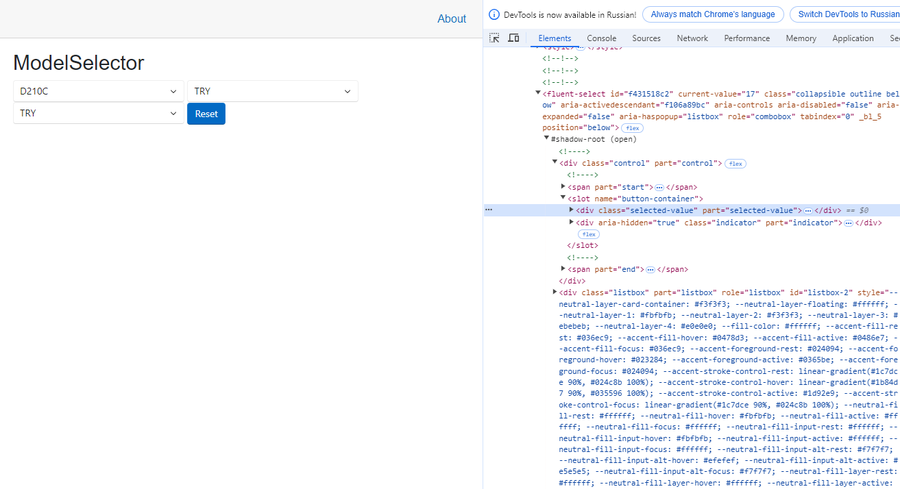
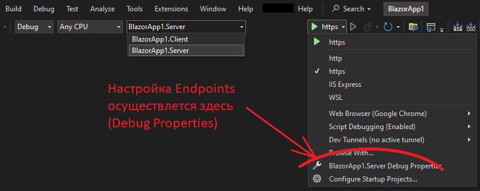

# Разработка web-приложений с использованием Blazor

При разработке Front-End часто используется принцип, называемый **Separation of Concerns**. В соответствии с этим принципом, структура данных описывается посредством HTML, стилистическое оформление определяется каскадными таблицами **CSS**, а динамическое поведение определяет JavaScript-код.

Однако на практике такого разделения не достаточно для того, чтобы обеспечить простое и быстрое сопровождение web-приложения. Каждую из частей (HTML, CSS и код) желательно разбить на отдельные компоненты, каждый из которых решает простую, изолированную и легко верифицируемую задачу.

Внедрение компонентной модели является решением проблемы управляемости разработкой web-приложения. Компонентная модель используется, в частности, в React, Angular, Vue.js и Svelte.

Однако, использование перечисленных выше библиотек и framework-ов не только решает, но и создаёт множество проблем:

- необходимо умело использовать объектную модель и хорошо знать особенности конкретной библиотеки (например, хуки в React)
- могут возникать утечки памяти из-за замыканий (closures) и блокировка объектов при подписке на события
- JavaScript не самый простой язык программирования, а его Runtime не самый быстрый
- оптимизация рендеринга это весьма сложный и дорогостоящий процесс
- для разработки web-приложения нужны три специалиста: дизайнер (HTML верстка+CSS), JavaScript-разработчик для Front-а и Backend-разработчик

Появление Blazor, потенциально, решает значительную часть проблем:

- зрелый, хорошо спроектированный язык программирования (C\#)
- язык является универсальным и позволяет использовать одни и те же библиотека в разных средах: сервера, клиентский web-код, мобильные приложения, и т.д.
- мощный и функциональный Runtime
- общие модели и общую логику можно использовать как в клиенте, так и на сервере
- .NET Core выполняет приложения с высокой скоростью
- в случае Blazor, JavaScript-разработчик для Front-а не нужен, остаётся потребность только в дизайнере и разработчике на C\#, котрый совмещает работу и с Frontend, и с Backend
- стартовый setting простой и понятный. Начальный этап использования технологии - комфортный

Однако существуют риски, связанные с использованием Blazor:

- наборы свободно доступных компонентов Blazor могут быть существенно более унылыми, чем, например, наборы компонентов для React
- Hot Reload в клиентской части Blazor ближе всего к "не работоспособен"
- используемый подход мешает полноценному использованию таких мощных и надёжных библиотек, как [DataTables.NET](https://datatables.net/)
- Deployment приложения сложнее, чем для приложений ASP.NET Core 8. На практике возникали проблемы с поддержкой AOT, лишная зависимость приводила к зависанию в "Loading" без адекватной отладочной информации, были проблемы с сериализацией кода
- прозводительность может быть низкой, т.к. компоненты используют JSRuntime и компоненты-обёртки, что увеличивает вычислительные затраты на передачу данных
- в случае, если избежать необходимости использования JSRuntime в прикладном коде не удаётся, код становится сильно хуже читаемым
- при использовании JSRuntime можно попасть в pitfall, когда одна и таже функция будет определяться многократно, если этот код определён через `<script>` непосредственно в верстке. Это означает, что если нужен JavaScript-код, то его следует выносить в отдельные js-файлы
- модель Server-Side Blazor совмещает удобство для программиста доступа к базе данных и отзывчивость пользовательского интерфейса, но ценой кратного роста нагрузки на сервера с плохой горизонтальной масштабируемостью
- в случае, если необходимо использовать не стандартное поведение органов управления, очень высока вероятность, что придётся писать много Custom-компонентов (даже не Custom-поведения компонентов). Например, FluentSelect не присылает событие OnSelectionChanged, если пользователь click-ает на уже выбранном элементе повторно
- Наборы компонентов прячут почти всё в ShadowDOM, что очень сильно мешает сделать две вещи: реализовывать собственные стили пользовательского интерфейса (приходится лезть в чужой ShadowDOM) и разрабатывать тесты автоматизированного тестирования (например, используя Selenium/WebKit/Puppeteer)
- ChatGPT 4 не очень дружен с Blazor, который для него "ещё слишком молодой". Проявляется это в том, что при попытке получить от ChatGPT рекомендацию по устранению ошибки в работе Blazor-приложения, ChatGPT предлагает решения, в которых доминирует использование JSRuntime, критически снижающий производительность и сильно ухудшающий читаемость кода
- в 2025 году в команде Blazor в Microsoft работало всего 6 инженеров. Сообщество разработчиков ASP.NET Core составляет 1300 человек, из которых Blazor занимается, в лучшем случае - 20. Т.е. с точки зрения инженерного потенциала у Blazor всё очень плохо
- по сути, в Blazor нет **state management** библиотек. В браузере есть singleton, а на сервере - база данных, но это не то же самое, что state management

>Следует также обратить внимание на особенности FluentUI - очень много элементов пользовательского интерфейса размещены в #shadowroot, что сильно осложняет управление стилистическим оформлением пользовательского интерфейса. В общем случае, если требуется разработать front-end со сложным поведением, FluentUI может быть не лучшим выбором. Ниже приведён пример DOM:
>
> 
>
>В приведённом выше примере можно увидеть, что в `#shadow-root` определено много span-ов и div-ов, а также некоторое к классов. Для доступа к элементам теневого DOM нельзя использовать обычные селекторы, такие как `querySelector()`. Обычно для модификации стилей теневого элемента необходимо найти имя этого стиля, например, оно может быть указано в значении атрибута _pseudo_ (под `#shadow-root`). Устанавливаемое значение указывается в CSS, например: `input::-webkit-slider-runnable-track { background: red; }`. Именно использование `#shadow-root` усложняет стилистическое оформление web-приложения, т.к. смысл применения Shadow DOM - инкапсуляция (изоляция, сокрытие) стилей и поведения.
>
>Тотальное использование shadow root создаёт сильные проблемы при разработке системы автоматизированного тестирования. Так, например, разработка скриптов на Selenium/WebKit для приложений с FluentUI - огромная боль, дорого и долго.
>
>Так же следует обратить внимание на серьёзные проблемы с работой продуктовой команды. В качестве примера, имеем смысл рассмотреть [замечание пользователя](https://github.com/microsoft/fluentui-blazor/issues/2731) по FluentTabs, которое было закрыто с формулировкой dvoituron: "_Because we don't have enough time to document and think about all this 😀. We're trying to improve, and v5 of the library will be even better_".
>
>Как условный вариант решения проблемы - там, где FluentUI мешает работе, использовать собственные компоненты, даже если они дублируют функционал компонентов библиотеки FluentUI.

Однако следует отметить и сильные стороны FluentUI:

- Существует Fluent UI React, адаптация [библиотеки для React](https://react.fluentui.dev/). Исходные тексты [находятся на GitHub](https://github.com/microsoft/fluentui)
- Библиотека используется [в приложениях Microsoft](https://github.com/microsoft/fluentui/blob/master/README.md): Microsoft 365, Office и Edge. Следует заметить, что проекты [Fluent UI](https://github.com/microsoft/fluentui) и [Fluent UI Blazor](https://github.com/microsoft/fluentui-blazor) отличаются на два порядка. Количество tag-ов в первом - 30210, а во втором - 102.

В качестве альтернативы можно рассматривать библиотеку [MudBlazor](https://mudblazor.com/), базирующуюся на идеях MaterialUI. В отличие от FluentUI, в MudBlazor в Shadow DOM почти ничего нет и кастомизировать внешний вид приложения достаточно легко. Набор органов управления очень большой и большая часть из них анимирована. Кроме этого MudBlazor похож на MaterialUI, что значительно снижает порог вхождения у тех разработчиков, которые использовали MaterialUI вместе с React.

Ещё одна популярная и мощная библиотека - [Radzen Blazor Components](https://blazor.radzen.com/?theme=material3). Библиотека используется такими корпорациями, как: Microsoft, Porshe, NASA, Dell, Siemens, и т.д.

Другие библиотеки:

- [Blazorise](https://blazorise.com/)
- [Blazm](https://github.com/EngstromJimmy/Blazm.Components) - библиотека от автора книг о Blazor - _Jimmy Engström_. Ключевая особенность - реализация Grid-а
- Progress Telerik (компания поддерживает санкционное давление на Россию)
- DevExpress (компания поддерживает санкционное давление на Россию)
- Syncfusion (компания поддерживает санкционное давление на Россию)

Заметим, что и другие инструменты идут по пути трансляции в Wasm для работы в браузерах. В этом направлении движется [Kotlin/Wasm](https://kotlinlang.org/docs/wasm-overview.html) и [Rust/Wasm](https://rustwasm.github.io/book/).

>В марте 2025 года складывается впечатление, что для Blazor существует достаточно узкая ниша - относительно небольшие корпоративные приложения, работающие в модели Blazor Server. Ключевые характеристики: низкая стоимость разработки, поскольку можно не разрабатывать и не нужно управлять API, требования к пользовательскому интерфейсу - минималистичные. Т.е. Blazor Server с FluentUI - это инструмент корпоративного Backend-разработчика, который может сделать быстрое, красивенькое приложение быстро. В определённом смысле, можно проводить перспективы с ASP.NET 2.0, который также сильно упрощал работу эксперту по базам данных, минимизируя работы с frontend-ом и backend-ом.

## Blazor-приложения в промышленной эксплуатации

По словам Jimmy Engström в Швеции эксплуатируются десятки промышленных Blazor-приложений. Доминирующая hosting model - Blazor Server. Основная причина - можно не разрабатывать API и это значительно ускоряет разработку приложения. Однако масштабируемость Blazor Server приложения - это боль и модель не очень подходит для приложений с миллионами пользователей. Критичным для работы Blazor-приложений являются характеристики сети: полоса пропускания и латентность.

**Jimmy Engström**: главный враг Blazor-приложений - это кнопка F5. Чтобы пользователи не запускали загрузку всего приложений когда им кажется, что приложение сломалось, добавить в верстку своего приложения кнопку "Обновить", по которой будут перезагружаться данные, но не будет перезагружаться приложение.

## Обратить внимание - кэширование запросов через HttpClient

На практике мы столкнулись с тем, что корпоративный proxy кэширует http-пакеты, которыми обмениваются Blazor-клиент с сервером. Как результат - данные являются не достоверными и работоспособность системы в целом нарушается. Рекомендуется для ознакомления статья [Bypass HTTP browser cache when using HttpClient in Blazor WebAssembly](https://www.meziantou.net/bypass-browser-cache-using-httpclient-in-blazor-webassembly.htm) by Gérald Barré.

Заметим, что [Cache-Control](https://developer.mozilla.org/en-US/docs/Web/HTTP/Headers/Cache-Control) это директива, которая используется как в запросе, так и ответе на http-запрос. Эта директива контролирует кэширование как в браузере, так и в _shared caches_, к которым относятся proxies и CDNs. Некоторые директивы могут содержать дополнительные параметры (указываются через знак равно), также может быть указано несколько параметров (перечисляются через запятую). Например: `Cache-control: max-age=180, public`

Обычно браузер (именно он отвечает за сетевое взаимодействие при выполнении http-запросов в Blazor) анализирует значение поля Cache-Control в ответе сервера и принимает решение о том, следует ли кэшировать полученные данные. Некоторые люди (например, разработчики ПроАТМ) подмешивают в URL некоторые случайные значения для того, чтобы гарантировать, что данные не будут закэшированы, но более правильным является управление кэшем посредством директивы `Cache-Control`.

Blazor WebAssemble позволяет управлять значением директивы, когда выполняет соответствующий запрос. Например, можно запретить использовать cache:

```csharp
using var httpClient = new HttpClient();
using var request = new HttpRequestMessage(HttpMethod.Get, "https://www.meziantou.net");
request.SetBrowserRequestCache(BrowserRequestCache.NoCache);
using var response = await httpClient.SendAsync(request);
```

В статье Gérald Barré приведён пример кода, который выполняет три запроса последовательно: первый кэширует данные, второй получает данные из кэша, а третий - игнорирует cache. Для анализа поведения используется "F12 Developer Console" браузера. То, что данные взяты из cache видно по значению поля "Size" в закладке "Network", которое содержит значение "(disk cache)", если ответ был взят из кэша. Это пример иллюстрирует, что браузер обрабатывает Cache-Control, хотя не даёт никакой информации о том, как себя будет вести корпоративный прокси.

В статье также приводится пример кода, который позволяет устанавливать настройку параметра Cache-Control для всех запросов, а не только для какого-то конкретного. См. HttpMessageHandler.

В случае использования https подобных проблем возникать не должно, т.к. proxy не сможет кэшировать шифрованный трафик.

## Создание первого приложения (в действительности - первых приложений)

Инструкция базируется на [статье на сайте Microsoft.NET](https://dotnet.microsoft.com/en-us/learn/aspnet/blazor-tutorial/create).

Для генерации boilerplate-кода можно использовать шаблоны приложений, встроенные в Visual Studio.

Ключевыми шаблонами являются **Blazor Web App** и **Blazor Web Assembly Standalone App**.

Разные типы Blazor также известны как **hosting models**. Этот термин является устоявшимся.

Шаблон **Blazor Web App** реализует парадигму в которой рендеринг страниц осуществляется на сервере. При возникновении каких-либо событий на странице они пересылаются на сервер посредством библиотеки SignalR (WebSockets). При обработке событий, сервер генерирует обновления DOM и передаёт их клиенту. Этот вариант требует широкополосной сети с низкой латентностью и ощутимо нагружает сервер. Тем не менее, этот вариант близок к традиционным web-приложениям, и при разработке можно использовать доступ к данным (EntityFramework) прямо в разметке. Вся логика для взаимодействия с клиентом находится в файле "blazor.web.js".

Резюмируя пункты за Blazor Server:

- Минимальное время запуска в браузере
- Безопасность кода (он работает на сервере)
- Не нужно никаких API
- Отличная поддержка браузерами
- Доступ ко множеству сервисов сервера, включая базы данных "из коробки"

Минусы Blazor Server:

- Необходимо постоянное сетевое соединение
- Нет опции "Offline"
- Большая латентность, т.к. постоянно нужно пересылать данные между клиентом и сервером
- Большая нагрузка на сервер (в частности, требуется значительно больше ОЗУ для работы)
- Требует установки на сервер ASP.NET Core
- Очень сложно масштабировать решение в случае если приложение используют миллионы пользователей

Шаблон **Blazor Web Assembly Standalone App** предполагает, что при запросе ресурса будет загружен скрипт "_framework/blazor.webassembly.js", который установит .NET Core (при необходимости), скачает клиентское .NET-приложение и запустит его в песочнице браузера. Слова WebAssembly в названии шаблона означают, что .NET Core приложение взаимодействует с DOM браузера через песочницу WebAssembly. При первом запуске скачивается приблизительно 7-20 Мб на .NET Core и standalone-приложения и все компоненты кэшируются. Основное достоинство подхода состоит именно в использовании .NET Core: приложение работает быстро, есть многопоточность, богатый Runtime. Однако, в этом случае потребуется взаимодействие с web-сервером по https с использованием API. Соответственно, разработка разделяется на две части: клиентскую и серверную. Однако, в данном подходе приложение может работать и без доступа в интернет, т.е. абсолютно автономно. В определённом смысле этот подход похож на Electon.

Резюмируя пункты за Blazor Web Assembly:

- PWA
- Очень высокая производительность вычислений в браузере
- Меньше нагрузка на сервер, чем при использовании Blazor Server
- AOT-компиляция

Минусы Blazor Web Assembly:

- Программный код из DLL легко перехватить и дезасемблировать
- Нужно дополнительно разрабатывать API
- Large footprint (требует много памяти, загружает большие файлы, и т.д.)
- Относительно долгая загрузка (кэширование частично решает эту проблему)

Понять, какая _hosting model_ используется можно по инициализации приложения в "Program.cs". Следующий код указывает на **Server-Side Blazor**:

```csharp
builder.Services
    .AddRazorPages()
    .AddServerSideBlazor();
```

А код инициализации приложения **Standalone App** выглядит приблизительно так:

```csharp
var builder = WebAssemblyHostBuilder.CreateDefault(args);
builder.RootComponents.Add<App>("#app");
builder.RootComponents.Add<HeadOutlet>("head::after");

builder.Services
    .AddScoped(sp => new HttpClient { BaseAddress = new Uri(builder.HostEnvironment.BaseAddress) })
    .AddFluentUIComponents();

await builder.Build().RunAsync();
```

Следует заметить, что языком разметки для обоих режимов работы является **Razor** (как и для ASP.NET Core). В чём разница в поведении между Razor и Blazor? Razor в ASP.NET Core применяется только при генерации страницы, тогда как Blazor работает на протяжении всего времени жизни страницы, обрабатывая события и управляя разметкой.

> Также следует сказать, что возможно и другие варианты использования Blazor, например, можно использовать Client Side-Blazor и взаимодействовать через API с Backend-ом на другом языке программирования. Однако такой вариант уничтожает преимущество использование C\# и на Frontend, и на Backend. Еще один вариант использование Blazor - разработка PWA приложений. 

В действительности, нет какого-то одного наилучшего типа Blazor-приложения, выбор необходимо осуществлять исходя из стоящей перед разработчиком задачи. Дополнительно о выборе типа Blazor-приложения можно почитать в книге "Exploring Blazor: Creating Server-side and Client-side Applications in .NET 7. 2nd Edition" by _Taurius Litvinavicius_.

Различия двух Blazor _hosting models_:


> Чуть более глубоко объяснить разницу между hostimgs models можно через подобие. Существует две больших группы программного кода. Одна группа всегда работает в браузере - это интеграционный слой "Blazor.js" и DOM браузера. Вторая группа состоит из: Razor Components, Blazor и Render Tree. Вот эта вторая группа может размещаться как на сервере, так и внутри браузера. В случае Blazor Server - эта группа представляет собой IL-сборки .NET Core; связь этого кода с "Blazor.js" осуществляется посредством SignalR (WebSockets). В случае Blazor WebAssembly - группа представляет собой сборки dotnet.wasm, которые размещаются и работают внутри браузера и обмениваются сообщениями с "Blazor.js" через JS Interop.
>
> В случае использование .NET MAUI всё становится немного сложнее, т.к. за DOM появляются ещё и Native Components, специфические для каждой конкретной операционной системы (macOS, Android, iOS, Tizen).

При генерации кода проекта любого из шаблонов, рекомендуется в форме "Additional Information" убрать кнопку "Do not use top-level statements".

> Если заранее подготовиться, то переход из одной модели в другую можно выполнить очень быстро. Подробно процесс описан в книге Mark J. Price "C\# 10 and .NET 6. Modern Cross-Platform Development" в главе 17. Ключевое требование - доступ к базе данных должен осуществляться не на прямую (через DbContext), а через специализированные сервис. В приложении Blazor Web Assembly этот сервис будет обращаться к серверу по https для получения данных. В приложении Blazor Web App этот сервис будет напрямую работать с DbContext.

В случае использования Visual Studio Code, сгенерировать проекты по шаблону можно консольными командами.

Начать следует с поиска подходящего шаблона в репозитарии NuGet:

```shell
dotnet new blazor --search
```

Из нескольких десятков вариантов следует выбрать подходящий и загрузить его. Пример:

```shell
dotnet new install blazorbootstrap-wasm-net6 -f net6.0
```

Сгенерировать шаблон можно командой:

```shell
dotnet new blazorbootstrap-wasm-net6 -o BlazorApp
```

Загрузить зависимости можно командой:

```shell
dotnet restore
```

Запустить приложение в режиме hot-update можно командой:

```shell
dotnet watch run
```

При запуске приложение может выдать, например, вот такой текст:

```shell
developer@developer-HP-ENVY-15-Notebook-PC:~/projects/MyNewBlazorApp$ dotnet run
Building...
info: Microsoft.Hosting.Lifetime[14]
      Now listening on: https://localhost:7194
info: Microsoft.Hosting.Lifetime[14]
      Now listening on: http://localhost:5114
```

Соответственно, далее следует открыть браузер и перейти по локальной ссылке: `http://localhost:5114`

## Blazor Web App

Стоит заметить, что [Blazor Server не загружает Microsoft.NET](https://learn.microsoft.com/en-us/aspnet/core/blazor/hosting-models?view=aspnetcore-8.0) и может работать с браузерами, не поддерживающими Web Assembly. Однако, в этом варианте значительно повышается латентность системы, т.к. любое изменение на клиенте транслируется на сервер и выполняет (частичный?) рендеринг страницы.

В соответствии с шаблоном генерируется Server-Side приложение на ASP.NET Core - файл "Program.cs". В этом файле запускается ряд сервисов, включая web-сервер для статических файлов, AntiForgery и включается mapping Blazor-компонентов. Это типовой код ASP.NET Core:

```csharp
using BlazorBootstrapApp.Components;

var builder = WebApplication.CreateBuilder(args);
builder.Services.AddRazorComponents()   // Add services to the container.
    .AddInteractiveServerComponents();

var app = builder.Build();

// Configure the HTTP request pipeline.
if (!app.Environment.IsDevelopment()) {
    app.UseExceptionHandler("/Error", createScopeForErrors: true);
    app.UseHsts();
}

app.UseHttpsRedirection();

app.UseStaticFiles();
app.UseAntiforgery();

app.MapRazorComponents<App>().AddInteractiveServerRenderMode();

app.Run();
```

В папке "Components" будет доступно несколько razor-pages (server-side). В частности, страница App.razor загружает стили (включая bootstrap) и ключевой скрипт управления web-приложением "blazor.web.js":

```js
<body>
    <Routes />
    <script src="_framework/blazor.web.js"></script>
</body>
```

При верстка используется Razor-синтаксис:

```html
<tbody>
    @foreach (var forecast in forecasts)
    {
        <tr>
            <td>@forecast.Date.ToShortDateString()</td>
            <td>@forecast.TemperatureC</td>
            <td>@forecast.TemperatureF</td>
            <td>@forecast.Summary</td>
        </tr>
    }
</tbody>
```

В разделе `@code` размещается код на C#, который содержит callback-методы, вызываемые framework-ом:

```csharp
@code {
    private WeatherForecast[]? forecasts;

    protected override async Task OnInitializedAsync()
    {
        await Task.Delay(500);  // Simulate asynchronous loading to demonstrate streaming rendering

        var startDate = DateOnly.FromDateTime(DateTime.Now);
        var summaries = new[] { "Freezing", "Bracing", "Chilly", "Cool", "Mild", "Warm", "Balmy", "Hot", "Sweltering", "Scorching" };
        forecasts = Enumerable.Range(1, 5).Select(index => new WeatherForecast
        {
            Date = startDate.AddDays(index),
            TemperatureC = Random.Shared.Next(-20, 55),
            Summary = summaries[Random.Shared.Next(summaries.Length)]
        }).ToArray();
    }
...
```

Файл "Routes.razor" содержит тэги для запуска навигационной системы с использованием Blazor Web Assembly:

```js
<Router AppAssembly="@typeof(Program).Assembly">
    <Found Context="routeData">
        <RouteView RouteData="@routeData" DefaultLayout="@typeof(Layout.MainLayout)" />
        <FocusOnNavigate RouteData="@routeData" Selector="h1" />
    </Found>
</Router>
```

Так же в папке "Components" есть две подпапки: "Layout" и "Pages". Подпапка "Layout" содержит разметку основной формы (MainLayout.razor) и навигационную панель (NavMenu.razor). В подпапке "Pages" находится реализация страниц, по которым можно переходить посредством навигационной системы Blazor.

Типовой пример страницы:

```csharp
@page "/counter"
@rendermode InteractiveServer

<PageTitle>Counter</PageTitle>

<h1>Counter</h1>

<p role="status">Current count: @currentCount</p>

<button class="btn btn-primary" @onclick="IncrementCount">Click me</button>

@code {
    private int currentCount = 0;

    private void IncrementCount()
    {
        currentCount++;
    }
}
```

Можно увидеть, что в файле есть часть, содержащая код (`@code{}`) и часть, содержащая верстку. Макросы @page и @rendermode определяют идентификатор страницы для использования в навигационной системе и режим работы - InteractiveServer.

В случае использования server-side rendering, при возникновении событий на стороне клиента, они транслируются на сервер посредством библиотеки SignalR (WebSockets). В общем случае, обмен данными быстрый, но в информационных системах с ограничением количества одновременно открытых соединений и высокой латентностью сети, Blazor-приложения могут испытывать серьёзные проблемы.

Следует сразу заметить, что при использовании профиля "https", современные версии Chrome не дадут запустить его без доверенного сертификата. В этом варианте основным браузером для разработки приложения станет Microsoft Edge. Однако, если запустить приложение из под профила "http", то Chrome не будет блокировать работу приложения на localhost.

## Добавить ещё одну кнопку и обработчик

Предположим, что нам нужно добавить ещё одну кнопку на форму "Counter" (приведённую выше). Для этого мы оперделяем кнопку в верстке:

```html
<button class="btn btn-primary" @onclick="DecrementCount">Decrement</button>
```

Обработчик нажатия на кнопку будет называться DecrementCount и выглядеть в коде он будет так:

```csharp
@code {
    private void DecrementCount()
    {
        currentCount--;
    }
}
```

### Обработка событий DOM в Blazor

Большинство событий, обрабатываемых в коде на C# имеют такое же имя, как и в JavaScript-коде, но начинаются с символа @, например: `@onkeydown`, `@onclick` или `@onfocus`.

Обработчик события @onclick может выглядеть следующим образом:

```csharp
private void IncrementCount(MouseEventArgs e)
{
    if (e.CtrlKey) // Ctrl key pressed as well
    {
        currentCount += 5;
    }
    else
    {
        currentCount++;
    }
}
```

Для разных событий, входной параметр в обработчике будет иметь разный тип: MouseEventArgs, KeyboardEventArgs, и т.д.

В приложении Blazor можно обрабатывать события как в C#, так и в JavaScript-коде.

Blazor позволяет осуществлять асинхронную обработку событий, например:

```csharp
<button @onclick="DoWork">Run time-consuming operation</button>

@code {
    private async Task DoWork()
    {
        // Call a method that takes a long time to run and free the current thread
        var data = await timeConsumingOperation();

        // Omitted for brevity
    }
}
```

Также следует заметить, что Blazor поддерживает лямбда-выражения:

```csharp
@page "/counter"

<h1>Counter</h1>
<p>Current count: @currentCount</p>

<button class="btn btn-primary" @onclick="() => currentCount++">Click me</button>

@code {
    private int currentCount = 0;
}
```

Блокировать default-ную обработку событий JavaScript можно используя **preventDefault** и **stopPropagation**:

```csharp
<input value=@data @onkeypress="ProcessKeyPress" @onkeypress:preventDefault />
```

## Вызов Callback-метода родительского компонента

Реклмендуется [ознакомиться со статьёй](https://learn.microsoft.com/ru-ru/training/modules/blazor-improve-how-forms-work/2-attach-csharp-code-dom-events-blazor-event-handlers).

В дочернем компонент определяем параметр, в качестве которого используется шаблон класса EventCallback, со специализацией подходящим нам типом:

```csharp
@* TextDisplay component *@
@using WebApplication.Data;

<p>Enter text:</p>
<input @onkeypress="HandleKeyPress" value="@data" />

@code {
    [Parameter]
    public EventCallback<KeyTransformation> OnKeyPressCallback { get; set; }

    private string data;

    private async Task HandleKeyPress(KeyboardEventArgs e)
    {
        KeyTransformation t = new KeyTransformation() { Key = e.Key };
        await OnKeyPressCallback.InvokeAsync(t);
        data += t.TransformedKey;
    }
}
```

Тип специализации может быть произвольным, например:

```csharp
namespace WebApplication.Data
{
    public class KeyTransformation
    {
        public string Key { get; set; }
        public string TransformedKey { get; set; }
    }
}
```

В родительском классе Callback указывается так:

```csharp
@page "/texttransformer"
@using WebApplication.Data;

<h1>Text Transformer - Parent</h1>

<TextDisplay OnKeypressCallback="@TransformText" />

@code {
    private void TransformText(KeyTransformation k)
    {
        k.TransformedKey = k.Key.ToUpper();
    }
}
```

## Blazor Web Assembly Standalone App

К сожалению, интернет полон поверхностных и вводящих в заблуждение статей о технологии Blazor. Например, в статье [Введение в Blazor с сайта Метанит](https://metanit.com/sharp/blazor/1.1.php), указывается, что _web assembly_ используется только для загрузки .NET и необходимых сборок.

Однако, в статье [A deeper understanding of Blazor and WebAssembly](https://www.azenix.com.au/blog/a-deeper-understanding-of-blazor-and-webassembly) by Mariekie Coetzee говориться о том, что Blazor компилирует сборки в **Wasm** и после загрузки его в браузер исполняет посредством Mono. **Mono Runtime** - это среда исполнения .NET, включающая:

- компилятор C#
- Mono Runtime, реализующий **ECMA Common languages infrastructure**. Содержит: Just-in-Time(JIT) compiler,  Ahead of Time (AOT) compiler, загрузчик, сборщик мусора, многопоточность и interoperability
- .NET framework Class Library
- Mono Class Library

Разработка Mono велась **Miguel de Icaza** в компании **Xamarin**, которая была куплена Microsoft в 2016 году.

Начиная с .NET Core 5 Mono стала частью платформы.

Blazor поддерживает Ahead-of-Time (AOT) компиляцию, т.е. транслирует сборки .NET в бинарный код WebAssembly, что означает, что клиентская машина (браузер) исполняет WebAssembly-код. Если AOT не разрешён, что Blazor запускает приложение в режиме интерпретации, что приводит к значительному замедлению кода. Интерпретатор IL является WebAssembly.

Главные недостатки AOT состоят в том, что:

- скомпилированные приложения весят больше, чем интерпретируемая IL-сборка. Обычно разница составляет два раза, но может достигать и 10 раз
- время компиляции в WebAssembly очень большое. Крупные проекты могут собираться десятки секунд
- время запуска приложения может быть хуже, чем если AOT не использовать

Для сборки приложения в режиме AOT требуется установить дополнительный инструментарий:

```csharp
dotnet workload install wasm-tools
```

Также в файле с описанием проекта (csproj), в разделе PropertyGroup, необходимо добавить специальный флаг:

```csharp
<PropertyGroup>
    <RunAOTCompilation>true</RunAOTCompilation>
</PropertyGroup>
```

Собрать приложение в Release-режиме можно командой:

```shell
dotnet publish -c Release
```

При использовании режима AOT компиляция может быть неуспешной. Вероятная причина - отсутствие интеграционных компонентов, которые описаны с статье [Ahead-of-Time компиляция и Blazor](https://habr.com/ru/articles/548132/) by Яков Лило. Приблизительно всё это выглядит так:

```csharp
dotnet tool install -g dotnet-install-blazoraot
dotnet install-blazoraot
```

Уникальные свойства Blazor Web Assembly:

- Загруженное приложение может в дальнейшем работать без подключения к Интернет
- Компилятор .NET может скомпилировать код в wasm, который затем, на клиентской машине, может быть скомпилирован в _native code_, что потенциально даёт очень высокую производительность
- Можно использовать _packages_, разработанные на C#, которых доступно очень много

Существенный (но не критичный) недостаток связан только с тем, что при первой загрузке приложения необходимо загрузить Runtime и зависимости. Однако, размер загружаемого кода (при должной оптимизации) относительно не велик.

### Дополнительная информация о Blazor

Заметим, что в приложении сгенерированном по шаблону Blazor Web Assembly Standalone App нет явно выделенного серверного кода. В примере загружается статический JSON-файл, т.е. проект, по всей видимости, работает как статический web-сайт, на котором хранятся dll-сборки и статические файлы.

Ориентировочно, базовый [размер загрузки приложения .NET - 6.72 Мб](https://www.reddit.com/r/Blazor/comments/kx8a17/whats_the_size_of_mb_downloaded_by_the_browser/). Такой размер достигается благодаря использованию trimmer-а - приложения, которое исключает из состава приложения не нужные ему зависимости. Т.е. чем больше у приложения зависимостей, тем больший объём данных оно будет скачивать с сервера. Следует заметить, что trimmer [не всегда может срабатывать корректно](https://learn.microsoft.com/en-us/aspnet/core/blazor/host-and-deploy/configure-trimmer?view=aspnetcore-6.0) - он не учитывает случаев использования Reflection и динамические типы. В этом случае, необходимо давать подсказки триммеру, как в сборке, так и в самом проекте. Рекомендуется ознакомиться с видео [Introducing Blazor: Razor Components | ASP.NET Core 101 - 10 of 13](https://www.youtube.com/watch?v=R23v4lgHYQI&ab_channel=dotnet).

В случае запуска приложения в браузере Microsoft Edge, в Developer Console F12 будет выведена приблизительно следующая информация:

```output
assetsCache.ts:30 
dotnet Loaded 22.51 MB resources 
This application was built with linking (tree shaking) disabled. Published applications will be significantly smaller if you install wasm-tools workload. See also https://aka.ms/dotnet-wasm-features
```

Если в Developer Console F12 на закладке "Console" раскрыть пункт "**dotnet** Loaded xx.xx Mb resources", то появится список загруженных компонентов. При первой загрузке это будут dll-файлы, в потом, извлечённые из cache это будут уже скомпилированные wasm-файлы. Очень легко заметить, что имена файлов (без расширений) будут на 100% одинаковыми. Однако, в дальнейшем мне не удалось получить ссылки на wasm-файлы - возможно, это работает только в Release-версии.

[По ссылке](https://aka.ms/dotnet-wasm-features) можно ознакомиться с документом, описывающим способы уменьшить размер package для загрузки в браузер.

Замеры трафика приложений из коллекции [Grid.Blazor](https://github.com/gustavnavar/Grid.Blazor) позволяют утверждать, что для реального приложения объём - 20 Мб.

Важным следствием применения триммера является тот факт, что каждое приложение загружает необходимые ему packages и runtime.

Также рекомендуется ознакомиться с обсуждением на [Blazor wasm size and load time is the worst and biggest problem ever and should be the #1 priority](https://github.com/dotnet/aspnetcore/issues/41909).

### Типовой код приложения Blazor Web Assembly

Вот как выглядит Program.cs в шаблоне **Blazor Web Assembly Standalone App**:

```csharp
using BlazorAppStandalone;
using Microsoft.AspNetCore.Components.Web;
using Microsoft.AspNetCore.Components.WebAssembly.Hosting;

var builder = WebAssemblyHostBuilder.CreateDefault(args);
builder.RootComponents.Add<App>("#app");
builder.RootComponents.Add<HeadOutlet>("head::after");

builder.Services.AddScoped(sp => new HttpClient { BaseAddress = new Uri(builder.HostEnvironment.BaseAddress) });

await builder.Build().RunAsync();
```

Формируется структура документа (на браузере), осуществляется внедрение зависимости (HttpClient), а затем WebAssemblyHostBuilder собирает сборку и запускает её.

Заметим, что _HTTPClient implementation is a wrapper around the browser's Fetch API_.

Внедрение зависимостей имеет ключевое значение - благодаря этому подходу мы можем обращаться к web-серверу с любой страницы вот так:

```csharp
@page "/weather"
@inject HttpClient Http

<PageTitle>Weather</PageTitle>
...
@code {
    private WeatherForecast[]? forecasts;

    protected override async Task OnInitializedAsync()
    {
        forecasts = await Http.GetFromJsonAsync<WeatherForecast[]>("sample-data/weather.json");
    }
...
```

В приведённом выше примере используется директива @inject, которая указывает, что здесь используется сервис HttpClient, синонимом для которого является Http: `@inject HttpClient Http`. Внедрить можно вообще любой класс, но такой класс должен быть зарегистрирован как сервис с указанием модели (Singleton, Scoped, и т.д.).

Основная html-разметка находится в файле "wwwroot/index.html". В этом файле есть небольшой кусочек верстки:

```html
<div id="app">
    <svg class="loading-progress">
        <circle r="40%" cx="50%" cy="50%" />
        <circle r="40%" cx="50%" cy="50%" />
    </svg>
    <div class="loading-progress-text"></div>
</div>
```

Стартовый код Blazor найдёт элемент с идентификатором "app" и, когда необходимые зависимости загрузятся, заменим контент на верстку из файла "App.razor". Файл "App.razor" имеет особое значение - это корневой компонент и через него обычно выполняется аутентификация пользователей.

Файл "MainLayout.razor" содержит основную разметку страницы, в которой определена навигационная панель (NavMenu) и блок с пользовательским контентом (@Body). [Свойство @Body](https://learn.microsoft.com/ru-ru/aspnet/core/blazor/components/layouts?view=aspnetcore-8.0) определяемое в базовом классе [LayoutComponentBase](https://learn.microsoft.com/ru-ru/dotnet/api/microsoft.aspnetcore.components.layoutcomponentbase?view=aspnetcore-8.0) возвращает содержимое, отображаемое внутри макета. Допускаю, что реализация компонента NavLink связывает @Body с конкретным активным документом (в базовом приложении: Counter.razor, Home.Razor и Weather.Razor). Навигационный блок выглядит следующим образом:

```csharp
<div class="@NavMenuCssClass nav-scrollable" @onclick="ToggleNavMenu">
    <nav class="flex-column">
        <div class="nav-item px-3">
            <NavLink class="nav-link" href="" Match="NavLinkMatch.All">
                <span class="bi bi-house-door-fill-nav-menu" aria-hidden="true"></span> Home
            </NavLink>
        </div>
        <div class="nav-item px-3">
            <NavLink class="nav-link" href="counter">
                <span class="bi bi-plus-square-fill-nav-menu" aria-hidden="true"></span> Counter
            </NavLink>
        </div>
        <div class="nav-item px-3">
            <NavLink class="nav-link" href="weather">
                <span class="bi bi-list-nested-nav-menu" aria-hidden="true"></span> Weather
            </NavLink>
        </div>
    </nav>
</div>
```

## Ключевые особенности языка описания страниц

Файлы с расширение "razor" определяют компоненты. В начале .razor-файла находится директива @page, определяющая маршрут компонента. Обычно, компоненты размещаются в папке /Components/\[папка\].

Если мы хотим добавить у компонента публичное свойство, то мы должны использовать атрибут [Parameter] в секции `@code`:

```csharp
@code {
    [Parameter]
    public string? UserName { get; set; }
```

Чтобы привязать значение элемента управления HTML к переменной C#, следует использовать `@bind()`:

```html
@page "/bind"

<p>
    <input @bind="inputValue" />
</p>
<ul>
    <li><code>inputValue</code>: @inputValue</li>
</ul>

@code {
    private string? inputValue;
}
```

Привязка является двухсторонней и успешно работает с такими DOM-объектами, как input, select и textbox. Примеры binding-а:

```html
<input type="checkbox" @bind="@textbox">
<input @bind="@textstring">
<textarea @bind="@textstring"></textarea>
```

NavLink - это особенный компонент Blazor, который базируется на NavigationManager и анализирует ссылку перехода. Если ссылка соответствует правилам оформления внутреннего перехода, то выполняется не загрузка по внешней ссылке, а локальный переход по локальному маршруту.

Рекомендуется ознакомиться с микро-курсами по Blazor на сайте [Microsoft Learn](https://learn.microsoft.com/).

Директива `@bind` является интеллектуальной и в зависимости от конкретного типа input-объекта, привязка будет осуществлена к корректному типу данных. По умолчанию, элемент управления привязан к событию DOM **onchange**, но иногда требуется привязка к другим типам событий. Добавить привязку к событию `oninput` можно используя директиву `@bind-value`, а для того, чтобы выполнить привязку к произвольному событию, используется директива `@bind-value:event` (сокращённый вариант - `@bind:event`). Например:

```csharp
@page "/"

<h1>My favorite pizza is: @favPizza</h1>
<p>
    Enter your favorite pizza:
    <input @bind-value="favPizza" @bind-value:event="oninput" />
</p>

@code {
    private string favPizza { get; set; } = "Margherita"
}
```

В приведённом выше коде, мы привязываем HTML атрибут **value** (имя конкретного атрибута - всё, что идёт после "@bind-") к переменной в C# коде, с именем favPizza. Соответственно, при изменении переменной favPizza в коде, будет изменяться значение HTML-атрибута с именем "value" в DOM-элементе браузера. При изменении input-а пользователем, будет вызвано событие `onchange` и значение переменной favPizza будет обновлено. Т.е. эта связь является двухсторонней. Т.е. фактически, этот код будет заменён на следующий:

```csharp
<input value="@favPizza" @onchange="@((ChangeEventArgs e) => favPizza = e.Value.ToString())" />
```

Что касается `@bind-value:event` то по умолчанию, для input элементов используется событие `onchange`, которое которое срабатывает, когда элемент ввода теряет фокус. Однако, если мы хотим, чтобы событие вызывалось при вводе каждого символа, без переключения фокуса, мы можем заменить его на `oninput`, так как это сделано в примере выше.

> Мы можем использовать async/await в обработчике события. Для этого нам нужно будет использовать `async ()` в лямбда-функции, а также вызываемая функция должна быть асинхронной.

```csharp
<button onclick="@((args) => )>
```

### Форматирование полей

Для форматирования полей может быть использована директива `@bind:format`, например:

```csharp
@page "/ukbirthdaypizza"

<h1>Order a pizza for your birthday!</h1>
<p>
    Enter your birth date:
    <input @bind="birthdate" @bind:format="dd-MM-yyyy" />
</p>

@code {
    private DateTime birthdate { get; set; } = new(2000, 1, 1);
}
```

В качестве альтернативы форматированию посредством `@bind:format` могут быть [реализованы setter и getter](https://learn.microsoft.com/ru-ru/training/modules/interact-with-data-blazor-web-apps/8-bind-control-data-blazor-applications).

## Fluent UI Blazor components library и другие библиотеки

В 2024 году появился мощный набор готовых компонентов [Fluent UI Blazor components library](https://www.fluentui-blazor.net/). Этот продукт можно расценивать как один из наиболее перспективных и в новых приложениях, в качестве базового набора компонентов, использовать именно его.

Другие библиотеки:

- [Radzen](https://blazor.radzen.com/?theme=material3)
- [Портал open-source библиотек для Blazor](https://awesomeopensource.com/projects/blazor)
- [Blazor.Bootstrap](./blazor_bootstrap.md) by Vicram Reddy

## Встраивание Bootstrap в Blazor-приложение (Standalone)

В сгенерированном по шаблону приложении, в папке /wwwroot/css/bootstrap находится файл "bootstrap.min.css", версии v5.1.0. Там же находится map-файл. Однако, в папке отсутстует js-файл, что не позволяет использовать динамическое поведение Twitter Bootstrap.

Рекомендуется скачать актуальную и полную версию Boostrap с официального [сайта](https://getbootstrap.com/). Файл "bootstrap.bundle.min.js" вместе с соответствующим map-файлом кажется разумным добавить в папку /wwwroot/js/bootstrap. Загрузку js-файла можно добавить в конец "index.html":

```html
<script src="_framework/blazor.webassembly.js"></script>
<script src="js/bootstrap/bootstrap.bundle.min.js"></script>
```

Для того, чтобы JavaScript "подхватился", может потребоваться выполнить команду Refresh в браузере.

### Замена NavBar с левой стороны на NavBar в верхней части экрана

В сгенерированном шаблоне приложения используется разметка с NavBar находящимся в левой части экрана. Чтобы заменить внешний вид на более привычную навигационную панель, находящуюся в верхней части экрана, потребуется модифицировать два файла: "MainLayout.razor" и "NavMenu.razor".

Основная разметка в "MainLayout.razor" может выглядеть следующим образом:

```html
@inherits LayoutComponentBase

<NavMenu />

<main class="container">
    @Body
</main>
```

Навигационная панель может быть такой:

```html
<nav class="navbar navbar-expand-md navbar-dark bg-dark mb-4">
    <div class="container-fluid">
        <a class="navbar-brand" href="">BlazingTopMenu</a>
        <button class="navbar-toggler @NavButtonCssClass" type="button" data-bs-toggle="collapse" data-bs-target="#navbarCollapse"
                aria-controls="navbarCollapse" aria-label="Toggle navigation" @onclick="ToggleNavMenu">
            <span class="navbar-toggler-icon"></span>
        </button>
        <div class="collapse navbar-collapse @NavBarCssClass" id="navbarCollapse" @onclick="ToggleNavMenu">
            <ul class="navbar-nav me-auto mb-2 mb-md-0">
                <li class="nav-item">
                    <NavLink class="nav-link" href="" Match="NavLinkMatch.All">
                        <span class="oi oi-home" aria-hidden="true"></span> Home
                    </NavLink>
                </li>
                <li class="nav-item">
                    <NavLink class="nav-link" href="counter">
                        <span class="oi oi-plus" aria-hidden="true"></span> Counter
                    </NavLink>
                </li>
                <li class="nav-item">
                    <NavLink class="nav-link" href="fetchdata">
                        <span class="oi oi-list-rich" aria-hidden="true"></span> Fetch data
                    </NavLink>
                </li>
            </ul>
        </div>
    </div>
</nav>

@code {
    private bool collapseNavMenu = true;
    private string? NavBarCssClass => collapseNavMenu ? null : "show";
    private string? NavButtonCssClass => collapseNavMenu ? "collapsed" : null;

    private void ToggleNavMenu()
    {
        collapseNavMenu = !collapseNavMenu;
    }
}
```

Однако, после компиляции примера возникает побочный эффект - первый пункт меню оказывается значительно ниже, чем следующие пункты меню. Если мы разместим пункт "Counter" перед "Home", то "глюк" применится уже к "Counter", что означает, что проблема связана не с разметкой "nav-item". Удаление "navbar-brand" и "navbar-toggler" также не влияют на проблему.

Если открыть "Developer Console" по F12 в Microsoft Edge и перейти на закладку "</> Элементы", окно в правой части содержит закладки "Стили", "Вычисляемые" и "Макет". Если перейти в "Макет" и установить галочки в разделе "Перекрытия флексбокс", то можно увидеть, что первый элемент выравнен по нижнему краю, а все последующие - по верхнему.

Экспериментирование со свойствами "li.nav-item" позволило увидеть, что первый элемент меню имеет другой padding - "16px 0px 8px", тогда как остальные элементы имеют padding "8px". Продолжив исследование, удалось найти следующее свойство:

```css
.nav-item:first-of-type[b-5myx3ezuz3] {
    padding-top: 1rem;
}
```

Это свойство определённо в файле "BlazorAppStandalone.styles.css". Этот стиль относится к ScopedCSS и является частью framework-а Blazor. Очень хороший маркер принадлежности стиля компонентам Blazor - "случайный" индекс элемента, в нашем случае - `b-5myx3ezuz3`.

Чтобы решить проблему, следует открыть файл "NavMenu.razor.css" через "Solution Explorer" и найти в каскадной таблице следующее свойство:

```css
.nav-item:first-of-type {
    padding-top: 1rem;
}
```

Соответственно, если мы удалим это свойство, или заменим 1rem на 0rem, а затем перезагрузим страницу, то элементы списка будут выравнены.

Дополнительная информация доступна на [StackOverflow](https://stackoverflow.com/questions/69275392/modifying-menu-spacing-in-blazor).

## Добавление выпадающего меню в меню

Чтобы добавить выпадающее меню в навигационную панель, достаточно встроить в элемент с классом 'navbar-nav' следующий блок:

```html
<li class="nav-item dropdown">
    <a class="nav-link dropdown-toggle" href="#" role="button" data-bs-toggle="dropdown" aria-expanded="false">
        Dropdown
    </a>
    <ul class="dropdown-menu">
        <li><a class="dropdown-item" href="#">Action</a></li>
        <li><a class="dropdown-item" href="#">Another action</a></li>
        <li><hr class="dropdown-divider"></li>
        <li><a class="dropdown-item" href="#">Something else here</a></li>
    </ul>
</li>
```

Чтобы переходить между страницами приложения, мы можем добавить NavLink:

```html
<li>
    <NavLink class="nav-link" href="counter">
        <span class="oi oi-plus" aria-hidden="true"></span> Counter
    </NavLink>
</li>
```

И выпадающее меню, и NavLink будут корректно работать, однако, потребуется внести некоторые изменения в стилическое оформление, чтобы выпадающее меню обладало контрастностью. Для демонстрации подхода, можно установить у класса выпадающего меню зелёный цвет фона:

```html
<ul class="dropdown-menu bg-success">
```

[Статья о цветах фона](https://getbootstrap.com/docs/5.3/utilities/background/) доступна в официальной документации по Bootstrap.

## Откладка клиентского кода

Отладка клиентского кода (браузерного) на C# в Visual Studio работает "из коробки".

Чтобы запустить отладку в Visual Studio Code, сначала следует поставить **Debugging Assets**. Code предлагает сделать это сразу же после запуска IDE с Blazor-проектом. После этого можно запустить приложение командой `dotnet run` и открыть приложение по ссылке.

Если у запущенного в браузере Blazor-приложения открыть Developer Console F12, то в разделе "Console" можно увидеть следующее сообщение: `Debugging hotkey: Shift+Alt+D (when application has focus)`

Если мы нажмём комбинацию клавиш **Shift+Alt+D** то будет открыта ещё одна закладка в браузере в которой будет находится инструкция о запуске удалённого отладчика. Следуя инструкции, выбираем команду для Chrome, или Edge и выполняем её через Win+R. Этот скрипт запускает ещё одну копию браузера, но уже с включенным отладчиком. Нажимаем в нём ещё раз **Shift+Alt+D** и попадаем в DevTools - среду отладки клиентского кода.

В закладке "Sources" мы можем найти исходные файлы (razor) и поставить breakpoint в любое место в коде. Отладчик прекрасно работает.

Таким образом код, который запускается по комбинации **Shift+Alt+D** проверяет режим, в котором запущен браузер. Если браузер запущен в обычном режиме, подсказывает, как перейти в режим отладки. Если браузер уже находится в режиме отладки, то комбинация клавиш запускает DevTools со встроенным отладчиком.

## Как вызвать JavaScript-код из C\#

Для большинства случаев, компонентам Blazor достаточно .NET Runtime, который является эквивалентом JSRuntime в JavaScript. Однако, при работе с существующими библиотеками JavaScript может потребоваться выполнить JavaScript-код. Для этого используется библиотека IJSRuntime, которая должна быть внедрена в страницу:

```csharp
@page "/counter"
@inject IJSRuntime JS
```

Затем должна быть определёна некоторая JavaScript-функция, которая может не возвращать результат и не принимать параметры, например:

```html
<script>
    window.showDialog = () => {
        console.log('Hello');
    };
</script>
```

Включаемые JavaScript-файлы (js) рекомендуется помещать в папку wwwroot проекта Blazor.

Непосредственно вызов осуществляется через InvokeVoidAsynс(), т.к. функция не возвращает какое-либо значение:

```csharp
@code {
    private async Task ShowDialog()
    {
        await JS.InvokeVoidAsync("showDialog", null);
    }
}
```

Вместе с тем, JavaScript-функция может принимать входные параметры и возвращать значение, например:

```csharp
<script>
    window.showDialog = (msg) => {
        console.log('msg');
        return "Done";
    };
</script>
```

В этом случае, вызов функции должен быть другим:

```csharp
@code {
    private MarkupString text;

    private async Task ShowDialog()
    {
        text = new(await JS.InvokeAsync<string>("showDialog", "Hello, world!"));
        Console.WriteLine(text);
    }
}
```

Следует заметить, что возвращаемым значением может быть и `String?`. Тип **MarkupString** - это строка с HTML-разметкой, которая может быть использована при рендеринге.

Больше информации о механизме доступно [по ссылке](https://learn.microsoft.com/ru-ru/aspnet/core/blazor/javascript-interoperability/call-javascript-from-dotnet?view=aspnetcore-8.0).

Blazor Server (?!): ссылки на загружаемые js-файлы следует добавлять в файл "Pages/_Host.cshtml". Ориентироваться следует на строку:

```html
<script src="_framework/blazor.server.js"></script>
```

В качестве примера библиотеки в [курсе обучения Blazor](https://learn.microsoft.com/ru-ru/training/modules/blazor-build-rich-interactive-components/3-exercise-use-javascript-libraries-blazor-apps) используется библиотека, которая выводит информационные сообщения - [SweetAlert2](https://sweetalert2.github.io/). КРИТИЧЕСКИ НЕ РЕКОМЕНДУЕТСЯ К ИСПОЛЬЗОВАНИЮ - Protestware.

Также возможно совместно использовать DataTables.NET и Blazor. Рекомендуется для ознакомления статья [Blazor Web Assembly – Two Methods For Using DataTables.net JavaScript Library](https://www.intertech.com/blazor-web-assembly-two-methods-for-using-datatables-net-javascript-library/) by Sean Woodward.

Существует возможность вызова .NET-кода из JavaScript. Для этого следует использовать вспомогательные методы класса DotNet: **invokeMethodAsync**() и **invokeMethod**(). При передаче ссылок на объекты, следует использовать специализированный тип **DotNetObjectReference**. Например, у нас есть следующий JavaScript-код:

```js
var JSvalue;
var pageref;

function SetValue(newvalue) {
    JSvalue = newvalue;
}

function RetrieveValue() {
    pageref.invokeMethodAsync('RetrieveJSValue', JSValue);
}

function SetPageReference(pagereference) {
    pageref = pagereference;
}
```

Ключевым в приведённом выше коде является функция SetPageReference, которая передаёт ссылку на объект, через который можно вызвать метод на C\#. Код на C\# предварительно должен передать в JS ссылку на этот метод. Соответствующий код на C\# (на странице "Index.razor") может выглядеть следующим образом:

```csharp
@inject IJSRuntime js

@code {
    string jsvalue;
    private DotNetObjectReference<Index> PageRef;

    protected override async Task OnInitializedAsync()
    {
        PageRef = DotNetObjectReference.Create(this);
        await js.InvokeAsync<string>("SetPageReference", PageRef);
    }

    async Task SetValueInJS()
    {
        await js.InvokeVoidAsync("SetValue", "testvalue");
    }

    [JSInvokableAttribute("RetrieveJSValue")]
    public async Task RetrieveJSValue(string newvalue)
    {
        jsvalue = newvalue;
        StateHasChanged();
    }
}
```

Приведённый выше код немного избыточный, т.к. он не только вызывает метод RetrieveJSValue() из JavaScript-кода, но и позволяет вызвать функцию SetValue() из C\#-кода в JavaScript.

## Советы по использованию

Чтобы просматривать DOM, следует использовать режим "Посмотреть код". Для этого следует нажать кнопку "Select an element in the Page to inspect it", и выбрать конкретный элемент в визуальном представлении. Как только мы выбираем элемент, DOM-представление обновляется и, таким образом, можно вполне успешно анализировать HTML-разметку.

Есть проблема с разработкой Unit-тестов: их очень легко делать для Backend, но весьма сложно для Frontend. Это отличает Blazor от, например, React, для которого легко выполнять Rendering-компонентов и, таким образом, выполнять их Unit-тестирование.

## Сравнение с React

По структуре проекта, Blazor похож на React с TypeScript. Однако, в нём нет hook-ов и код выглядит гораздо похоже на типовой структурный код, чем код React.

React адаптируется под особенности JavaScript/TypeScript и это приводит к более сложному коду. В случае Blazor - язык и среда выполнения адаптируются под Framework, что делает код гораздо менее сложным. Примеры:

- выполнение асинхронных запросов (http) в Blazor выглядит просто как синхронный код
- привязка (binding) переменной в коде на C# к HTML-элементу выполняется элементарно
- обработчики событий в Blazor могут быть асинхронными, т.е. обработчик может выполнять какую тяжёлую нагрузку, но это не отразится на потоке пользовательского интерфейса.

Благодаря значительно более низкой сложности программирования, Blazor выглядит предпочтительным инструментом, который, при удачном стечении обстоятельств закопает React, Angular, Vue.js и Svelte.

### Передача параметров в компонент

Осуществляется посредством использования атрибута `[Parameter]`:

```csharp
@code {
    [Parameter]
    public string PizzaName { get; set; }
}
```

### Вызывать метод родителя

Осуществляется через callback-функцию передаваемую через параметр дочернего компонента:

```csharp
@code {
    [Parameter]
    public EventCallback<KeyTransformation> OnKeyPressCallback { get; set; }
}
```

### Действия при инициализации компонента

Действия при инициализации компонента осуществляются в методе **OnInitialized**():

```csharp
@code {
  protected override void OnInitialized()
  {
    // ...
  }
}
```

### Обработка событий  DOM в Blazor

Большинство событий, обрабатываемых в коде на C# имеют такле же имя, как и в JavaScript-коде, но начинаются с символа @, например: `@onkeydown`, `@onclick` или `@onfocus`. Пример обработчика:

```csharp
private void IncrementCount(MouseEventArgs e)
{
    // ...
}
```

### State Management

State Management реализуется через механизм Dependency Injection. Для Blazor Server см. **AppState**, а для Blazor Web Assembly см. [справочную информацию](https://learn.microsoft.com/en-us/aspnet/core/blazor/fundamentals/dependency-injection?view=aspnetcore-8.0#add-client-side-services).

Одной из наиболее популярных библиотек State Management для Blazor является [timewarp-state
](https://github.com/TimeWarpEngineering/timewarp-state), ранее известная как Blazor-State.

В качестве альтернативы рассматривается библиотека [Fluxor](https://github.com/mrpmorris/Fluxor), для которой декларируется: "_Fluxor is a zero boilerplate Flux/Redux library for Microsoft .NET_".

### Асинхронные запросы на сервер

Асинхронные запросы в Blazor исключительно удобно выполнять, благодаря асинхронномы выполнению код и Dependency Injection:

```csharp
@inject HttpClient Http

...
@code {
    protected override async Task OnInitializedAsync()
    {
        forecasts = await Http.GetFromJsonAsync<WeatherForecast[]>("sample-data/weather.json");
    }
}
```

### Валидация полей форм

В React довольно часто используется библиотека Formik, а в Blazor - **EditForm** и **DataAnnotation** в модели данных.

### Другие hook-и (обработчики системных событий)

Для того, чтобы выполнить некоторый код после завершения рендеринга, следует использовать обработчики **OnAfterRenderAsync**() и **OnAfterRender**().

Эти же методы вызываются в том случае, если код на C\# выполняет вызов `StateHasChanged()`

Для более полного ознакомления с жизненным циклом компонентов Razor ASP.NET Core / Blazor, рекомендуется для ознакомления [статья](https://learn.microsoft.com/ru-ru/aspnet/core/blazor/components/lifecycle?view=aspnetcore-8.0).

### Работа с деревом отрисовки

Также как и React, в Blazor используется дерево отрисовки, которое формируется в результате рендеринга пользовательского интерфейса, а затем изменения синхронизуются между реальным DOM и деревом отрисовки.

В процессе работы приложения, сторонние библиотеки JavaScript могут влиять на DOM и это будет приводить к различным сторонним эффектам. Чтобы избежать подобных проблем, области DOM, на которые могут влиять сторонние JS-библиотеки, следует помечать сепциальным образом:

```html
<div @ref="placeHolder"></div>
```

Blazor интерпретирует этот код как пустое пространство, и дерево отрисовки Blazor не пытается отслеживать его содержимое. Можно добавлять в эту область что угодно и Blazor не будет пытаться изменить её.

## Хостинг приложения Blazor.WebAssembly. Проблема CORS

Типовой подход состоит в том, что используется два разных приложения: Blazor.WebAssembly (клиент) и REST API (сервер). Разделение на два разных проекта осуществляется исходя из того, что REST API может быть использован для работы не только Blazor-приложения, но и для, например, Android-приложения. Также в промышленной эксплуатации нагрузка на Blazor.WebAssembly и REST API может быть разной. В подобной ситуации может потребоваться запустить, например, одну копию хостинга для приложения Blazor.WebAssembly, и несколько копий приложения для REST API.

Альтернативный вариант состоит в том, чтобы совместить хостинг приложения Blazor.WebAssembly и REST API в одном Endpoint. Такая возможность, в частности, поддерживается шаблоном "Blazor WebAssembly Standalone App", но, по какой-то причине, только в варианте для ".NET Core 7" осуществляется генерация обоих частей проекта (Client/Server). Для того, чтобы сгенерировать проект, позволяющий использовать единый Endpoint, следует добавить галку в пункт "ASP.NET Core Hosted". Замечу, что шаблоне для ".NET Core 8", такой галочки нет, но вероятно, можно сгенерировать проект для ".NET Core 7", а потом мигрировать его на ".NET Core 8".

Если рассматривать проект сгенерированный с установленной галкой "ASP.NET Core Hosted", в solution появляется подпроекты: Client, Server и Shared.

Далее, в настройках Endpoints появляется возможность указывать один и тот же Endpoint, например: "https://localhost:7244;http://localhost:5276" (см. поле "App URL").

В случае, если будут указаны одинаковые Endpoint (доменное имя и порт), при запуске проекта, будут запущены и клиент, и сервер. При отладке приложений, выбор Client/Server будет влиять на то, в какой из частей приложения можно будет использовать _Breakpoint_.



Использование одного Endpoint позволяет упростить развертывание приложения, выполняя _hosting_ только одного приложения, а не двух. Кроме этого, в случае использования одного Endpoint исчезает необходимость использования CORS, что снижает техническую сложность и уменьшает сетевую нагрузку.

Рекомендуется для ознакомления статья [Host and deploy ASP.NET Core Blazor WebAssembly](https://learn.microsoft.com/en-us/aspnet/core/blazor/host-and-deploy/webassembly?view=aspnetcore-8.0).
