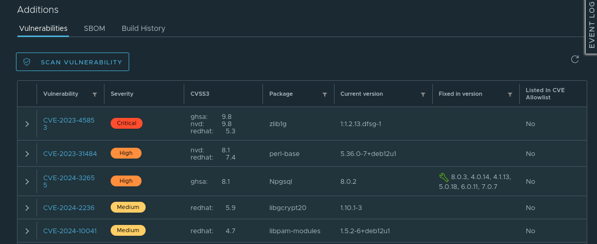

# Пример создания контейнеров Docker для web-приложения

Web-приложение разработано на ASP.NET Core 8 и требует использования базы данных Postgres.

Подготовку контейнеров кажется логичным начать с Postgres.

Чтобы ускорить разработу сценарией можно воспользоваться ChatGPT, однако, предложенные скрипты следует внимательно проанализировать, адаптировать под реальную задачу и выполнить оптимизацию контейнеров (если потребуется).

Крайне важным является выбор структуры проекта. Так, в корневом подкаталоге рекомендуется разместить файл "docker-compose.yml", в котором будут описаны запускаемые контейнеры и порты, доступные из хостовой системы. Для каждого из проекта сборки образов рекомендуется создать свой собственный подкаталог, например: "cinna-postgres" и "cinna-app". В каждом из этих подкаталогов размещается свой собственный "Dockerfile."

## Подготовка первого контейнера (Postgres)

Содержимое Dockerfile может выглядеть следующим образом:

```dockerfile
# Use the official PostgreSQL image from the Docker Hub
FROM postgres:latest

# Set environment variables for PostgreSQL
ENV POSTGRES_DB=proidc3
ENV POSTGRES_USER=postgres
ENV POSTGRES_PASSWORD=38Gjgeuftd

# Copy the seed data SQL script into the Docker image
COPY ./seed.sql /docker-entrypoint-initdb.d/

# Expose the PostgreSQL port
EXPOSE 5432
```

Важно заметить, что мы можем определить параметры создания базы данных через переменные окружения в Docker Compose. В этом случае, рекомендуется удалить следующие строки:

```dockerfile
# Set environment variables for PostgreSQL
ENV POSTGRES_DB=proidc3
ENV POSTGRES_USER=postgres
ENV POSTGRES_PASSWORD=38Gjgeuftd
```

Пример тестового SQL-скрипта:

```sql
-- seed.sql
CREATE TABLE IF NOT EXISTS users (
    id SERIAL PRIMARY KEY,
    name VARCHAR(100),
    email VARCHAR(100) UNIQUE NOT NULL
);

INSERT INTO users (name, email) VALUES
('Alice', 'alice@example.com'),
('Bob', 'bob@example.com');
```

Собрать контейнер можно командой:

```shell
docker build -t my-postgres-app .
```

Запуск контейнера:

```shell
docker run --name my-postgres-container -d my-postgres-app
```

Если запуск контейнера выполнен успешно, мы можем выполнить команду `docker ps` и увидим, что контейнер работает и обрабатывает запроса на порту 5432:

```shell
CONTAINER ID   IMAGE            COMMAND                  CREATED        STATUS         PORTS      NAMES
0a8946720f3a   cinna-postgres   "docker-entrypoint.s…"   16 hours ago   Up 8 minutes   5432/tcp   proidc3-db-1
```

Чтобы проверить, что Seed-данные применились, можно подключиться к контейнеру и запросить добавленные данные:

```shell
docker exec -it my-postgres-container psql -U postgres -d proidc3
```

Список таблиц можно получить командой `\d`, либо можно просто запросить данные из конкретной таблицы:

```sql
SELECT * FROM users;
```

В моём случае был создан контейнер на Debian 17.0.1.

### Проблемы, которые следует решить

При создании контейнера было выдано предупреждение о том, что не рекомендуется использовать инструкции ARG и ENV для чувствительных данных:

```output
1 warning found (use docker --debug to expand):
SecretsUsedInArgOrEnv: Do not use ARG or ENV instructions for sensitive data (ENV "POSTGRES_PASSWORD") (line 7)
```

В частности, проблемной является строка Dockerfile:

```Dockerfile
ENV POSTGRES_PASSWORD=38Gjgeuftd
```

На самом деле, встраивать директивы ENV в Dockerfile - на самая лучшая идея. Более разумно устанавливать их при запуске Docker-контейнера, например:

```shell
docker run --name my_postgres -e POSTGRES_PASSWORD=mysecretpassword -d postgres
```

Вынести пароли можно во внешний .env-файл и передавать не пароль в явном виде, а файл:

```shell
docker run --name my_postgres --env-file .env -d postgres
```

Пример ".env":

```env
POSTGRES_PASSWORD=mysecretpassword
```

## Создание реальной структуры базы данных

В приложениях на ASP.NET Core 8 часто используется подход Code First для Entity Framework. Это означает, что модель базы данных содержится в программном коде и её можно импортировать (как схему в виде SQL-скрипта) используя консольную команду:

```shell
dotnet ef migrations script
```

Генерация скрипта потребует компиляции приложения и завершится выводом скрипта в пользовательскую консоль. Мы можем использовать команду перенаправления вывода в файл.

Мы можем использовать ключ `--idempotent`, который добавит проверку применимости каждой строчки скрипта к конкретной миграции:

```sql
IF NOT EXISTS(SELECT * FROM [__EFMigrationsHistory] WHERE [MigrationId] = N'…')
```

Пример реальной команды для экспорта SQL-скрипта с поддержкой идемпотентности:

```shell
dotnet ef migrations script --idempotent --configuration Release --output ./Script.sql
```

Утилиту нужно запускать из подкаталога с csproj-файлом. В случае solution проекта состоящего из нескольких проектов, может потребоваться указать имя проекта, который собирает исполняемый файл к которому может быть применена интроспекция (_возможность программы анализировать собственные объекты во время её выполнения, чтобы получить информацию об их типе, атрибутах и методах_) для извлечения информации о структуре модели базы данных для построения SQL-скрипта.

>В проектах типа SPCD может потребоваться устанавливать дополнительные ключи настройки приложения, например: `set ASPNETCORE_ENVIRONMENT=Production` (команда для `cmd`).

**Идемпотентность** (_idempotence_) — это свойство операции, которое означает, что её многократное применение не приводит к дополнительным изменениям состояния, если операция уже была применена один раз.

Заметим, что если в нашем проекте есть несколько миграций, то скрипт будет содержать "сомнения и ошибки" разработчиков, например, вот такие команды:

```sql
ALTER TABLE "CriticalIssues" DROP COLUMN "HasProcessed";
```

Если продукт ещё не вводился в промышленную эксплуатацию, то может иметь смысл удалить все старые миграции и создать одну новую, чистую.

## Подготовка web-приложения для развертывании в Docker-контейнера

Сборка приложения для публикации, в общем случае, осуществляется следующей командой:

```shell
dotnet publish -c Release -o ./publish
```

При сборке приложения на Linux x64, был создан подкаталог с большим количеством файлов, ключевым из которых является "CinnaPages" (без расширения имени файла). Мы можем запустить файл этот файл, как обычный исполняемый файл: `./CinnaPages`

Это файл запускается на выполнение.

Единственная проблема, которую пришлось решить с локально развернутой копией PostgreSQL - установить новый пароль для пользователя postgres:

```sql
ALTER USER postgres PASSWORD 'new_password';
```

После этого действия web-сервер прекрасно запустился, автоматически выполнил миграцию и заработал в штатном режиме.

### Publish Single File

Однако может быть использован режим **Publish Single File**, который позволяет уменьшить количество файлов в папке публикации:

```shell
dotnet publish -c Release -o ./publish -p:PublishSingleFile=true -p:PublishTrimmed=true -p:RuntimeIdentifier=win-x64
```

Кроме этого, следует обратить внимание на идентификатор Runtime. В приведённом выше примере - это Microsoft Windows x64, но для работы в Docker следует использовать `-p:RuntimeIdentifier=linux-x64`

На моём стенде, при первом запуске было получено сообщение об отсутствии файла "CinnaPages.runtimeconfig.json". Основываясь на подсказках из интернет, файл был сформирован следующим образом:

```json
{
  "runtimeOptions": {
    "tfm": "net8.0",
    "framework": {
      "name": "Microsoft.NETCore.App",
      "version": "8.0.110"
    },
    "rollForward": "latestMinor"
  }
}
```

После создания файла приложение запустилось, но развалилось с исключением:

```output
Unhandled exception. System.TypeLoadException: Could not load type 'Microsoft.AspNetCore.Mvc.ApplicationParts.ConsolidatedAssemblyApplicationPartFactory' from assembly 'Microsoft.AspNetCore.Mvc.Razor, Version=8.0.0.0, Culture=neutral, PublicKeyToken=adb9793829ddae60'.
   at System.Reflection.RuntimeAssembly.GetTypeCore(String, ReadOnlySpan`1, Boolean, Boolean)
   at System.Reflection.TypeNameParser.GetType(String, ReadOnlySpan`1, String)
   at System.Reflection.TypeNameParser.NamespaceTypeName.ResolveType(TypeNameParser&, String)
   at System.Reflection.TypeNameParser.Parse()
   at System.Reflection.TypeNameParser.GetType(String, Func`2, Func`4, Assembly, Boolean , Boolean , Boolean )
   at System.Reflection.TypeNameParser.GetType(String, Assembly, Boolean , Boolean )
   at System.Type.GetType(String typeName, Boolean throwOnError)
   at Microsoft.AspNetCore.Mvc.ApplicationParts.ProvideApplicationPartFactoryAttribute.GetFactoryType()
   at Microsoft.AspNetCore.Mvc.ApplicationParts.ApplicationPartFactory.GetApplicationPartFactory(Assembly)
   at Microsoft.AspNetCore.Mvc.ApplicationParts.ApplicationPartManager.PopulateDefaultParts(String)
   at Microsoft.Extensions.DependencyInjection.MvcCoreServiceCollectionExtensions.GetApplicationPartManager(IServiceCollection, IWebHostEnvironment)
   at Microsoft.Extensions.DependencyInjection.MvcCoreServiceCollectionExtensions.AddMvcCore(IServiceCollection)
   at Microsoft.Extensions.DependencyInjection.MvcServiceCollectionExtensions.AddControllersCore(IServiceCollection)
   at Microsoft.Extensions.DependencyInjection.MvcServiceCollectionExtensions.AddControllers(IServiceCollection)
   at Program.<Main>$(String[]) in /home/developer/projects/ProIDC3/source/CinnaPages/Program.cs:line 84
   at Program.<Main>(String[])
Aborted (core dumped)
```

Проблемной оказалась следующая строка:

```csharp
builder.Services.AddControllers();
```

Пока полноценно запустить приложение в работу, в режиме Single File не удалось. Возможно, проблема связана с параметром `PublishTrimmed` - необходимо дополнительно изучить режим сборки однофайлового приложения.

## Dockerfile для приложения на ASP.NET Core 8

Стартовый Dockerfile можно взять с [сайта Learn Microsoft](https://learn.microsoft.com/ru-ru/dotnet/core/docker/build-container?source=recommendations&tabs=linux&pivots=dotnet-8-0):

```Dockerfile
FROM mcr.microsoft.com/dotnet/sdk:8.0 AS build-env
WORKDIR /App

# Копируем из внешней папки исходные тексты
COPY . ./
# Загружаем внешние зависимости (NuGet-пакеты)
RUN dotnet restore
# Собираем приложение в Release-режиме
RUN dotnet publish -c Release -o out

# Создаём новый образ, который не будет включать артефакты сборк
FROM mcr.microsoft.com/dotnet/aspnet:8.0
WORKDIR /App
COPY --from=build-env /App/out .

# Через порт 8080 (default) мы планируем получать http-запросы
EXPOSE 8080

# Указываем командую строку, которая будет выполняться при запуске контейнера
ENTRYPOINT ["dotnet", "CinnaPages.dll"]
```

В этом скрипте приложение собирается из исходников в папку -out контейнера **build-env**, а затем создаётся новый компактный контейнер, в котором есть только ASP.NET Core 8 Runtime и наше собранное приложение. Если мы используем внешнюю сборку, т.е. уже имеем результаты сборки, то можно ограничиться четырьмя последними строчками, но корректно указав исходную папку "publish":

```Dockerfile
FROM mcr.microsoft.com/dotnet/aspnet:8.0
WORKDIR /app
COPY publish/ /app/
EXPOSE 8080
ENTRYPOINT ["dotnet", "CinnaPages.dll"]
```

Сборка контейнера:

```shell
docker build -t cinna-pages .
```

Запуск контейнера:

```shell
docker run -d -p 8080:80 cinna-pages
```

### Как указать порты, которые будет обрабатывать Kestrel

Одним из вариантов указания портов, которые будет слушать web-сервер Kestrel - указать их явным образом в файле "appsettings.json". Например, так:

```json
"Kestrel": {
  "Endpoints": {
    "Http": {
      "Url": "http://localhost:5000"
    },
    "Https": {
      "Url": "https://localhost:5001"
    }
  }
},
```

Стоит заметить, что если сертификаты не созданы, то приложение не будет запускаться из-за соответствующей ошибки. Т.е. до момента добавления сертификатов, достаточно указать только следующую часть конфигурации:

```json
"Kestrel": {
  "Endpoints": {
    "Http": {
      "Url": "http://localhost:5000"
    }
  }
},
```

Порты важны, так как их необходимо явным образом указать в команде запуска контейнера:

```shell
docker run -d -p [порт хоста]:[внутренний порт] cinna-pages
```

Если не настроенны сертификаты, то следудует использовать http-порт.

## Размещение Docker Image у провайдера

**Under construction!**

После того, как мы собрали Docker images, мы можем разместить их на сервере провайдера. По умолчанию, провайдером является DockerHub, но мы можем использовать и российские IT-компании, например, Selectel. Команда подключения к репозитарию:

```shell
docker login registry.selectel.ru -u your-username -p your-password
```

Создание тэга:

```shell
docker tag your-image-name registry.selectel.ru/your-selectel-username/your-image-name:your-tag
```

Загрузка образа в репозитарий провайдера:

```shell
docker push registry.selectel.ru/your-selectel-username/your-image-name:your-tag
```

Ещё одна важная команда Docker - `commit`. Она берет верхний уровень контейнера, тот, что для записи и превращает его в слой для чтения. После этого мы можем выполнить push и залить получившийся контейнер в репозитарий. Эта операция позволяет сохранять в образе правки образа, выполненные вручную.

## Как будет выглядеть docker-compose.yml

**Under construction!**

Когда мы будем разрабатывать скрипт для запуска контейнеров посредством Docker Compose, скрипт в файле "docker-compose.yml" может выглядеть следующим образом:

```yaml
version: '3.8'

services:
  db:
    image: postgres:latest
    environment:
      POSTGRES_DB: proidc3
      POSTGRES_USER: postgres
      POSTGRES_PASSWORD: 38Gjgeuftd
    volumes:
      - ./seed.sql:/docker-entrypoint-initdb.d/seed.sql
    ports:
      - "5432:5432"
```

Запуск образов посредством Docker Compose выполняется следующей командой:

```shell
docker-compose up
```

### Более полный пример конфигурационного скрипта

Для решения проблемы взаимодействия между контейнерами при использовании Docker Compose, может потребоваться добавить ещё и определение общей сети, см. `networks`:

```yaml
name: proidc3

services:
  db:
    image: cinna-postgres
    environment:
      POSTGRES_DB: proidc3
      POSTGRES_PASSWORD: 38Gjgeuftd
    networks:
      - cinna_network
    ports:
      - "5432:5432"
      
  app:
    image: cinna-pages
    environment:
      ConnectionStrings__psql: "Host=db;Port=5432;Username=postgres;Password=38Gjgeuftd;Database=proidc3"
    networks:
      - cinna_network
    ports:
      - "8080:8080"
    depends_on:
      - db
      
networks:
  cinna_network:
```

Критически важно, чтобы контейнер с web-приложением запускался строго после того, как будет запущен контейнер с базой данных. Указать зависимость можно следующим строками в yaml-файле:

```yaml
depends_on:
  - db
```

Фактически, если мы указываем зависимость через **depends_on**, то можно не указывать настройки сети - сеть будет создана автоматически.

Кроме этого, для того, чтобы web-приложение подключалось не к хосту, а к конкретному сервису, именно имя сервиса следует указывать в строке подключения к базе данных:

```json
"ConnectionStrings": {
  "psql": "Host=db;Username=postgres;Password=38Gjgeuftd;Database=proidc3"
},
```

Альтернативный (заработавший) вариант состоит в том, чтобы убрать "ConnectionString" из "appsettings.json" и передавать их через переменные окружения:

```yaml
  app:
    image: cinna-pages
    environment:
      ConnectionStrings__psql: "Host=db;Username=postgres;Password=38Gjgeuftd;Database=proidc3"
    networks:
      - cinna_network
    ports:
      - "8080:8080"
```

Посмотреть, какие сетевые параметры (IP-адреса) выделены для разных контейнеров можно следующей командой:

```shell
sudo docker network inspect proidc3_cinna_network
```

Например, контейнер с базой данных получает адрес - `172.18.0.2`:

```json
"Containers": {
  "7f09ada497111411cd77122dd7b40c9e34120796ac511f7ba50e9a0278330b7e": {
      "Name": "proidc3-db-1",
      "EndpointID": "ce361b14c70768662b9aa0aaf1c0efad2fb13554dba414c1ef833224c3ab3dbd",
      "MacAddress": "02:42:ac:12:00:02",
      "IPv4Address": "172.18.0.2/16",
      "IPv6Address": ""
  }
},
```

Посмотреть логи контейнера можно следующим образом:

```shell
sudo docker logs 7f09ada49711
```

Чтобы пересобрать скрипт и запустить контейнеры, можно использовать флаг `--build`:

```shell
docker-compose up --build
```

## Сохранение данных на хостовом диске

Для того, чтобы сохранять данные в базе данных, следует добавить раздел **volumes** в свойство сервиса СУБД, а также добавить **volumes**, как сервис:

```yaml
name: ProIDC3

services:
  db:
    image: cinna-postgres
    environment:
      POSTGRES_DB: proidc3
      POSTGRES_PASSWORD: 38Gjgeuftd
    volumes:
      - db_data:/var/lib/postgresql/data
    ports:
      - "5432:5432"

  app:
    image: cinna-pages
    environment:
      ConnectionStrings__psql: "Host=db;Username=postgres;Password=38Gjgeuftd;Database=proidc3"
    ports:
      - "5000:8080"
    depends_on:
      - db

volumes:
  db_data:
```

## Как создать локальное хранилище Docker-образов

[How to Use Your Own Registry](https://www.docker.com/blog/how-to-use-your-own-registry-2/) by Peter McKee.

Одно из наиболее популярных решений для хранения зависимостей и Docker-контейнеров - Sonatype Nexus. Рекомендуется к прочтению статья [Установка Sonatype Nexus с SSL](https://habr.com/ru/companies/first/articles/661465/) by FirstVDS.

[Harbor](https://goharbor.io/) - open source registry для Docker-образов. [Демо-сервер](https://demo.goharbor.io/) позволяет эксперементировать с технологией и загружать на него образы. Registry можно установить и локально, используя [инструкции](https://goharbor.io/docs/2.11.0/install-config/). Дополнительная документация по тестовому серверу [доступна здесь](https://goharbor.io/docs/2.11.0/install-config/demo-server/).

> Следует заметить, что доступен 1 GB дискового пространства на Harbor.io, а образы будут удаляться после двух недель бездействия.

Особенности **Harbor**: есть [plugin для Jenkins](https://plugins.jenkins.io/harbor/). В Harbor включен популярный сканер безопасности [Trivy](https://trivy.dev/). Пример анализа от **Trivy**:



Как можно увидеть, Trivy ищет уязвимости в исполняемых файлах операционной системы.

[Paketo Buildpacks](https://paketo.io/docs/) позволяет создать запускаемый Docker-контейнер с вашим приложением, используя лишь файл проекта. Позволяет создавать контейнеры с приложениями для следующих сред исполнения: .NET Core, Java, Node.js, Python. Также есть поддержка (нужно читать дополнительно) для Golang, Ruby и PHP.

Дополнительная статья на Habr - [Используем Buildpacks вместо Dockerfile](https://habr.com/ru/companies/beeline_cloud/articles/850026/) от Александра Бархатова.

Важная информация о Buildpack - именно это решение используется в Heroku.

## Пример - передача подготовленного образа через Registry

В качестве registry выбран Harbor.io.

Первый шаг - подготовка образа с Postrges и применение к нему SQL-скриптов, т.к. создание структуры базы данных. Описание решения данной задачи есть в начале данного документа.

Создать образ и запустить контейнер можно командами:

```shell
docker build -t my-postgres-app .
docker run --name my-postgres-container -d my-postgres-app
```

Список образов можно посмотреть командой `docker images`

Затем мы подключаемся к контейнеру:

```shell
docker exec -it my-postgres-container psql -U postgres -d proidc3
```

Добавляем ещё одну запись (после применения seed.sql их должно быть три):

```sql
INSERT INTO users(name, email) VALUES('Max', 'go@mail.ru');
```

Проверяем успешность:

```sql
SELECT * FROM users;
```

Выходим из контейнера (`\q`) и сохраняем сделанные в нём изменения:

```shell
sudo docker commit cb61fc13fafc postrges-kermit
```

Первый параметр - это идентификатор запущенного контейнера, а второй - имя нового образра, в котором сохранены изменения. Мы можем проконтролировать создание этого образа командой `docker images`. Подробнее о команде commit можно почитать на [официальном сайте Docker](https://docs.docker.com/reference/cli/docker/container/commit/).

Далее мы должны создать tag, в котором будет привязка к репозитарию, используя команду tag:

```shell
sudo docker tag postrges-kermit demo.goharbor.io/storage_system/postgres-kermit
```

Затем следует пройти аутентификацию в репозитарии:

```shell
sudo docker login demo.goharbor.io
```

После этого мы можем загрузить наш образ в репозитарий, используя команду push:

```shell
sudo docker push demo.goharbor.io/storage_system/postgres-kermit
```

> Корректные форматы команд tag и push доступны в выпадающем меню "PUSH COMMAND" в списке репозитариев проекта на Harbor.io.

Как результат, мы можем увидеть, что наш образо появился в списке, в проекте "storage_system".

### Контроль исполнения

Остановить работающие контейнеры можно командой stop:

```shell
docker stop cb61fc13fafc 
```

Удалять не используемые контейнеры следует командой:

```shell
docker container prune
```

Для удаления отдельных образов контейнеров можно использовать команду:

```shell
docker rmi postrges_kermit <имя-образа>
```

Для проверки удаления всех контейнеров и образов следует выполнить команды:

```shell
docker ps
docker images
```

Загрузить ранее сформированный образ можно командой pull:

```shell
docker pull demo.goharbor.io/storage_system/postgres-kermit
```

Запустить загруженный контейнер и назначить ему имя "my-postgres-container" можно командой run:

```shell
sudo docker run --name my-postgres-container -d demo.goharbor.io/storage_system/postgres-kermit 
```

Подключиться к контейнеру можно командой exec -it:

```shell
docker exec -it my-postgres-container psql -U postgres -d proidc3
```

> Мой результат: в базе данных были записи об Alice и Bob, но не было Max. Скорее всего, команда `commit` сохраняет не все данные в работающем контейнере, а только те, которые были добавлены при выполнении команды `docker build`.

### Почему у меня не получилось сохранить третью запись в базе данных?

Образ - это набор слоёв для которых используется read-only файловая система. Мы не можем изменить те слои, из которых состоит образ.

Контейнер добавляет к образу ещё один уровень, но этот верхний уровень доступен не только для чтения, но и для записи (Read-Write layer). Процесс совмещения Read-only слоёв с изменяемым слоем называется _unioning_ (объединение).

> Технология изоляции слоёв, лежащая в основе технологии Docker и создаёт всю магию - это самая ценная часть этой технологии!

Когда мы выполняем команду `docker create <image-id>`, мы создаёт слой чтения-записи над слоями образа, найденного по "image-id".

Команда `docker start` создаёт пространство процессов вокруг слоём контейнера. Команда `docker run` последолвательно выполняет команды `docker create` и `docker start`.

Команда `docker ps` отображает только список запущенных контейнеров, а команда `docker ps -a` - всех контейнеров, включая не запущенные.

Команда `docker commit` превращает Read-Write слой контейнера в Read-only.

Команда `docker save` создаёт один файл, который может быть использован для импорта образа на другую хост-систему.

Команда `docker export` создаёт tar-архив с содержимым файлов контейнера, в результате чего появляется папка, пригодная для использования вне Docker.

Причина, по которой мои изменения не сохранились, возможно, связаны с тем, что я не вышел их контейнера, используя команду `exit` перед тем, как выполнить команду `docker commit`.

## Sonatype/Nexus 3

За основу взята инструкция [Setting up a Nexus3 Lab Server](https://github.com/chrisbmatthews/lab-nexus-sever) by Chris B. Matthews. Инструкция четёрыхлетней давности.

Команда клонирования репозитария:

```shell
git clone https://github.com/chrisbmatthews/lab-nexus-sever.git
```

Скрипт запуска сервера Nexus 3:

```bash
#!/usr/bin/env bash

#To allow full file access to the volume in case docker is running as root...
chmod 777 volume

#Bring up the server
docker-compose up -d
```

Содержимое "docker-compose.yml" следующее:

```yaml
version: "3.7"

services:
  nexus:
    image: sonatype/nexus3
    expose:
      - 8081
      - 8082
      - 8083
    ports:
      - "8082:8082"
      - "8083:8083"
      - "8081:8081"
    volumes:
      - ./volume:/nexus-data
    restart: always
```

Скрипт даёт права доступа к папке "volume" и выполняет команду запуска контейнера:

```shell
docker-compose up -d
```

Если всё пошло по плану, появляется возможность зайти на локальный сайт Nexus 3: `http://localhost:8081/`

Далее нужно изменить default-ного пользователя (admin) щёлкнув по ссылке "Sign In" на главной странице. Пароль пользователя есть в локальной папке `volume` в файле "admin.password". Можно посмотреть пароль командой:

```shell
admin.password
```

После ввода логина и пароля, система предлагает поменять пользовательский пароль.

### Работа с Nexus 3 как с Proxy

TODO: пока не отрабатывал этот вариант.

### Работа с Nexus 3 как с Private Repo

В навигационной панели (слева) выбрать "Repository --> Blob Stores". На форме уже будет один blob под именем "default", но мы можем создать езё один. Для этого следует найти на форме кнопку "Create Blob Store" (правый верхний угол). При создании Blob-а нужно указать его тип (File), имя и путь к нему. Например: "kermitblob" и путь как "/nexus-data/blobs/kermitblob".

Если перейти на закладку "Proprietary Repositories", то можно увидеть репозитарии в разделах "Generic Hosted Repositories" и "Proprietary Hosted Repositories". Это списки доступных репозитариев. По умолчанию, уже доступны репозитарии для Maven и NuGet-hosted.

Мы можем перейти в закладку "Repositories --> Repositories" и увидим список репозиториев системы. Посредством кнопки "Create repository" мы можем создать новый репозиторий, выбрав его тип "docker (hosted)". Заметим, что Nexus 3 умеет создавать совершенно разные репозитории, включая: apt, Cargo, Conda, NuGet, npm, PyPi, Yum(RPM) и другие.

После ввода имени репозитария следует выбрать транспортный протокол. Чтобы не разбираться с сертификатами, можно выбрать "HTTP" и указать номер порта 8083.

После создания репозитария (он появится в списке доступных), необходимо разрешить Docker-у использовать небезопасное соединение. В конфигурационном файле Docker-а необходимо найти раздел "insecure-registries" и в него следует добавить строки (с большой вероятностью, файл не существует и нужно создать новый):

```
{
  "insecure-registries": [
    "localhost:8082",
    "localhost:8083"
  ]
}
```

Далее следует перезагрузить docker daemon. В зависимости от того как он был установлен потребуется либо команда `sudo systemctl status docker`, либо (при использовании Snap): `sudo snap restart docker`

Мне не удалось при выполнении команды `sudo docker info` увидеть, что были добавлены порты 8082 и 8083, однако вот такая строка была:

```
Insecure Registries:
 127.0.0.0/8
```

Далее была выполнена команда: `docker login localhost:8083`, которая закончилась успешно:

```
time="2025-01-06T15:32:21+03:00" level=info msg="Error logging in to endpoint, trying next endpoint" error="Get \"https://localhost:8083/v2/\": http: server gave HTTP response to HTTPS client"
WARNING! Your password will be stored unencrypted in /home/developer/snap/docker/2963/.docker/config.json.
Configure a credential helper to remove this warning. See
https://docs.docker.com/engine/reference/commandline/login/#credential-stores

Login Succeeded
```

Далее я создал некоторый Docker-образ (Postgres из CinnaPages)

```shell
docker build -t localhost:8083/kermitrepo:latest .
```

Проверить, что образ был собран можно выполнив команду `sudo docker images`:

```output
REPOSITORY                  TAG       IMAGE ID       CREATED        SIZE
localhost:8083/kermitrepo   latest    f6c7915984d7   20 hours ago   435MB
sonatype/nexus3             latest    d3df1178e8d7   4 weeks ago    635MB
```

Легко увидеть, что существует как образ с nexus3, так и собранный локально образ (localhost:8083/kermitrepo). В качестве репозитария образа указан "localhost:8083/kermitrepo".

Команад сохранения образа в Nexus:

```shell
docker push localhost:8083/kermitrepo:latest
```

Пример успешного выполнения команды:

```output
The push refers to repository [localhost:8083/kermitrepo]
e9b5403ec39f: Pushed 
292d421ade97: Pushed 
6e96dce9a5cf: Pushed 
957b5f570bef: Pushed 
2125bae0c1d7: Pushed 
c993c95f45c3: Pushed 
023af46da835: Pushed 
e4f6953e8595: Pushed 
11efcd43b7f2: Pushed 
9e776ff275e9: Pushed 
0196325b5059: Pushed 
095b6f5b03a7: Pushed 
5eefae50e9e6: Pushed 
9afe14b4c027: Pushed 
8b296f486960: Pushed 
latest: digest: sha256:bb2ea77115d4852b40c492a7694c522434a6f27f86246198d7ddb3df0c1afa75 size: 3455
```

Если зайти в "Repository --> Blob Stores", то можно увидеть, что занято 295.90 МБ. Если предположить, что для хранения данных используется сжатие, то 300 МБ похоже на сжатые 435 МБ.

Мы можем выполнить команду загрузки Docker-образа из репозитария: `sudo docker pull localhost:8083/kermitrepo:latest`

```console
latest: Pulling from kermitrepo
Digest: sha256:bb2ea77115d4852b40c492a7694c522434a6f27f86246198d7ddb3df0c1afa75
Status: Image is up to date for localhost:8083/kermitrepo:latest
localhost:8083/kermitrepo:latest
```

Вывод позволяет утверждать, что запрос в репозитарий был успешным и, поскольку образ не изменился, то ничего обновлять не пришлось.

В управляющей консоли видно, что за последние 24 часа был выполнен один Unique Logins и за день было выполнено три запроса из 20,000 разрешённых.

Чтобы увидеть содержимое репозитария "kermitrepo" нужно щелкнуть на имя репозитария в закладке "Browse". В этом случае будет открыто дерево "HTML View" в котором есть список "blobs", манифесты "manifests" и tags. В tags находится элемент "latest", в котором будет информация о том когда и кто создал этот tag и как загрузить образ из него.
