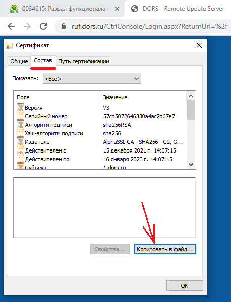

# Настройка IIS. Публикация ASP.NET приложения. Сертификаты.

## Установка IIS

По умолчанию, сервисы IIS не установливаются в Windows 10. Отправной точкой для разработки инструкции являлась статья [Install and Setup a Website in IIS on Windows 10](https://helpdeskgeek.com/windows-10/install-and-setup-a-website-in-iis-on-windows-10/).

Запустить «Параметры Windows», выбрать «Programs and Features / Приложения». С правой стороны, в углу – «Сопутствующие параметры – Программы и компоненты». Открывается «Control Panel» в разделе «Программы и компоненты».

Далее, выбираем в левой панели «Turn Windows features on and off - Включение или отключение компонентов Windows». Далее выбираем «Internet Information Services – Службы IIS» в дереве компонентов. Устанавить «Службы интернета» и «Средства управления web-сайтом». Устанавливать нужно довольно большое количество компонентов, включая:

* проверку подлинности Windows (если приложение использует доменную аутентификацию)
* фильтрацию запросов
* ASP.NET x.y: .NET Extensibility, расширение ISAPI, фильтры ISAPI, протокол WebSocket
* Все общие функции HTTP, за исключением "Публикации WebDAV"
* Сжатие статического и динамического контента

Проверка: запустить браузер, перейти по ссылке «localhost/».

В файле "c:\windows\system32\drivers\etc\hosts" можно определить псевдонимы имени машины, которые позволят обращаться к различным web-приложениям, запущенным в IIS. Например:

```hosts
127.0.0.1     garmr.com          # Система мониторинга
127.0.0.1     openadm.ru         # Интеграционный сервер
```

## Настройка рабочей локальной сети

Для тестирования, или испытания web-приложения в локальной сети может потребоваться настроить видимость компьютерами друг друга. Отправной точкой для настройки сети являлась [статья](http://winitpro.ru/index.php/2018/04/23/windows-10-ne-vidit-kompyutery-v-setevom-okruzhenii/).

Узнать IP-адрес компьютера можно командой: `ipconfig`

За обнаружение компьютеров в сети в Windows 10 отвечает отдельная служба **Function Discovery Resource Publication**, которая после установки 1803 по умолчанию не запускается (тип запуска с "Автоматического" изменен на "Отключен"). Если эта служба остановлена, компьютер не обнаруживается в сети другими компьютерами. Включить службу автообнаружения в Windows 10 1803 можно так.

1. Откройте консоль управления службами Windows (`services.msc`)
2. В списке служб найдите службу Function Discovery Resource Publication (Публикация ресурсов обнаружения функции). Она должна быть отключена.
3. Измените тип запуска службы с Manual на автоматический с отложенной загрузкой — Automatic (Delayed Start).

Так же нужно разрешить сетевое обнаружение компьютера:


Рекомендация: можно добавить папку и объявить её «папкой общего доступа». Если операционная система не может выполнить задачу, она активирует Wizard-а, что либо решит проблему, либо поможет идентифицировать проблемы. Довольно часто доступ блокируют сетевые фильтры, например, **Norton Security**.

## Загрузка .NET Core Hosting Bundle

Для запуска приложений .NET Core 3/5/6 необходимо установить **ASP.NET Core Runtime 3/5/6 Hosting Bundle**. Портал для загрузки: https://dotnet.microsoft.com/download

Перейти нужно на «.NET Core», кнопка «Download .NET Core Runtime». На следующей странице есть несколько кнопок для загрузки, нужно выбрать «Download Hosting Bundle» (в разделе «Run server apps»).

Форма, на которой есть всё (Advanced): https://dotnet.microsoft.com/download/dotnet-core

При установке приложения ASP.NET Core необходимо внимательно проверить, что ключевые компоненты в .NET Core Hosting Bundle и в сборке ASP.NET Core-приложения совпадали. При наличии расхождений, приложение может не запуститься.

После установки **Hosting Bundle** следует перезагрузить компьютер.

## Добавление нового приложения в IIS

Статья: https://helpdeskgeek.com/windows-10/install-and-setup-a-website-in-iis-on-windows-10/

Запуск управляющей консоли IIS осуществляется вызовом приложения «inetmgr.exe».

Начать нужно с добавления сайта:


При добавлении сайта следует указать параметр «Site name», который предназначен для администратора (упрощает идентификацию наборов параметров).

«Пул приложения» описывает окружение (runtime environment) для запуска приложений. Несколько сайтов могут использовать один и тот же «Пул приложений», если им подходят его параметры. С "пулом приложений" связан пользователь, из под учётной записи которого запускается этот **app pool**.

«Физический путь» это подкаталог, в котором находятся файлы сайта. Для статического сайта это может быть папка с файлами html, css и картинками. 
Для ASP.NET приложения, это папка с исполняемыми и конфигурационными файлами. Внутри этой папки обычно есть папка «wwwroot».

Ключевые параметры – Binding, т.е. «привязки». Привязка позволяет указать связь между входным соединением и протоколом. Входное соединение описывается маской IP-адресов и портом, а протокол выбирается из списка (http, https).

ВНИМАНИЕ! Поддержка http в IIS очень сильно ограничена - рекомендуется сразу настраивать сервер на использование https с сертификатом "IIS Express Developer Certificate", который создаётся при установке Visual Studio. Можно экспортировать "IIS Express Developer Certificate" используя браузер, открыв окно с сертификатом страницы, сгенерированной сервером IIS. В закладке "Состав" есть кнопка "Копировать в файл", нажатие на которую позволяет перейти в режим экспорта сертификатов.

Извлечь из pfx-файла публичный ключ сервера и сохранить его в pem-формате можно используя команду **openssl**:

``` shell
openssl pkcs12 -in localhost.pfx -clcerts -nokeys -out cert.pem
```

Если openssl не установлена в системе можно использовать утилиту **certutil**.

Для каждого из сайтов будет создан новый пользователь операционной системы, из-под которого будет запускаться IIS. В случае, если проекте в Visual Studio будет осуществляться запуск IIS, это может потребовать перезапустить Visual Studio из-под учётной записи сайта.

Пример основных настроек:


Пример привязок (bindings):


При создании сайта IIS Manager автоматически создаёт для него «Пул приложений».

В простейшем случае мы можем положить в некоторый подкаталог статические файлы и создать в IIS для него сайт. Для этого нужно будет в настройках сайта, выбрать пункт «Просмотр каталога» и выполнить действие «Включить». После этого, на сайт можно будет заходить через браузер, с указанием IP-адреса, порта и конкретного имени ресурса.

При настройке приложения ASP.NET Core, необходимо в «пуле приложений» указать, что для этого пула «версия среды CLR .NET» является «Без управляемого кода», а режим управляемого конвейера «Встроенный». Дополнительные параметры – «режим запуска», возможность запуска 32-бит приложений (этого нужно избегать), и т. д.

Критичным для запуска ASP.NET приложения может быть выделение необходимых прав доступа. При создании нового сайта, прав доступа будет недостаточно, что приведёт к получению кода с ошибкой авторизации сайта (400-ый тип). Чтобы добавить права доступа, следует в пункте «Действия» (панель справа) выбрать «Редактировать разрешения» -> закладка «Безопасность» (а не «Доступ»). Мне потребовалось добавить пользователя **IIS_IUSRS**, чтобы сайт заработал, причём добавить из-под «Total Commander».

В случае запуска IIS с web-приложение из-под Visual Studio, может быть разумным указать учётную запись текущего пользователя системы (разработчика), как учётную запись, из под которой выполняется запуск IIS.

Рекомендуется установить "режим запуска" web-приложения "Always Running".

## Подключение базы данных

В случае, если к СУБД обращается IIS, взаимодействие с базой данных проще всего настроить по протоколу TCP.

Рекомендуется устанавливать версию **SQL Server Developer Edition**, либо Express Edition. В первом случае существенно меньше ограничений, но эта версия не может быть использована в production-окружении. Рекомендуется устанавливать только **Database Core** и **Connective Tools**. Ссылка для загрузки продукта: https://www.microsoft.com/en-us/sql-server/sql-server-downloads

Для настройки подключения можно использовать утилиту **Microsoft Management Console** (mmc.exe). После запуска утилиты следует добавить оснастку через «Файл -> Добавить или удалить оснастку». Имя необходимой оснастки «SQL Server Configuration» (Диспетчер конфигураций SQL Server).

В добавленной оснастке нужно выбрать пункт «Сетевая конфигурация SQL Server», далее – «Протоколы для [имя Instance]» и «TCP/IP». В появившемся диалоге есть два пункта: «Протокол» и «IP-адреса». На закладке «Протокол» следует установить переменную «Включено» в значение «Да». На закладке «IP-адреса» следует найти элемент дерева, в котором указан адрес 127.0.0.1 и установить TCP-порт в значение «1433» (номер порта для SQL Server «по умолчанию»). Значение «Динамические TCP-порты» следует установить в пустое значение.


Для подключения к базе данных используется строка вида: tcp:[ip-адрес],[порт]

Пример из файла «appsettings.json» (приложение на ASP.NET):

```json
"AppConfiguration": {
	"ConnectionString": "Data Source=tcp:127.0.0.1,7777;
		Integrated Security=False;Database=Garmr;User ID=sa;Password=38Gjgeuftd"
},
```

Номер порта по умолчанию: 1433.

На практике, зафиксированы случаи, когда изменение настроек SQL Server через **Microsoft Management Console** не работал корректно. В частности, выпадающие списки с вариантами выбора оказывались пустыми. В подобных ситуациях следует использовать **SQL Server 20xx Configuration Manager**, который предоставляет схожий набор сервисов, но работает стабильнее.

Существует возможность ограничить максимальный объём памяти занимаемой СУБД на машине. Для этого можно использовать SQL Server Management Studio, выбрать instance СУБД, в контекстном меню выбрать пункт "Properties". В появившемся диалоге нужно выбрать закладку "Memory" и уменьшить значение параметра "Maximum server memory (in MB)", например, до значения 4096 (4Gb).

## Создание профиля публикации проекта Visual Studio

Один из распространённых способов разработки web-приложений – автоматическая публикация и запуск проекта на IIS при выборе пункта «Run», или «Debug» в Visual Studio.
Для этого необходимо создать специальный профиль через пункт «Properties» из контекстного меню, вызываемого правой кнопкой мыши в меню над названием проекта в «Solution Explorer».

Необходимо перейти на закладку «Debug» и нажать кнопку «New…» для создания нового профиля. Типовые настройки могут быть следующими:


При запуске проекта на исполнение нужно будет выбрать «IIS» из соответствующего выпадающего списка. В случае, если настройки корректны, Visual Studio предупреждает о том, что необходимо перезапустить IDE с другим набором Credentials – «Restart under different credentials». Перезапуск из-под другой учётной записи нужен для того, чтобы и IIS, и Visual Studio имели одинаковый набор прав. Credentials соответствуют пользователю Windows, который создаётся в IIS для конкретного приложения. 

После перезапуска IDE следует повторно перезапустить приложение на исполнение и отладку.

## Подключение по SSL

Первая задача – генерация сертификатов посредством [скрипта](https://gist.github.com/Kerminator1973/306c45206a025df8df0a99f72b651e0a) .

В результате создаётся несколько файлов:

1. acme.ru.key – private key, который используется для генерации сертификатов
2. acme.ru.crt – основной серверный сертификат
3. acme.ru.der.crt – клиентский сертификат, который может быть использован для проверки серверного сертификата
4. acme.ru.pem - клиентский сертификат в текстовом виде, пригодном для хранения в ресурсах клиентского приложения
5. acme.ru.pfx – файл обмена личной информации, по сути тоже файл с сертификатом, его умеет импортировать Microsoft IIS

Статья: https://wiki.merionet.ru/servernye-resheniya/18/ustanovka-ssl-sertifikata-na-iis-servere/

Запустив «Диспетчер служб IIS» (inetmgr.exe) следует выбрать соединение (корневой элемент дерева «Подключения»), затем выбрать иконку «Сертификаты сервера» и действие «Импортировать…».


Для импорта сертификата потребуется файл с расширением **pfx**.

Далее следует перейти к параметрам сайта и выбрать действие «Привязки…». Следует связать https-протокол с IP-адресом и уникальным портом (например, 443, или 4321).

Для того, чтобы на web-сервер можно было бы зайти без указания порта, следует назначить хотя бы одному web-серверу порт 443 в привязках.

Проверочное действие №1: зайти на сайт по https, увидеть сообщение браузера о том, что сервер не является доверенным, т.к. не установлен клиентский сертификат.

Для того, чтобы иметь возможность обратиться к web-серверу по символическому имени, следует изменить файл «hosts», который находится в папке «c:\windows\system32\drivers\etc\hosts». В этом файле нужно указать символическое имя и соответствующий ему IP-адрес, например:

```
192.168.0.178	JOYOFEUGENE
```

Далее, на клиентском компьютере следует добавить сертификат «.der.crt» в раздел «Доверенные корневые центры сертификации». Для этого достаточно дважды щёлкнуть на имени файла.

Для того, чтобы Google Chrome не активировал сообщения о непроверенном сайте, необходимо через настройки браузера (chrome://settings/), зайдя в пункт «Конфиденциальность и безопасность» -> «Ещё» -> «Настроить сертификаты» выполнить импорт сертификата с расширением «.der.crt» в раздел «Доверенные корневые центры сертификации» операционной системы (не браузера!).

Проверочное действие №2: зайти на сайт по https, увидеть, что web-приложение работает по протоколу https.

### Привязка к диапазону IP-адресов/доменному имени

Возможно, что проблема возникает из-за того, что в коде приложения с Boost.Beast я обращаюсь к серверу по IP-адресу, а не по его сетевому имени.

## Доступ к серверу из виртуальной машины

Для доступа из виртуальной машины к ресурсам хостовой машины следует использовать специальный IP-адрес. Этот адрес можно получить, выполнив консольную команду ipconfig - нужный адрес указан в строке "Основной шлюз". Из этих данных нужно взять первые три цифры, а в качестве последней указать 1. Идея состоит в том, что «1» - это хостовой компьютер, а «2» - шлюз в интернет. В моём случае, «основной шлюз» - 192.168.213.2, а IP-адрес хостового компьютера, на котором был запущен web-сервер (успешно отработавший запрос из виртуальной машины) - 192.168.213.1.

Входящий в состав Visual Studio web-сервер IIS Express не позволяет обрабатывать запросы отличные от localhost (127.0.0.1) и, следовательно, к нему не удастся подключиться из виртуальной машины. Чтобы обеспечить функционирование системы в подобном режиме следует создать web-сервер на IIS, выполнить публикацию приложения ASP.NET на сервере и подключить специальный plug-in "Поддержка времени разработки в IIS", что обеспечит возможность отладки кода приложения запущенного в Internet Information Server.

Создание сайта описано в начале документа, см: «inetmgr.exe».

## Компоненты для отладки приложений, запущенных в IIS

Для того, чтобы иметь возможность выполнять отладку приложения развернутого в IIS, необходимо установить в Visual Studio специальный компонент "Поддержка времени разработки в IIS". Этот пункт находится в группе "ASP.NET и разработка web-приложений", в подразделе "Дополнительно".

Подобная функция нужна в том случае, если в IIS должен быть настроен какой-то специализированный SSL-сертификат. Пример: отладка взаимодействия между ПроАТМ и интеграционным сервером OpenADM с использованием TlsProxy.

## Проблемы и решения

**Проблема**: автоматическое развертывание приложения в IIS и отладка не работают. Если остановить приложение на IIS, скомпилировать его и снова запустить в IIS, то будет работать самый актуальный код.

**Решение**: проверить на IIS наличие дубликатов AppPool в группе "Пулы приложений". По каким-то причинам, такого рода дубликаты могут существоваться и они могут блокировать как обновление, так и отладку кода в IIS.

## Заметки о RUFServer - ASP.NET 2 (унылое старьё)

Приложение RUFServer использует три разных логических базы данных: непосредственно RUFServer, aspnet_Membership (в нём хранятся логины и пароли пользователей) и база данных текущих сессий. Параметры из файла "Web.Config" отображаются, преимущественно в закладках секции "ASP.NET". Ключевыми, в части настройки, являются блоки параметров "Строки подключения" и "Состояние сеанса".

Информация об актуальных сеансах может храниться как в базе данных, так и в запущенном процессе. С целью минимизации усилий по запуску web-сервера, можно активировать режим "В процессе" (InProc). Заметим, что управление сессиями осуществляется с использованием системного сервиса ASP.NET State Service. Соответствующая настройка в файле "Web.Config" может выглядеть следующим образом:

``` xml
<system.web>
 <sessionState cookieless="UseCookies" mode="InProc" />
```

Отрадно, что в IIS конфигурационный файл "Web.Config" транслируется в поля графического пользовательского интерфейса и их довольно удобно изменять. При изменении параметров в управляющей консоли IIS, содержимое файла "Web.Config" также будет корректироваться.

## Импортировать публичный сертификат сайта в файл

Существует возможно импорта публичного сертификата сайта в файл. Сделать это проще всего используя браузер. Рядом с URL ресурса есть зона с изображением замочка, щелчок на который позволяет получить информацию об установленных параметрах безопасности: cookie, сертификаты, и т.д. Выбрав пункт "Безопасное подключение", а затем "Действительный сертификат" мы можем перейти в диалог работы с сертификатами. Нам нужно выбрать закладку "Состав" и нажать кнопку "Копировать в файл...". Google Chrome предложит несколько форматов из которых нужно выбрать "Файлы X.509 (.CER) в кодировке Base-64". Затем нужно будет указать имя файла на локальном диске в котором следует сохранить сертификат. Файл может иметь расширение ".cer". Пример имени файла: "dors_site_publcert.cer"



Чтобы преобразовать "cer" в "pem" потребуется утилита openssl.exe. Пример команды конвертации формата файла:

``` cmd
openssl.exe x509 -in dors_site_publcert.cer -out dors_site_publcert.pem -outform PEM
```
